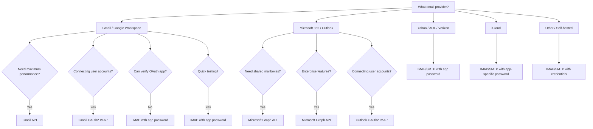

<!--
Sources merged:
- docs-unified/accounts/index.md (primary comprehensive guide)
-->

# Account Management

EmailEngine connects to email accounts via IMAP/SMTP or native APIs (Gmail API, Microsoft Graph). This section covers everything you need to know about adding, configuring, and managing accounts.

## Choosing Your Setup Method

EmailEngine supports multiple ways to connect to email accounts, each with different trade-offs:

### IMAP/SMTP (Standard Protocol)

**Best for:** Self-hosted email servers, simple setup (except Gmail/Outlook)

**Pros:**
- Works with most email providers
- Simple username/password authentication
- Immediate setup

**Cons:**
- Requires username and password
- Some providers block IMAP access
- Gmail requires app-specific password (not regular password)
- Outlook/Microsoft 365 not supported (OAuth2 required)

**Supported Providers:**
- Gmail (with app password)
- Any IMAP/SMTP server (except Outlook/Microsoft 365)
- Self-hosted email

[Learn more about IMAP/SMTP accounts →](./imap-smtp)

### OAuth2 (IMAP/SMTP)

**Best for:** Gmail and Outlook/Microsoft 365 accounts at scale

**Pros:**
- No password storage
- Automatic token refresh
- Works with 2FA-enabled accounts
- Better security and user experience
- Required for Outlook/Microsoft 365 IMAP access

**Cons:**
- Requires OAuth app registration (Google Cloud Console or Azure AD)
- OAuth app verification needed for production

**Use Cases:**
- SaaS applications connecting user Gmail/Outlook accounts
- CRM systems syncing customer emails
- Email automation tools

**Setup Guides:**
- [Gmail OAuth2 Setup →](./gmail-imap)
- [Outlook OAuth2 Setup →](./outlook-365)

### Gmail API (Native)

**Best for:** High-volume Gmail operations, advanced features

**Pros:**
- Generally faster than IMAP (except message listing)
- Access to Gmail-specific features (labels, drafts)
- Better threading support
- No IMAP connection limits
- Faster message fetching and sending

**Cons:**
- Message listing slower than IMAP (due to data enrichment)
- Requires Cloud Pub/Sub setup
- Only works with Gmail
- More complex configuration

**Use Cases:**
- High-volume email processing
- Applications needing Gmail-specific features
- Systems requiring maximum performance

[Gmail API Setup Guide →](./gmail-api)

### OAuth2 (Outlook IMAP/SMTP)

**Best for:** Microsoft 365 and Outlook.com accounts

**Pros:**
- No password storage
- Automatic token refresh
- Works with 2FA-enabled accounts
- Supports shared mailboxes

**Cons:**
- Requires Azure AD setup
- App verification for multi-tenant apps

**Use Cases:**
- Business applications using M365 accounts
- CRM systems for Office 365 users
- Email tools for enterprises

[Outlook OAuth2 Setup Guide →](./outlook-365)

### Microsoft Graph API (Native)

**Best for:** Microsoft 365 and Outlook.com advanced features

**Pros:**
- Faster than IMAP
- Access to Microsoft 365 features
- Better integration with Outlook features
- Supports shared mailboxes natively
- Works with both Microsoft 365 and Outlook.com (Hotmail)

**Cons:**
- Very limited search capabilities compared to IMAP
- Requires Microsoft Graph subscription setup
- Only works with Microsoft accounts
- More complex configuration

**Use Cases:**
- Enterprise applications on Microsoft stack
- Shared mailbox management
- Advanced Microsoft 365 integrations
- Outlook.com and Hotmail accounts

[Microsoft Graph Setup →](./outlook-365#ms-graph-api)

## Decision Tree: Which Method Should I Use?



## Account Management Tasks

### Adding Accounts

**Via API (Programmatic):**

Use the [register account API](/docs/api/post-v-1-account):

```javascript
// Add account via REST API
const response = await fetch('https://your-ee.com/v1/account', {
  method: 'POST',
  headers: {
    'Authorization': 'Bearer YOUR_TOKEN',
    'Content-Type': 'application/json'
  },
  body: JSON.stringify({
    account: 'user123',
    name: 'John Doe',
    email: 'john@example.com',
    imap: { /* config */ },
    smtp: { /* config */ }
  })
});
```

**Via Hosted Authentication Form (User-Friendly):**

Generate a form URL and redirect users to it. They enter their credentials, and EmailEngine handles the rest.

```javascript
// Generate authentication form URL
const formResponse = await fetch('https://your-ee.com/v1/authentication/form', {
  method: 'POST',
  headers: {
    'Authorization': 'Bearer YOUR_TOKEN',
    'Content-Type': 'application/json'
  },
  body: JSON.stringify({
    account: 'user123',
    email: 'john@example.com',
    redirectUrl: 'https://myapp.com/settings'
  })
});

const { url } = await formResponse.json();
// Redirect user to: url
```

[Learn about hosted authentication →](./authentication-server)

**Via Web Interface:**

Navigate to **Email Accounts** → **Add Account** in the EmailEngine dashboard.

### Updating Accounts

Use the [update account API](/docs/api/put-v-1-account-account):

```javascript
// Update account settings
await fetch('https://your-ee.com/v1/account/user123', {
  method: 'PUT',
  headers: {
    'Authorization': 'Bearer YOUR_TOKEN',
    'Content-Type': 'application/json'
  },
  body: JSON.stringify({
    name: 'John Doe Updated',
    subconnections: ['\\Sent']  // Enable instant Sent folder notifications
  })
});
```

### Account States

| State | Description | Actions Available |
|-------|-------------|-------------------|
| `new` | Just added, not yet connected | Wait for initialization |
| `init` | Being initialized | Wait |
| `syncing` | Performing initial mailbox sync | Wait for sync to complete |
| `connecting` | Establishing connection | Wait |
| `connected` | Active and syncing | All operations available |
| `authenticationError` | Invalid credentials | Update credentials |
| `connectError` | Cannot reach server | Check connectivity, retry |
| `unset` | OAuth2 authentication not complete | Complete OAuth2 flow |
| `disconnected` | Manually disconnected or paused | Re-enable account |

### Reconnecting Accounts

If an account enters an error state, you can trigger a reconnection using the [reconnect account API](/docs/api/put-v-1-account-account-reconnect):

```bash
curl -X PUT https://your-ee.com/v1/account/user123/reconnect \
  -H "Authorization: Bearer YOUR_TOKEN"
```

### Deleting Accounts

Use the [delete account API](/docs/api/delete-v-1-account-account):

```bash
curl -X DELETE https://your-ee.com/v1/account/user123 \
  -H "Authorization: Bearer YOUR_TOKEN"
```

This removes the account from EmailEngine and closes all connections. Email data on the server remains unchanged.

## Advanced Configuration

### Sub-Connections

By default, EmailEngine monitors the INBOX folder in real-time but polls other folders periodically. Sub-connections allow instant notifications for additional folders.

```json
{
  "account": "user123",
  "subconnections": [
    "\\Sent",
    "Important",
    "Projects/Active"
  ]
}
```

**Benefits:**
- Instant webhooks for sent emails
- Real-time tracking of specific folders
- Better CRM integration (know immediately when user sends email)

**Trade-offs:**
- Opens additional IMAP connections
- Most servers limit parallel connections (typically 10-15)
- Use sparingly

[Learn more in performance tuning →](/docs/advanced/performance-tuning#sub-connections)

### Path Filtering

Limit which folders EmailEngine syncs and monitors to save resources:

```json
{
  "account": "user123",
  "path": [
    "INBOX",
    "\\Sent",
    "\\Drafts"
  ]
}
```

**What this does:**
- EmailEngine syncs and monitors only the listed folders
- Unlisted folders won't trigger webhooks
- API access to unlisted folders still works

[Learn more in performance tuning →](/docs/advanced/performance-tuning#path-filtering)

### Custom Special Folder Paths

If EmailEngine doesn't correctly identify your special folders (Sent, Drafts, Junk, Trash):

```json
{
  "account": "user123",
  "imap": {
    "partial": true,
    "sentMailPath": "Sent Items",
    "draftsMailPath": "Draft Messages",
    "junkMailPath": "Spam",
    "trashMailPath": "Deleted Items"
  }
}
```

:::warning Important
Always include `"partial": true` when updating IMAP settings to avoid replacing the entire IMAP configuration and losing authentication credentials.
:::

**Available overrides:**
- `sentMailPath` - Where sent messages go
- `draftsMailPath` - Where drafts are saved
- `junkMailPath` - Where spam goes
- `trashMailPath` - Where deleted messages go

[Learn more about folder overrides →](/docs/receiving/mailbox-operations#override-special-folders)

## OAuth2 Token Management

For OAuth2 accounts, EmailEngine automatically refreshes access tokens in the background. You never need to handle token expiration.

### Using Tokens for Other APIs

You can retrieve valid access tokens for use in your own Google/Microsoft API calls:

```javascript
// Get current OAuth2 access token
const tokenResponse = await fetch(
  'https://your-ee.com/v1/account/user123/oauth-token',
  {
    headers: { 'Authorization': 'Bearer YOUR_TOKEN' }
  }
);

const { accessToken, expires } = await tokenResponse.json();

// Use token with Google/Microsoft APIs
const apiResponse = await fetch('https://www.googleapis.com/gmail/v1/users/me/profile', {
  headers: { 'Authorization': `Bearer ${accessToken}` }
});
```

[Learn more about OAuth2 token management →](./oauth2-token-management)

## Service Accounts (Google Workspace)

For Google Workspace domains, you can use service accounts with domain-wide delegation to access any user's mailbox without individual OAuth2 consent.

**Benefits:**
- No per-user OAuth2 flow
- Centralized access management
- Ideal for enterprise deployments

**Requirements:**
- Google Workspace (not free Gmail)
- Super admin access
- Domain-wide delegation setup

[Service Accounts Setup Guide →](./google-service-accounts)

## Shared Mailboxes (Microsoft 365)

Microsoft 365 shared mailboxes can be accessed through the primary user's credentials:

```json
{
  "account": "shared-support",
  "email": "support@company.com",
  "oauth2": {
    "provider": "outlook",
    "auth": {
      "user": "admin@company.com"  // User with access to shared mailbox
    }
  }
}
```

[Shared Mailboxes Guide →](./outlook-365#shared-mailboxes)

## Authentication Server (Custom OAuth2 Flow)

For advanced use cases, you can delegate the OAuth2 flow to an external authentication server:

```json
{
  "account": "user123",
  "oauth2": {
    "provider": "gmail",
    "auth": {
      "authUrl": "https://your-auth-server.com/auth",
      "tokenUrl": "https://your-auth-server.com/token"
    }
  }
}
```

[Authentication Server Guide →](./authentication-server)


## API Reference

- [POST /v1/account - Add Account](/docs/api/post-v-1-account)
- [GET /v1/accounts - List Accounts](/docs/api/get-v-1-accounts)
- [GET /v1/account/\{account\} - Get Account Details](/docs/api/get-v-1-account-account)
- [PUT /v1/account/\{account\} - Update Account](/docs/api/put-v-1-account-account)
- [DELETE /v1/account/\{account\} - Delete Account](/docs/api/delete-v-1-account-account)
- [PUT /v1/account/\{account\}/reconnect - Reconnect](/docs/api/put-v-1-account-account-reconnect)
- [POST /v1/verifyaccount - Verify Account](/docs/api/post-v-1-verifyaccount)
- [GET /v1/account/\{account\}/oauthtoken - Get OAuth Token](/docs/api/get-v-1-account-account-oauthtoken)
