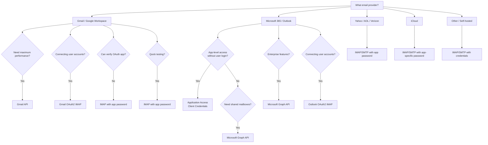

<!--
Sources merged:
- docs-unified/accounts/index.md (primary comprehensive guide)
-->

# Account Management

EmailEngine connects to email accounts via IMAP/SMTP or native APIs (Gmail API, Microsoft Graph). This section covers everything you need to know about adding, configuring, and managing accounts.

## Choosing Your Setup Method

EmailEngine supports multiple ways to connect to email accounts, each with different trade-offs:

### IMAP/SMTP (Standard Protocol)

**Best for:** Self-hosted email servers, simple setup (except Gmail/Outlook)

**Pros:**
- Works with most email providers
- Simple username/password authentication
- Immediate setup

**Cons:**
- Requires username and password
- Some providers block IMAP access
- Gmail requires app-specific password (not regular password)
- Outlook/Microsoft 365 not supported (OAuth2 required)

**Supported Providers:**
- Gmail (with app password)
- Any IMAP/SMTP server (except Outlook/Microsoft 365)
- Self-hosted email

[Learn more about IMAP/SMTP accounts →](/docs/accounts/imap-smtp)

### OAuth2 (IMAP/SMTP)

**Best for:** Gmail, Outlook/Microsoft 365, and Mail.ru accounts at scale

**Pros:**
- No password storage
- Automatic token refresh
- Works with 2FA-enabled accounts
- Better security and user experience
- Required for Outlook/Microsoft 365 IMAP access

**Cons:**
- Requires OAuth app registration (Google Cloud Console or Azure AD)
- OAuth app verification needed for production

**Use Cases:**
- SaaS applications connecting user Gmail/Outlook accounts
- CRM systems syncing customer emails
- Email automation tools

**Setup Guides:**
- [Gmail OAuth2 Setup →](/docs/accounts/gmail-imap)
- [Outlook OAuth2 Setup (Delegated Access) →](/docs/accounts/outlook-365)
- [Outlook Application Access (Client Credentials) →](/docs/accounts/outlook-client-credentials)
- [Mail.ru OAuth2 Setup →](/docs/accounts/mail-ru)

### Gmail API (Native)

**Best for:** High-volume Gmail operations, when limited OAuth2 scopes are required

**Pros:**
- Generally faster than IMAP (except message listing)
- Access to Gmail-specific features (labels, drafts)
- Better threading support
- No IMAP connection limits
- Faster message fetching and sending
- Can use granular OAuth2 scopes (`gmail.readonly`, `gmail.modify`, etc.)

**Cons:**
- Message listing slower than IMAP (due to data enrichment)
- Requires Cloud Pub/Sub setup
- Only works with Gmail
- More complex configuration

**Use Cases:**
- High-volume email processing
- Applications needing Gmail-specific features
- Systems requiring maximum performance
- When Google requires limited OAuth2 scopes during app verification

:::info OAuth2 Scope Requirements
IMAP/SMTP requires the full `https://mail.google.com/` scope. Gmail API can use more limited scopes like `gmail.readonly` or `gmail.modify`. If Google's verification process requires you to use limited scopes, you must use Gmail API instead of IMAP/SMTP.
:::

[Gmail API Setup Guide →](/docs/accounts/gmail-api)

### OAuth2 (Outlook IMAP/SMTP)

**Best for:** Microsoft 365 and Outlook.com accounts

**Pros:**
- No password storage
- Automatic token refresh
- Works with 2FA-enabled accounts
- Supports shared mailboxes

**Cons:**
- Requires Azure AD setup
- App verification for multi-tenant apps

**Use Cases:**
- Business applications using M365 accounts
- CRM systems for Office 365 users
- Email tools for enterprises

[Outlook OAuth2 Setup Guide →](/docs/accounts/outlook-365)

### Microsoft Graph API (Native)

**Best for:** Microsoft 365 and Outlook.com advanced features

**Pros:**
- Faster than IMAP
- Access to Microsoft 365 features
- Better integration with Outlook features
- Supports shared mailboxes natively
- Works with both Microsoft 365 and Outlook.com (Hotmail)

**Cons:**
- Very limited search capabilities compared to IMAP
- Requires Microsoft Graph subscription setup
- Only works with Microsoft accounts
- More complex configuration

**Use Cases:**
- Enterprise applications on Microsoft stack
- Shared mailbox management
- Advanced Microsoft 365 integrations
- Outlook.com and Hotmail accounts

[Microsoft Graph Setup →](/docs/accounts/outlook-365#choosing-imapsmtp-vs-ms-graph-api)

### Microsoft 365 Application Access (Client Credentials)

**Best for:** Enterprise deployments accessing mailboxes without interactive user login

**Pros:**
- No interactive user login required
- Admin grants access once for the entire organization
- Access any mailbox with the same app credentials
- Ideal for automated workflows and service integrations

**Cons:**
- Microsoft 365 only (no personal accounts)
- Requires Azure AD admin privileges and admin consent
- MS Graph API only (no IMAP/SMTP)
- Client secret has maximum 2-year lifetime

**Use Cases:**
- Helpdesk and compliance systems
- Shared mailbox management at scale
- Automated email processing across an organization
- Service integrations where interactive login is not possible

[Outlook Application Access Setup →](/docs/accounts/outlook-client-credentials)

## How Credentials Are Stored

EmailEngine stores email account credentials in Redis. Understanding this is important for security planning.

### What Gets Stored

- IMAP/SMTP passwords
- OAuth2 access tokens
- OAuth2 refresh tokens
- OAuth2 application client secrets
- Service account private keys

:::info
Email message content is **not stored** in Redis. EmailEngine fetches messages from the mail server on demand and only caches metadata for synchronization.
:::

### Default Behavior (Development)

By default, credentials are stored in **cleartext** in Redis. This is acceptable for local development but **not recommended for production**.

### Production Security (Required)

Configure the `EENGINE_SECRET` environment variable to enable **AES-256-GCM encryption** for all sensitive data:

```bash
# Generate a secure encryption secret
export EENGINE_SECRET=$(openssl rand -hex 32)
```

With encryption enabled, all credentials are encrypted before being written to Redis.

:::danger Critical
If you lose the `EENGINE_SECRET`, encrypted credentials cannot be recovered. Store this secret securely and include it in your backup strategy.
:::

[Complete security guide](/docs/support/security-faq) | [Encryption details](/docs/advanced/encryption)

## Decision Tree: Which Method Should I Use?



## Account Management Tasks

### Adding Accounts

**Via API (Programmatic):**

Use the [register account API](/docs/api/post-v-1-account):

```javascript
// Add account via REST API
const response = await fetch('https://your-ee.com/v1/account', {
  method: 'POST',
  headers: {
    'Authorization': 'Bearer YOUR_TOKEN',
    'Content-Type': 'application/json'
  },
  body: JSON.stringify({
    account: 'user123',
    name: 'John Doe',
    email: 'john@example.com',
    imap: { /* config */ },
    smtp: { /* config */ }
  })
});
```

**Via Hosted Authentication Form (User-Friendly):**

Generate a form URL and redirect users to it. They enter their credentials, and EmailEngine handles the rest.

```javascript
// Generate authentication form URL
const formResponse = await fetch('https://your-ee.com/v1/authentication/form', {
  method: 'POST',
  headers: {
    'Authorization': 'Bearer YOUR_TOKEN',
    'Content-Type': 'application/json'
  },
  body: JSON.stringify({
    account: 'user123',
    email: 'john@example.com',
    redirectUrl: 'https://myapp.com/settings'
  })
});

const { url } = await formResponse.json();
// Redirect user to: url
```

[Learn about hosted authentication →](/docs/accounts/authentication-server)

**Via Web Interface:**

Navigate to **Email Accounts** → **Add Account** in the EmailEngine dashboard.

:::note
The web interface is a shorthand for the hosted authentication form. When you click "Add Account", EmailEngine generates a hosted authentication form URL and redirects your browser to that form. The experience is identical to what end users see when your application generates the URL via API and redirects them to complete the authentication flow.
:::

### Updating Accounts

Use the [update account API](/docs/api/put-v-1-account-account):

```javascript
// Update account settings
await fetch('https://your-ee.com/v1/account/user123', {
  method: 'PUT',
  headers: {
    'Authorization': 'Bearer YOUR_TOKEN',
    'Content-Type': 'application/json'
  },
  body: JSON.stringify({
    name: 'John Doe Updated',
    subconnections: ['\\Sent']  // Enable instant Sent folder notifications
  })
});
```

:::warning Partial Updates for Nested Objects
When updating fields within nested objects (like `imap`, `smtp`, or `oauth2`), you must set `{subobject}.partial = true` to perform a partial update. Otherwise, the entire sub-object is replaced with only the fields you provide.

```javascript
// Correct: Update only imap.sentMailPath, keep other IMAP settings
{
  "imap": {
    "partial": true,
    "sentMailPath": "Sent Items"
  }
}

// Wrong: This replaces the entire imap object, losing host, port, auth, etc.
{
  "imap": {
    "sentMailPath": "Sent Items"
  }
}
```
:::

### Account States

| State | Description | Actions Available |
|-------|-------------|-------------------|
| `init` | Being initialized | Wait |
| `syncing` | Performing initial mailbox sync | Wait for sync to complete |
| `connecting` | Establishing connection | Wait |
| `connected` | Active and syncing | All operations available |
| `authenticationError` | Invalid credentials | Update credentials |
| `connectError` | Cannot reach server | Check connectivity, retry |
| `unset` | OAuth2 authentication not complete | Complete OAuth2 flow |
| `disconnected` | Manually disconnected or paused | Re-enable account |

### Reconnecting Accounts

If an account enters an error state, you can trigger a reconnection using the [reconnect account API](/docs/api/put-v-1-account-account-reconnect):

```bash
curl -X PUT https://your-ee.com/v1/account/user123/reconnect \
  -H "Authorization: Bearer YOUR_TOKEN"
```

### Flushing Accounts

The [flush API](/docs/api/put-v-1-account-account-flush) resets the internal email index for an account and re-syncs from scratch. This is useful for:

- **Resetting corrupted index** - Fix sync issues by rebuilding the index
- **Processing existing emails** - Trigger `messageNew` webhooks for existing emails (IMAP only)
- **Changing indexer type** - Switch between full and fast indexing strategies

```bash
# Basic flush - reset index, only notify about new messages going forward
curl -X PUT https://your-ee.com/v1/account/user123/flush \
  -H "Authorization: Bearer YOUR_TOKEN" \
  -H "Content-Type: application/json" \
  -d '{
    "flush": true
  }'

# Flush with options - process existing emails and change indexer
curl -X PUT https://your-ee.com/v1/account/user123/flush \
  -H "Authorization: Bearer YOUR_TOKEN" \
  -H "Content-Type: application/json" \
  -d '{
    "flush": true,
    "notifyFrom": "2024-01-01T00:00:00.000Z",
    "imapIndexer": "full"
  }'
```

**Parameters:**

| Parameter | Type | Description |
|-----------|------|-------------|
| `flush` | boolean | Must be `true` to confirm the flush operation |
| `notifyFrom` | string | Only send webhooks for messages after this date (IMAP only). Defaults to current time, so only new messages trigger webhooks. Set to a past date like `"1970-01-01T00:00:00.000Z"` to process existing emails |
| `imapIndexer` | string | Set indexing strategy: `"full"` or `"fast"` (IMAP only) |

:::warning Single Operation at a Time
You can only run one flush operation at a time. Wait for the previous flush to complete before starting a new one.
:::

:::note API-Based Backends
For Gmail API and MS Graph accounts, `notifyFrom` has no effect. These backends only notify about new emails arriving after the account was connected, not existing emails.
:::

[Learn more about IMAP indexers →](/docs/accounts/imap-indexers)

### Deleting Accounts

Use the [delete account API](/docs/api/delete-v-1-account-account):

```bash
curl -X DELETE https://your-ee.com/v1/account/user123 \
  -H "Authorization: Bearer YOUR_TOKEN"
```

This removes the account from EmailEngine and closes all connections. Email data on the server remains unchanged.

## Advanced Configuration

### Sub-Connections

By default, EmailEngine monitors the INBOX folder in real-time but polls other folders periodically. Sub-connections allow instant notifications for additional folders.

```json
{
  "account": "user123",
  "subconnections": [
    "\\Sent",
    "Important",
    "Projects/Active"
  ]
}
```

**Benefits:**
- Instant webhooks for sent emails
- Real-time tracking of specific folders
- Better CRM integration (know immediately when user sends email)

**Trade-offs:**
- Opens additional IMAP connections
- Most servers limit parallel connections (typically 10-15)
- Use sparingly

[Learn more in performance tuning →](/docs/advanced/performance-tuning#sub-connections-for-selected-folders)

### Path Filtering

Limit which folders EmailEngine syncs and monitors to save resources:

```json
{
  "account": "user123",
  "path": [
    "INBOX",
    "\\Sent",
    "\\Drafts"
  ]
}
```

**What this does:**
- EmailEngine syncs and monitors only the listed folders
- Unlisted folders won't trigger webhooks
- API access to unlisted folders still works

[Learn more in performance tuning →](/docs/advanced/performance-tuning#limiting-indexed-folders)

### Custom Special Folder Paths

EmailEngine automatically detects special-use folders (Sent, Drafts, Junk, Trash, Archive) using the following priority order:

1. **User-configured paths** (`specialUseSource: "user"`) - Highest priority. Paths you explicitly set via API.
2. **Server SPECIAL-USE extension** (`specialUseSource: "extension"`) - Folder flags provided by the IMAP server.
3. **Folder name heuristics** (`specialUseSource: "name"`) - Lowest priority. EmailEngine guesses based on common folder names.

**Why custom paths are needed:**

- **Outlook IMAP** does not expose SPECIAL-USE flags, so EmailEngine relies on folder name matching
- **Localized accounts** may have folder names in different languages (e.g., "Gesendete Elemente" in German, "Saadetud kirjad" in Estonian)
- **Non-standard servers** may use unusual folder names like "Outbox" instead of "Sent"
- **Custom folder structures** where you want sent emails stored in a specific location

If EmailEngine doesn't correctly identify your special folders, override them explicitly:

```json
{
  "account": "user123",
  "imap": {
    "partial": true,
    "sentMailPath": "Sent Items",
    "draftsMailPath": "Draft Messages",
    "junkMailPath": "Spam",
    "trashMailPath": "Deleted Items",
    "archiveMailPath": "Archive"
  }
}
```

:::warning Important
Always include `"partial": true` when updating IMAP settings to avoid replacing the entire IMAP configuration and losing authentication credentials.
:::

**Available overrides:**
- `sentMailPath` - Where sent messages are stored
- `draftsMailPath` - Where drafts are saved
- `junkMailPath` - Where spam/junk goes
- `trashMailPath` - Where deleted messages go
- `archiveMailPath` - Where archived messages are stored

You can check how EmailEngine detected each folder's special-use status by looking at the `specialUseSource` field in the [mailbox listing response](/docs/api/get-v-1-account-account-mailboxes).

[Learn more about special-use folders →](/docs/receiving/mailbox-operations#special-use-folders)

## OAuth2 Token Management

For OAuth2 accounts, EmailEngine automatically refreshes access tokens in the background. You never need to handle token expiration.

### Using Tokens for Other APIs

You can retrieve valid access tokens for use in your own Google/Microsoft API calls:

```javascript
// Get current OAuth2 access token
const tokenResponse = await fetch(
  'https://your-ee.com/v1/account/user123/oauth-token',
  {
    headers: { 'Authorization': 'Bearer YOUR_TOKEN' }
  }
);

const { account, user, accessToken, provider, expires } = await tokenResponse.json();

// Use token with Google/Microsoft APIs
const apiResponse = await fetch('https://www.googleapis.com/gmail/v1/users/me/profile', {
  headers: { 'Authorization': `Bearer ${accessToken}` }
});
```

:::warning Endpoint Disabled by Default
The `/v1/account/{account}/oauth-token` endpoint is **disabled by default** for security reasons. You must explicitly enable it before use.

**To enable via Web UI:**
1. Navigate to **Configuration** > **Service Configuration**
2. Check **Allow OAuth2 Token Access via API**
3. Click **Save**

**To enable via environment variable:**
Set `EENGINE_ENABLE_OAUTH_TOKENS_API=true` when starting EmailEngine.

This setting cannot be changed via the API - it must be configured through the web interface or environment variable.
:::

[Learn more about OAuth2 token management →](/docs/accounts/oauth2-token-management)

## Service Accounts (Google Workspace)

For Google Workspace domains, you can use service accounts with domain-wide delegation to access any user's mailbox without individual OAuth2 consent.

**Benefits:**
- No per-user OAuth2 flow
- Centralized access management
- Ideal for enterprise deployments

**Requirements:**
- Google Workspace (not free Gmail)
- Super admin access
- Domain-wide delegation setup

[Service Accounts Setup Guide →](/docs/accounts/google-service-accounts)

## Shared Mailboxes (Microsoft 365)

Microsoft 365 shared mailboxes can be accessed through two approaches:

- **Direct access** - Add shared mailbox with its own OAuth2 credentials
- **Delegated access** - Add main account, then reference it for shared mailboxes (recommended)

Delegated access allows one user to manage multiple shared mailboxes without re-authenticating.

[Complete Shared Mailboxes Guide →](/docs/accounts/shared-mailboxes)

## Authentication Server (External Token Management)

For advanced use cases where you already manage OAuth2 tokens in your application, you can use an external authentication server. EmailEngine will call your server to fetch access tokens instead of managing them internally.

**Step 1: Configure the authentication server URL globally:**

```bash
curl -X POST https://your-ee.com/v1/settings \
  -H "Authorization: Bearer YOUR_TOKEN" \
  -H "Content-Type: application/json" \
  -d '{
    "authServer": "https://your-auth-server.com/authenticate"
  }'
```

**Step 2: Register accounts with `useAuthServer: true`:**

For IMAP/SMTP accounts:

```json
{
  "account": "user123",
  "name": "John Doe",
  "email": "john@outlook.com",
  "imap": {
    "useAuthServer": true,
    "host": "outlook.office365.com",
    "port": 993,
    "secure": true
  },
  "smtp": {
    "useAuthServer": true,
    "host": "smtp-mail.outlook.com",
    "port": 587,
    "secure": false
  }
}
```

For Gmail API or MS Graph API accounts:

```json
{
  "account": "user123",
  "name": "John Doe",
  "email": "john@gmail.com",
  "oauth2": {
    "useAuthServer": true,
    "provider": "<oauth2-app-id>",
    "auth": {
      "user": "john@gmail.com"
    }
  }
}
```

When EmailEngine needs to authenticate, it calls your server at `GET {authServer}?account={account}&proto={proto}` (where `proto` is `imap`, `smtp`, or `api`) and expects a response with `user` and either `pass` or `accessToken` fields.

[Authentication Server Guide →](/docs/accounts/authentication-server)


## API Reference

- [POST /v1/account - Add Account](/docs/api/post-v-1-account)
- [GET /v1/accounts - List Accounts](/docs/api/get-v-1-accounts)
- [GET /v1/account/\{account\} - Get Account Details](/docs/api/get-v-1-account-account)
- [PUT /v1/account/\{account\} - Update Account](/docs/api/put-v-1-account-account)
- [DELETE /v1/account/\{account\} - Delete Account](/docs/api/delete-v-1-account-account)
- [PUT /v1/account/\{account\}/reconnect - Reconnect](/docs/api/put-v-1-account-account-reconnect)
- [POST /v1/verifyaccount - Verify Account](/docs/api/post-v-1-verifyaccount)
- [GET /v1/account/\{account\}/oauth-token - Get OAuth Token](/docs/api/get-v-1-account-account-oauthtoken)
