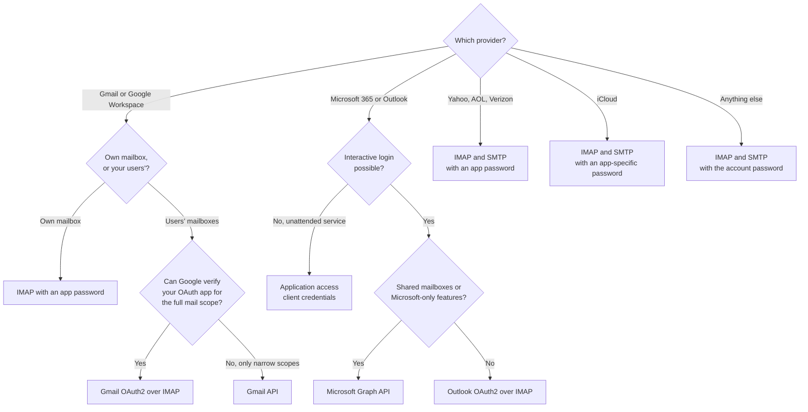

# Account Management

EmailEngine connects to email accounts via IMAP/SMTP or native APIs (Gmail API, Microsoft Graph). This section covers everything you need to know about adding, configuring, and managing accounts.

## Choosing Your Setup Method

EmailEngine supports multiple ways to connect to email accounts, each with different trade-offs:

### IMAP/SMTP (Standard Protocol)

**Best for:** Self-hosted email servers, simple setup (except Gmail/Outlook)

**Pros:**
- Works with most email providers
- Simple username/password authentication
- Immediate setup

**Cons:**
- Requires username and password
- Some providers block IMAP access
- Gmail requires app-specific password (not regular password)
- Outlook/Microsoft 365 not supported (OAuth2 required)

**Supported Providers:**
- Gmail (with app password)
- Any IMAP/SMTP server (except Outlook/Microsoft 365)
- Self-hosted email

[Learn more about IMAP/SMTP accounts →](/docs/accounts/imap-smtp)

### OAuth2 (IMAP/SMTP)

**Best for:** Gmail, Outlook/Microsoft 365, and Mail.ru accounts at scale

**Pros:**
- No password storage
- Automatic token refresh
- Works with 2FA-enabled accounts
- Better security and user experience
- Required for Outlook/Microsoft 365 IMAP access

**Cons:**
- Requires OAuth app registration (Google Cloud Console or Azure AD)
- OAuth app verification needed for production

**Use Cases:**
- SaaS applications connecting user Gmail/Outlook accounts
- CRM systems syncing customer emails
- Email automation tools

**Setup Guides:**
- [Gmail OAuth2 Setup →](/docs/accounts/gmail/gmail-imap)
- [Outlook OAuth2 Setup (Delegated Access) →](/docs/accounts/microsoft-365/outlook-365)
- [Outlook Application Access (Client Credentials) →](/docs/accounts/microsoft-365/outlook-client-credentials)
- [Mail.ru OAuth2 Setup →](/docs/accounts/mail-ru)

### Gmail API (Native)

**Best for:** High-volume Gmail operations, when limited OAuth2 scopes are required

**Pros:**
- Generally faster than IMAP (except message listing)
- Access to Gmail-specific features (labels, drafts)
- Better threading support
- No IMAP connection limits
- Faster message fetching and sending
- Can use granular OAuth2 scopes (`gmail.readonly`, `gmail.modify`, etc.)

**Cons:**
- Message listing slower than IMAP (due to data enrichment)
- Requires Cloud Pub/Sub setup
- Only works with Gmail
- More complex configuration

**Use Cases:**
- High-volume email processing
- Applications needing Gmail-specific features
- Systems requiring maximum performance
- When Google requires limited OAuth2 scopes during app verification

:::info OAuth2 Scope Requirements
IMAP/SMTP requires the full `https://mail.google.com/` scope. Gmail API can use more limited scopes like `gmail.readonly` or `gmail.modify`. If Google's verification process requires you to use limited scopes, you must use Gmail API instead of IMAP/SMTP.
:::

[Gmail API Setup Guide →](/docs/accounts/gmail/gmail-api)

### Microsoft Graph API (Native)

**Best for:** Microsoft 365 and Outlook.com advanced features

**Pros:**
- Faster than IMAP
- Access to Microsoft 365 features
- Better integration with Outlook features
- Supports shared mailboxes natively
- Works with both Microsoft 365 and Outlook.com (Hotmail)

**Cons:**
- Very limited search capabilities compared to IMAP
- Requires Microsoft Graph subscription setup
- Only works with Microsoft accounts
- More complex configuration

**Use Cases:**
- Enterprise applications on Microsoft stack
- Shared mailbox management
- Advanced Microsoft 365 integrations
- Outlook.com and Hotmail accounts

[Microsoft Graph Setup →](/docs/accounts/microsoft-365/outlook-365#choosing-imapsmtp-vs-ms-graph-api)

### Microsoft 365 Application Access (Client Credentials)

**Best for:** Enterprise deployments accessing mailboxes without interactive user login

**Pros:**
- No interactive user login required
- Admin grants access once for the entire organization
- Access any mailbox with the same app credentials
- Ideal for automated workflows and service integrations

**Cons:**
- Microsoft 365 only (no personal accounts)
- Requires Azure AD admin privileges and admin consent
- MS Graph API only (no IMAP/SMTP)
- Client secret has maximum 2-year lifetime

**Use Cases:**
- Helpdesk and compliance systems
- Shared mailbox management at scale
- Automated email processing across an organization
- Service integrations where interactive login is not possible

[Outlook Application Access Setup →](/docs/accounts/microsoft-365/outlook-client-credentials)

## How Credentials Are Stored

EmailEngine stores email account credentials in Redis. Understanding this is important for security planning.

### What Gets Stored

- IMAP/SMTP passwords
- OAuth2 access tokens
- OAuth2 refresh tokens
- OAuth2 application client secrets
- Service account private keys

:::info
Email message content is **not stored** in Redis. EmailEngine fetches messages from the mail server on demand and only caches metadata for synchronization.
:::

### Default Behavior (Development)

By default, credentials are stored in **cleartext** in Redis. This is acceptable for local development but **not recommended for production**.

### Production Security (Required)

Configure the `EENGINE_SECRET` environment variable to enable **AES-256-GCM encryption** for all sensitive data. Generate the secret once and store it permanently - for example in an `.env` file or a secrets manager:

```bash
# Generate the secret once and persist it
echo "EENGINE_SECRET=$(openssl rand -hex 32)" >> .env
```

With encryption enabled, all credentials are encrypted before being written to Redis. The same secret value must be provided on every start.

:::danger Critical
If you lose the `EENGINE_SECRET`, encrypted credentials cannot be recovered and every account must be re-authenticated. Store this secret securely and include it in your backup strategy.
:::

[Complete security guide](/docs/support/security-faq) | [Encryption details](/docs/deployment/encryption)

## Decision Tree: Which Method Should I Use?


```mermaid
graph TD
    Start{Which provider?}
    Start -->|Gmail or Google Workspace| G1{Own mailbox,<br/>or your users'?}
    Start -->|Microsoft 365 or Outlook| M1{Interactive login<br/>possible?}
    Start -->|Yahoo, AOL, Verizon| YahooIMAP[IMAP and SMTP<br/>with an app password]
    Start -->|iCloud| iCloudIMAP[IMAP and SMTP<br/>with an app-specific password]
    Start -->|Anything else| OtherIMAP[IMAP and SMTP<br/>with the account password]

    G1 -->|Own mailbox| GmailIMAPApp[IMAP with an app password]
    G1 -->|Users' mailboxes| G2{Can Google verify<br/>your OAuth app for<br/>the full mail scope?}
    G2 -->|Yes| GmailOAuth2[Gmail OAuth2 over IMAP]
    G2 -->|No, only narrow scopes| GmailAPI[Gmail API]

    M1 -->|No, unattended service| AppAccess[Application access<br/>client credentials]
    M1 -->|Yes| M2{Shared mailboxes or<br/>Microsoft-only features?}
    M2 -->|Yes| GraphAPI[Microsoft Graph API]
    M2 -->|No| OutlookOAuth2[Outlook OAuth2 over IMAP]
```

## Account Management Tasks

The lifecycle of a registered account, from registration to deletion, is on [Managing Accounts](/docs/accounts/managing-accounts). In short:

- **Adding accounts** - register through [`POST /v1/account`](/docs/api/post-v-1-account) with the credentials in the body, through a [hosted authentication form](/docs/accounts/hosted-authentication) that collects them from the user, or in the admin interface under **Accounts** > **Add account**, which opens the same hosted form. See [Adding accounts](/docs/accounts/managing-accounts#adding-accounts).
- **Updating accounts** - [`PUT /v1/account/{account}`](/docs/api/put-v-1-account-account) changes any field. The `imap`, `smtp` and `oauth2` objects are replaced whole unless they carry `"partial": true`. See [Updating accounts](/docs/accounts/managing-accounts#updating-accounts).
- **Account states** - what `init`, `connecting`, `syncing`, `connected`, `disconnected`, `authenticationError`, `connectError`, `paused` and `unset` mean, and what to do about each, is in [Account states](/docs/accounts/managing-accounts#account-states).
- **Reconnecting** - [`PUT /v1/account/{account}/reconnect`](/docs/api/put-v-1-account-account-reconnect) with `{"reconnect": true}`. See [Reconnecting accounts](/docs/accounts/managing-accounts#reconnecting-accounts).
- **Flushing** - [`PUT /v1/account/{account}/flush`](/docs/api/put-v-1-account-account-flush) rebuilds the index, optionally with a `notifyFrom` cutoff for webhooks and a different `imapIndexer`. See [Flushing accounts](/docs/accounts/managing-accounts#flushing-accounts).
- **Deleting** - [`DELETE /v1/account/{account}`](/docs/api/delete-v-1-account-account) removes the account and closes its connections; the mailbox itself is untouched. See [Deleting accounts](/docs/accounts/managing-accounts#deleting-accounts).

## Advanced Configuration

- **Sub-connections** (`subconnections`) open a dedicated IMAP connection for each listed folder, so changes there are detected as fast as in the INBOX, at the cost of one more connection per folder against the server's limit. See [Enable sub-connections](/docs/accounts/managing-accounts#enable-sub-connections) and [Sub-connections for selected folders](/docs/advanced/performance-tuning#sub-connections-for-selected-folders).
- **Path filtering** (`path`) limits syncing and webhooks to the listed folders; API access to the other folders still works. See [Configure path filtering](/docs/accounts/managing-accounts#configure-path-filtering) and [Limiting indexed folders](/docs/advanced/performance-tuning#limiting-indexed-folders).
- **Custom special folder paths** (`sentMailPath`, `draftsMailPath`, `junkMailPath`, `trashMailPath` and `archiveMailPath` inside the `imap` object) override the folder EmailEngine picks for Sent, Drafts, Junk, Trash and Archive. See [Custom special folder paths](/docs/accounts/imap-smtp#custom-special-folder-paths).

## OAuth2 Token Management

EmailEngine refreshes the access token of an OAuth2 account itself, before a connection or API request that needs it. The current token can be read through [`GET /v1/account/{account}/oauth-token`](/docs/api/get-v-1-account-account-oauthtoken) for use with other Google or Microsoft APIs; the endpoint is off by default and is switched on under **Configuration** > **Security**. See [OAuth2 Token Management](/docs/accounts/oauth2-token-management) for the refresh rules, the token lifetimes per provider and the endpoint.

## Service Accounts (Google Workspace)

A Google Workspace domain can grant a service account access to every mailbox through domain-wide delegation, so accounts are registered without a per-user OAuth2 consent flow. It needs Google Workspace (not consumer Gmail) and a super admin to set up the delegation. See [Google Service Accounts](/docs/accounts/gmail/google-service-accounts).

## Shared Mailboxes (Microsoft 365)

A Microsoft 365 shared mailbox is added either with its own OAuth2 authorization (direct access) or by referencing the account of a user who has access to it (delegated access, the usual choice, since a shared mailbox has no credential of its own). See [Shared Mailboxes (Microsoft 365)](/docs/accounts/microsoft-365/shared-mailboxes).

## Authentication Server (External Token Management)

An application that already holds the credentials can hand them to EmailEngine on demand instead of storing them: set the `authServer` setting to your endpoint and register accounts with `useAuthServer: true` on the `imap` and `smtp` objects, or on `oauth2` for Gmail API and MS Graph accounts. EmailEngine then calls `GET {authServer}?account={account}&proto={proto}` whenever it needs a credential and expects `user` with either `pass` or `accessToken` in the answer. See [Using an Authentication Server](/docs/accounts/authentication-server) for the protocol, the failure handling and the setup.

## API Reference

- [POST /v1/account - Add Account](/docs/api/post-v-1-account)
- [GET /v1/accounts - List Accounts](/docs/api/get-v-1-accounts)
- [GET /v1/account/\{account\} - Get Account Details](/docs/api/get-v-1-account-account)
- [PUT /v1/account/\{account\} - Update Account](/docs/api/put-v-1-account-account)
- [DELETE /v1/account/\{account\} - Delete Account](/docs/api/delete-v-1-account-account)
- [PUT /v1/account/\{account\}/reconnect - Reconnect](/docs/api/put-v-1-account-account-reconnect)
- [POST /v1/verifyAccount - Verify Account](/docs/api/post-v-1-verifyaccount)
- [GET /v1/account/\{account\}/oauth-token - Get OAuth Token](/docs/api/get-v-1-account-account-oauthtoken)

## See Also

- [Managing accounts](/docs/accounts/managing-accounts) - The lifecycle: update, pause, reconnect, delete
- [Hosted authentication](/docs/accounts/hosted-authentication) - Letting EmailEngine collect the credentials
- [IMAP indexers](/docs/accounts/imap-indexers) - What each indexing strategy detects
- [Troubleshooting accounts](/docs/accounts/troubleshooting) - Connection and authentication failures
- [Webhooks overview](/docs/webhooks/overview) - The events an account emits once it is connected
