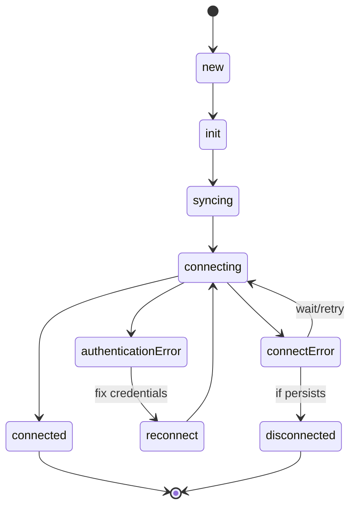

# Managing Accounts

This guide covers the complete lifecycle of account management in EmailEngine, including creating, updating, monitoring, and deleting accounts using both the API and web dashboard.

## Account Lifecycle

### Account States

Every account in EmailEngine has a state that indicates its current status:

| State | Description | Can Send/Receive | Actions |
|-------|-------------|------------------|---------|
| `new` | Just added, not yet initialized | No | Wait |
| `init` | Being initialized | No | Wait |
| `syncing` | Performing initial mailbox sync | No | Wait |
| `connecting` | Establishing connection | No | Wait |
| `connected` | Active and operational | Yes | All operations available |
| `authenticationError` | Invalid or expired credentials | No | Update credentials or reconnect |
| `connectError` | Cannot reach mail server | No | Check network, server status |
| `unset` | OAuth2 authentication not complete | No | Complete OAuth2 flow |
| `disconnected` | Manually disconnected or paused | No | Re-enable account |

### State Transitions



## Adding Accounts

### Via API (Programmatic)

#### IMAP/SMTP with Password

Register a new account using the [account registration API](/docs/api/post-v-1-account):

```bash
curl -X POST https://your-ee.com/v1/account \
  -H "Authorization: Bearer YOUR_TOKEN" \
  -H "Content-Type: application/json" \
  -d '{
    "account": "user123",
    "name": "John Doe",
    "email": "john@example.com",
    "imap": {
      "host": "imap.example.com",
      "port": 993,
      "secure": true,
      "auth": {
        "user": "john@example.com",
        "pass": "password123"
      }
    },
    "smtp": {
      "host": "smtp.example.com",
      "port": 587,
      "secure": false,
      "auth": {
        "user": "john@example.com",
        "pass": "password123"
      }
    }
  }'
```

[See IMAP/SMTP setup guide →](./imap-smtp)

#### OAuth2 (Gmail/Outlook)

```bash
curl -X POST https://your-ee.com/v1/account \
  -H "Authorization: Bearer YOUR_TOKEN" \
  -H "Content-Type: application/json" \
  -d '{
    "account": "user123",
    "name": "John Doe",
    "email": "john@gmail.com",
    "oauth2": {
      "provider": "gmail",
      "accessToken": "ya29.a0AWY7Ckl...",
      "refreshToken": "1//0gDj5..."
    }
  }'
```

[See Gmail OAuth2 guide →](./gmail-imap)
[See Outlook OAuth2 guide →](./outlook-365)

#### Service Accounts (Google Workspace)

```bash
curl -X POST https://your-ee.com/v1/account \
  -H "Authorization: Bearer YOUR_TOKEN" \
  -H "Content-Type: application/json" \
  -d '{
    "account": "user123",
    "name": "John Doe",
    "email": "john@company.com",
    "oauth2": {
      "provider": "gmailService",
      "auth": {
        "user": "john@company.com"
      }
    }
  }'
```

[See Service Accounts guide →](./google-service-accounts)

#### Authentication Server

```bash
curl -X POST https://your-ee.com/v1/account \
  -H "Authorization: Bearer YOUR_TOKEN" \
  -H "Content-Type: application/json" \
  -d '{
    "account": "user123",
    "name": "John Doe",
    "email": "john@outlook.com",
    "imap": {
      "useAuthServer": true,
      "host": "outlook.office365.com",
      "port": 993,
      "secure": true
    },
    "smtp": {
      "useAuthServer": true,
      "host": "smtp-mail.outlook.com",
      "port": 587,
      "secure": false
    }
  }'
```

[See Authentication Server guide →](./authentication-server)

### Via Hosted Authentication Form

Generate a form URL and redirect users to complete setup:

```bash
curl -X POST https://your-ee.com/v1/authentication/form \
  -H "Authorization: Bearer YOUR_TOKEN" \
  -H "Content-Type: application/json" \
  -d '{
    "account": "user123",
    "email": "john@gmail.com",
    "name": "John Doe",
    "redirectUrl": "https://myapp.com/settings"
  }'
```

**Response:**
```json
{
  "url": "https://your-ee.com/accounts/new?data=eyJhY2NvdW50..."
}
```

Direct user to this URL. After completing setup, they'll be redirected to your `redirectUrl`.

[Learn more about hosted authentication →](/docs/accounts/oauth2-setup)

### Via Web Dashboard

1. Navigate to **Email Accounts** in EmailEngine dashboard
2. Click **Add Account** button
3. Choose authentication method:
   - Manual IMAP/SMTP configuration
   - Sign in with Google
   - Sign in with Microsoft
4. Complete setup
5. Account appears in accounts list

## Retrieving Account Information

### Get Single Account

```bash
curl https://your-ee.com/v1/account/user123 \
  -H "Authorization: Bearer YOUR_TOKEN"
```

**Response:**
```json
{
  "account": "user123",
  "name": "John Doe",
  "email": "john@gmail.com",
  "state": "connected",
  "syncTime": "2024-01-15T10:30:00.000Z",
  "oauth2": {
    "provider": "gmail",
    "expires": "2024-01-15T11:30:00.000Z"
  },
  "imap": {
    "host": "imap.gmail.com",
    "port": 993,
    "secure": true
  },
  "smtp": {
    "host": "smtp.gmail.com",
    "port": 587,
    "secure": false
  },
  "path": "*",
  "subconnections": [],
  "counters": {
    "sent": 42,
    "received": 158
  }
}
```

### List All Accounts

```bash
curl https://your-ee.com/v1/accounts \
  -H "Authorization: Bearer YOUR_TOKEN"
```

**Response:**
```json
{
  "accounts": [
    {
      "account": "user123",
      "name": "John Doe",
      "email": "john@gmail.com",
      "state": "connected"
    },
    {
      "account": "user456",
      "name": "Jane Smith",
      "email": "jane@outlook.com",
      "state": "authenticationError"
    }
  ],
  "total": 2,
  "page": 0,
  "pages": 1
}
```

### Filter Accounts

**By state:**
```bash
curl "https://your-ee.com/v1/accounts?state=connected" \
  -H "Authorization: Bearer YOUR_TOKEN"
```

**By email pattern:**
```bash
curl "https://your-ee.com/v1/accounts?query=@gmail.com" \
  -H "Authorization: Bearer YOUR_TOKEN"
```

**Pagination:**
```bash
curl "https://your-ee.com/v1/accounts?page=1&pageSize=20" \
  -H "Authorization: Bearer YOUR_TOKEN"
```

## Updating Accounts

### Update Basic Information

Use the [update account API](/docs/api/put-v-1-account-account):

```bash
curl -X PUT https://your-ee.com/v1/account/user123 \
  -H "Authorization: Bearer YOUR_TOKEN" \
  -H "Content-Type: application/json" \
  -d '{
    "name": "John Doe (Updated)",
    "email": "john.doe@gmail.com"
  }'
```

### Update IMAP/SMTP Settings

```bash
curl -X PUT https://your-ee.com/v1/account/user123 \
  -H "Authorization: Bearer YOUR_TOKEN" \
  -H "Content-Type: application/json" \
  -d '{
    "imap": {
      "host": "imap.newserver.com",
      "port": 993,
      "secure": true,
      "auth": {
        "user": "john@newserver.com",
        "pass": "newpassword"
      }
    }
  }'
```

### Update OAuth2 Tokens

```bash
curl -X PUT https://your-ee.com/v1/account/user123 \
  -H "Authorization: Bearer YOUR_TOKEN" \
  -H "Content-Type: application/json" \
  -d '{
    "oauth2": {
      "accessToken": "new.access.token",
      "refreshToken": "new.refresh.token"
    }
  }'
```

### Enable Sub-Connections

Monitor additional folders in real-time:

```bash
curl -X PUT https://your-ee.com/v1/account/user123 \
  -H "Authorization: Bearer YOUR_TOKEN" \
  -H "Content-Type: application/json" \
  -d '{
    "subconnections": [
      "\\Sent",
      "Important",
      "Projects"
    ]
  }'
```

**Benefits:**
- Instant webhooks for messages in these folders
- Real-time notifications
- Better CRM integration

**Limits:**
- Uses additional IMAP connections
- Most servers limit to 10-15 concurrent connections
- Use sparingly

[Learn more about sub-connections →](/docs/advanced/performance-tuning#sub-connections)

### Configure Path Filtering

Sync only specific folders:

```bash
curl -X PUT https://your-ee.com/v1/account/user123 \
  -H "Authorization: Bearer YOUR_TOKEN" \
  -H "Content-Type: application/json" \
  -d '{
    "path": [
      "INBOX",
      "\\Sent",
      "\\Drafts",
      "Important"
    ]
  }'
```

All other folders will be ignored.

[Learn more about path filtering →](/docs/advanced/performance-tuning#path-filtering)

### Set Custom Sent Mail Path

If EmailEngine doesn't correctly identify your Sent folder:

```bash
curl -X PUT https://your-ee.com/v1/account/user123 \
  -H "Authorization: Bearer YOUR_TOKEN" \
  -H "Content-Type: application/json" \
  -d '{
    "imap": {
      "sentMailPath": "Sent Items"
    }
  }'
```

Common sent folder names:
- `Sent` (most providers)
- `Sent Messages`
- `Sent Items` (Microsoft Exchange)
- `[Gmail]/Sent Mail` (Gmail)

## Reconnecting Accounts

If an account enters an error state, trigger a reconnection:

```bash
curl -X PUT https://your-ee.com/v1/account/user123/reconnect \
  -H "Authorization: Bearer YOUR_TOKEN"
```

**When to Use:**
- Account in `authenticationError` state
- Account in `connectError` state
- After updating credentials
- After network issues resolved

**What It Does:**
- Closes existing connections
- Clears error states
- Attempts fresh connection
- Updates account state

### Reconnect Response

**Success:**
```json
{
  "account": "user123",
  "state": "connecting",
  "reconnect": true
}
```

**Account Not Found:**
```json
{
  "error": "Account not found",
  "code": "AccountNotFound"
}
```

## Disabling and Enabling Accounts

### Disable Account

Temporarily stop syncing without deleting:

```bash
curl -X PUT https://your-ee.com/v1/account/user123 \
  -H "Authorization: Bearer YOUR_TOKEN" \
  -H "Content-Type: application/json" \
  -d '{
    "disabled": true
  }'
```

**Effect:**
- Closes all connections
- Stops webhook notifications
- Account data retained
- Can be re-enabled later

**Use Cases:**
- Temporarily pause account
- Maintenance periods
- User subscription expired
- Testing without deleting

### Enable Account

Re-enable a disabled account:

```bash
curl -X PUT https://your-ee.com/v1/account/user123 \
  -H "Authorization: Bearer YOUR_TOKEN" \
  -H "Content-Type: application/json" \
  -d '{
    "disabled": false
  }'
```

Account will reconnect and resume syncing.

## Deleting Accounts

Permanently remove an account from EmailEngine using the [delete account API](/docs/api/delete-v-1-account-account):

```bash
curl -X DELETE https://your-ee.com/v1/account/user123 \
  -H "Authorization: Bearer YOUR_TOKEN"
```

**Response:**
```json
{
  "account": "user123",
  "deleted": true
}
```

**What Happens:**
- All connections closed immediately
- Account data removed from EmailEngine
- Webhook subscriptions cancelled
- Stored credentials deleted

**What Doesn't Happen:**
- Email data on mail server remains unchanged
- Messages are not deleted
- Server-side folders remain
- OAuth2 tokens remain valid (until revoked by provider or you)

:::warning Irreversible
Deleting an account cannot be undone. You'll need to re-add the account if needed later.
:::

## Verifying Accounts

Before adding an account, verify credentials work:

```bash
curl -X POST https://your-ee.com/v1/verifyaccount \
  -H "Authorization: Bearer YOUR_TOKEN" \
  -H "Content-Type: application/json" \
  -d '{
    "mailboxes": [{
      "email": "john@example.com",
      "imap": {
        "host": "imap.example.com",
        "port": 993,
        "secure": true,
        "auth": {
          "user": "john@example.com",
          "pass": "password123"
        }
      },
      "smtp": {
        "host": "smtp.example.com",
        "port": 587,
        "secure": false,
        "auth": {
          "user": "john@example.com",
          "pass": "password123"
        }
      }
    }]
  }'
```

**Response (Success):**
```json
{
  "mailboxes": [{
    "email": "john@example.com",
    "imap": {
      "success": true
    },
    "smtp": {
      "success": true
    }
  }]
}
```

**Response (Failure):**
```json
{
  "mailboxes": [{
    "email": "john@example.com",
    "imap": {
      "success": false,
      "error": {
        "message": "Invalid credentials",
        "code": "AUTHENTICATIONFAILED"
      }
    },
    "smtp": {
      "success": true
    }
  }]
}
```

Use this before adding accounts to catch configuration errors early.

## Monitoring Account Health

### Check Account Status

```bash
curl https://your-ee.com/v1/account/user123 \
  -H "Authorization: Bearer YOUR_TOKEN"
```

**Key Fields to Monitor:**

```json
{
  "account": "user123",
  "state": "connected",  // ← Current state
  "syncTime": "2024-01-15T10:30:00.000Z",  // ← Last successful sync
  "lastError": {  // ← Recent errors
    "response": "Connection timeout",
    "serverResponseCode": "TIMEOUT"
  }
}
```

### Account Metrics

Get detailed metrics:

```bash
curl https://your-ee.com/v1/account/user123/metrics \
  -H "Authorization: Bearer YOUR_TOKEN"
```

**Response:**
```json
{
  "account": "user123",
  "counters": {
    "sent": 42,
    "received": 158,
    "webhooksSent": 200,
    "webhooksFailed": 3
  },
  "connections": {
    "imap": 2,
    "smtp": 0
  },
  "lastActivity": "2024-01-15T10:30:00.000Z"
}
```

### Monitor All Accounts

Check for accounts in error states:

```bash
# Get accounts with authentication errors
curl "https://your-ee.com/v1/accounts?state=authenticationError" \
  -H "Authorization: Bearer YOUR_TOKEN"

# Get accounts with connection errors
curl "https://your-ee.com/v1/accounts?state=connectError" \
  -H "Authorization: Bearer YOUR_TOKEN"
```

### Set Up Monitoring Alerts

**Example monitoring script (pseudo code):**

```
// Pseudo code - implement in your preferred language

function CHECK_ACCOUNT_HEALTH() {
  response = HTTP_GET('https://your-ee.com/v1/accounts', {
    headers: { 'Authorization': 'Bearer YOUR_TOKEN' }
  })

  data = PARSE_JSON(response.body)
  accounts = data.accounts

  errorAccounts = FILTER(accounts, function(account) {
    return account.state == 'authenticationError' OR account.state == 'connectError'
  })

  if LENGTH(errorAccounts) > 0 {
    PRINT(LENGTH(errorAccounts) + " accounts in error state:")
    for each account in errorAccounts {
      PRINT("- " + account.account + " (" + account.email + "): " + account.state)
    }

    // Send alert (email, Slack, PagerDuty, etc.)
    SEND_ALERT(errorAccounts)
  } else {
    PRINT("All accounts healthy")
  }
}

// Run every 5 minutes
SCHEDULE_INTERVAL(CHECK_ACCOUNT_HEALTH, 300000)  // 5 minutes in milliseconds
```

## Bulk Operations

### Add Multiple Accounts

```bash
#!/bin/bash

# Read accounts from CSV
while IFS=, read -r account_id email password; do
  curl -X POST https://your-ee.com/v1/account \
    -H "Authorization: Bearer YOUR_TOKEN" \
    -H "Content-Type: application/json" \
    -d "{
      \"account\": \"$account_id\",
      \"email\": \"$email\",
      \"imap\": {
        \"host\": \"imap.example.com\",
        \"port\": 993,
        \"secure\": true,
        \"auth\": {
          \"user\": \"$email\",
          \"pass\": \"$password\"
        }
      }
    }"

  # Rate limit
  sleep 1
done < accounts.csv
```

### Update Multiple Accounts

```
// Pseudo code - implement in your preferred language

accounts = ['user1', 'user2', 'user3']

function UPDATE_ALL_ACCOUNTS(updates) {
  for each account in accounts {
    HTTP_PUT('https://your-ee.com/v1/account/' + account, {
      headers: {
        'Authorization': 'Bearer YOUR_TOKEN',
        'Content-Type': 'application/json'
      },
      body: JSON_ENCODE(updates)
    })

    // Rate limit - wait 100ms between requests
    SLEEP(100)
  }
}

// Enable sub-connections for all accounts
UPDATE_ALL_ACCOUNTS({
  subconnections: ['\\Sent']
})
```

### Delete Multiple Accounts

```bash
#!/bin/bash

# Delete all accounts matching pattern
accounts=$(curl -s "https://your-ee.com/v1/accounts?query=test" \
  -H "Authorization: Bearer YOUR_TOKEN" \
  | jq -r '.accounts[].account')

for account in $accounts; do
  echo "Deleting $account..."
  curl -X DELETE "https://your-ee.com/v1/account/$account" \
    -H "Authorization: Bearer YOUR_TOKEN"
  sleep 0.5
done
```

## Common Account Management Patterns

### Trial Period Handling

```
// Pseudo code - implement in your preferred language

function HANDLE_TRIAL_EXPIRY(accountId) {
  // Disable account when trial expires
  HTTP_PUT('https://your-ee.com/v1/account/' + accountId, {
    headers: {
      'Authorization': 'Bearer YOUR_TOKEN',
      'Content-Type': 'application/json'
    },
    body: JSON_ENCODE({ disabled: true })
  })

  PRINT("Account " + accountId + " disabled - trial expired")
}

// Re-enable when user subscribes
function HANDLE_SUBSCRIPTION(accountId) {
  HTTP_PUT('https://your-ee.com/v1/account/' + accountId, {
    headers: {
      'Authorization': 'Bearer YOUR_TOKEN',
      'Content-Type': 'application/json'
    },
    body: JSON_ENCODE({ disabled: false })
  })

  PRINT("Account " + accountId + " re-enabled - subscription active")
}
```

### Automatic Reconnection

```
// Pseudo code - implement in your preferred language

function AUTO_RECONNECT_ERROR_ACCOUNTS() {
  response = HTTP_GET('https://your-ee.com/v1/accounts', {
    headers: { 'Authorization': 'Bearer YOUR_TOKEN' }
  })

  data = PARSE_JSON(response.body)
  accounts = data.accounts

  for each account in accounts {
    if account.state == 'connectError' {
      PRINT("Reconnecting " + account.account + "...")

      HTTP_PUT('https://your-ee.com/v1/account/' + account.account + '/reconnect', {
        headers: { 'Authorization': 'Bearer YOUR_TOKEN' }
      })

      SLEEP(1000)  // Wait 1 second between reconnect attempts
    }
  }
}

// Run every hour
SCHEDULE_INTERVAL(AUTO_RECONNECT_ERROR_ACCOUNTS, 3600000)  // 60 * 60 * 1000 ms
```

### Credential Rotation

```
// Pseudo code - implement in your preferred language

function ROTATE_ACCOUNT_PASSWORD(accountId, newPassword) {
  // Update password
  HTTP_PUT('https://your-ee.com/v1/account/' + accountId, {
    headers: {
      'Authorization': 'Bearer YOUR_TOKEN',
      'Content-Type': 'application/json'
    },
    body: JSON_ENCODE({
      imap: {
        auth: { pass: newPassword }
      },
      smtp: {
        auth: { pass: newPassword }
      }
    })
  })

  // Trigger reconnection
  HTTP_PUT('https://your-ee.com/v1/account/' + accountId + '/reconnect', {
    headers: { 'Authorization': 'Bearer YOUR_TOKEN' }
  })

  PRINT("Password rotated for " + accountId)
}
```

## Best Practices

### Account IDs

**Choose meaningful IDs:**
- Use user IDs from your database
- Make them unique and permanent
- Avoid changing account IDs

**Good:**
```
user_12345
customer_uuid_abc123
john.doe@company.com
```

**Avoid:**
```
1, 2, 3 (not descriptive)
temp_account (non-permanent)
test123 (not meaningful)
```

### Error Handling

Always check response status:

```
// Pseudo code - implement in your preferred language

response = HTTP_POST('https://your-ee.com/v1/account', {
  headers: {
    'Authorization': 'Bearer YOUR_TOKEN',
    'Content-Type': 'application/json'
  },
  body: JSON_ENCODE(accountData)
})

if response.statusCode != 200 {
  error = PARSE_JSON(response.body)
  PRINT("Failed to add account: " + error.error)

  // Handle specific errors
  if error.code == 'AccountExists' {
    // Account already exists, update instead
    UPDATE_ACCOUNT(accountData)
  } else if error.code == 'AuthFailed' {
    // Invalid credentials
    NOTIFY_USER('Invalid email credentials')
  }

  return
}

result = PARSE_JSON(response.body)
PRINT("Account added: " + result.account)
```

### Rate Limiting

Respect EmailEngine's rate limits:

```
// Pseudo code - implement in your preferred language

// Sequential with delay
function ADD_MULTIPLE_ACCOUNTS(accounts) {
  for each account in accounts {
    ADD_ACCOUNT(account)
    SLEEP(100)  // 100ms delay between requests
  }
}

// Batch processing (faster but respect limits)
function ADD_ACCOUNTS_BATCH(accounts, batchSize = 5) {
  for i = 0 to LENGTH(accounts) step batchSize {
    batch = SLICE(accounts, i, i + batchSize)

    // Process batch in parallel
    for each account in batch {
      ASYNC_ADD_ACCOUNT(account)
    }

    WAIT_FOR_ALL_ASYNC()  // Wait for all parallel requests to complete
    SLEEP(1000)  // 1 second between batches
  }
}
```

### Security

**Never log credentials:**
```
// Bad - DO NOT DO THIS
PRINT("Adding account:", accountData)  // Logs passwords!

// Good - Only log non-sensitive fields
PRINT("Adding account:", accountData.account, accountData.email)
```

**Use environment variables for tokens:**
```
// Read token from environment variable
EMAILENGINE_TOKEN = GET_ENV_VARIABLE('EMAILENGINE_TOKEN')
```

**Validate input:**
```
// Pseudo code - implement in your preferred language

function VALIDATE_ACCOUNT_DATA(data) {
  if NOT data.account OR NOT data.email {
    THROW_ERROR('Missing required fields')
  }

  if NOT REGEX_MATCH(data.account, '^[a-zA-Z0-9_-]+$') {
    THROW_ERROR('Invalid account ID format')
  }

  // ... more validation
}
```
