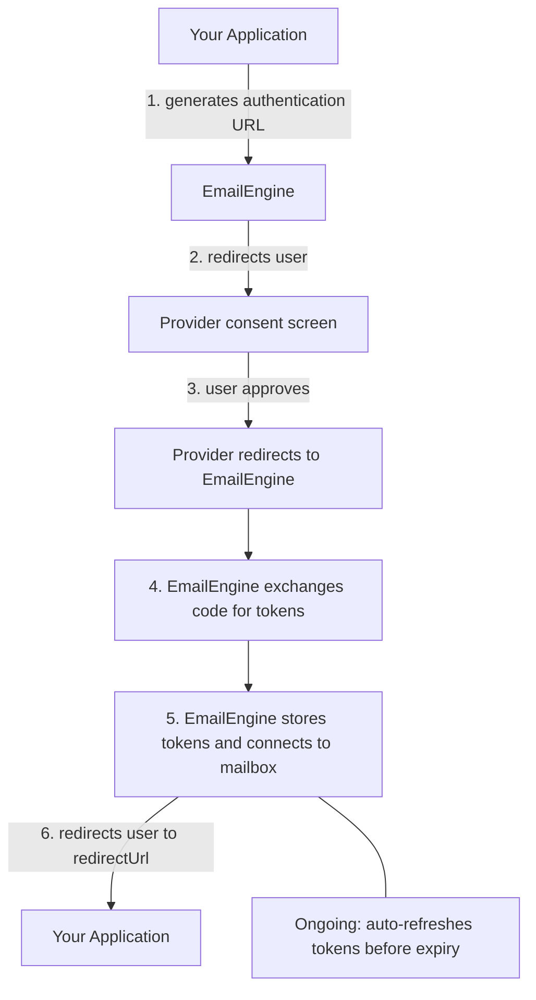

<!--
Sources merged:
- docs/configuration/oauth2-configuration.md (structure)
- General OAuth2 concepts
- Common patterns from Gmail and Outlook guides
-->

# OAuth2 Setup Guide

This guide explains OAuth2 authentication concepts and how to set up OAuth2 applications with EmailEngine. For provider-specific instructions, see the dedicated guides for [Gmail](./gmail-imap), [Outlook](./outlook-365), or [Google Service Accounts](./google-service-accounts).

## What is OAuth2?

OAuth2 is an authorization framework that allows applications to access user data without requiring passwords. Instead of storing passwords, your application receives temporary access tokens that can be refreshed automatically.

### Benefits of OAuth2

**Better Security:**

- No password storage required
- Tokens can be revoked without changing passwords
- Scoped permissions (request only what you need)
- Works seamlessly with two-factor authentication

**Better User Experience:**

- Users authenticate directly with their provider (Google, Microsoft)
- Familiar consent screens
- Users can review and revoke access anytime
- No need to share passwords with third parties

**Better Compliance:**

- Meets modern security standards
- Supports enterprise security policies
- Audit trail of access grants
- Automatic token expiration

## OAuth2 Flow Overview

Understanding the OAuth2 flow helps troubleshoot issues:



EmailEngine handles the token exchange and refresh automatically. You just need to:

- Set up the OAuth2 application with the provider (one-time)
- Direct users to the EmailEngine authentication URL
- EmailEngine handles token exchange, storage, and refresh

## Supported Providers in EmailEngine

EmailEngine supports OAuth2 for:

### Gmail / Google Workspace

**Protocol Options:**

- **IMAP/SMTP with OAuth2** - Standard protocols with OAuth2 authentication
- **Gmail API** - Native Gmail REST API (faster, more features)

**Account Types:**

- **Internal Apps** - Google Workspace organization only
- **Service Accounts** - Google Workspace with domain-wide delegation
- **Public Apps** - Any Gmail user (requires security audit)

[Gmail IMAP OAuth2 Setup →](./gmail-imap)
[Gmail API Setup →](./gmail-api)
[Google Service Accounts →](./google-service-accounts)

### Outlook / Microsoft 365

**Protocol Options:**

- **IMAP/SMTP with OAuth2** - Standard protocols with OAuth2 authentication
- **Microsoft Graph API** - Native Microsoft 365 API

**Account Types:**

- **Single Tenant** - Your organization only
- **Multi-Tenant** - Any Microsoft 365 organization
- **Personal Accounts** - Outlook.com, Hotmail.com, Live.com
- **Combined** - Organizations + personal accounts

[Outlook OAuth2 Setup →](./outlook-365)

## Setting Up OAuth2 in EmailEngine

### Overview of Steps

1. **Create OAuth2 app** with the provider (Google Cloud Console or Azure AD)
2. **Configure consent screen** and permissions
3. **Get credentials** (Client ID and Client Secret)
4. **Add to EmailEngine** via Configuration → OAuth2
5. **Test** by adding an account

### OAuth2 Application Types

EmailEngine supports different OAuth2 application types:

**Gmail:**

- Gmail (IMAP/SMTP)
- Gmail API
- Gmail Service Accounts

**Outlook:**

- Outlook (IMAP/SMTP or MS Graph API)

Each type has its own configuration page in EmailEngine.

### Required Information

When configuring OAuth2 in EmailEngine, you'll need:

**From Provider (Google/Microsoft):**

- **Client ID** - Identifies your application
- **Client Secret** - Authenticates your application
- **Redirect URI** - Where users return after consent

**For EmailEngine:**

- **Application Name** - Internal identifier
- **Base Scope** - Protocol to use (IMAP/SMTP or API)
- **Enabled** - Whether app shows in authentication forms

### Configuration in EmailEngine

Navigate to **Configuration** → **OAuth2** in EmailEngine dashboard.

**Add New Application:**

1. Click **Add application**
2. Select provider type (Gmail or Outlook)
3. Enter application details:
   - **Name**: Internal identifier (e.g., "Production Gmail")
   - **Enabled**: Check to make available to users
   - **Client ID**: From provider console
   - **Client Secret**: From provider console
   - **Redirect URL**: Your EmailEngine URL + `/oauth`
   - **Base Scope**: Choose protocol (IMAP/SMTP or API)
4. Click **Register app**

### Credentials File Upload

Both Google and Microsoft allow downloading credentials as JSON files:

**Google credentials file** (starts with `client_secret_`):

```json
{
  "web": {
    "client_id": "123456789.apps.googleusercontent.com",
    "client_secret": "abcdef123456",
    "redirect_uris": ["http://localhost:3000/oauth"],
    ...
  }
}
```

**Microsoft credentials** (entered manually):

- Application (client) ID
- Client secret value

EmailEngine can auto-fill fields from Google's JSON file.

## OAuth2 Scopes

Scopes define what your application can access.

### Gmail Scopes

**For IMAP/SMTP:**

```
https://mail.google.com/
```

Required scope for IMAP and SMTP authentication.

**For Gmail API:**

```
gmail.modify
```

Full Gmail API access (read, write, delete, but not admin functions).

**Narrower Scopes (if required by Google):**

```
gmail.readonly      - Read-only access
gmail.send          - Send emails only
gmail.labels        - Manage labels
gmail.compose       - Create drafts
```

### Outlook Scopes

**For IMAP/SMTP:**

```
IMAP.AccessAsUser.All
SMTP.Send
offline_access
```

**For MS Graph API:**

```
Mail.ReadWrite
Mail.Send
offline_access
```

:::important offline_access Required
The `offline_access` scope is required for both providers. It allows EmailEngine to refresh access tokens in the background without user interaction.
:::

### Additional Scopes

You can add extra scopes if you want to use OAuth2 tokens for other APIs:

**Example - Add Google Calendar access:**

```
https://www.googleapis.com/auth/calendar
```

Configure this in **Additional scopes** field in EmailEngine.

[Learn more about using tokens for other APIs →](./oauth2-token-management)

### Disabled Scopes

If Google/Microsoft requires narrower scopes, you can disable the default wide scope:

**Disabled scopes** field:

```
https://mail.google.com/
```

This removes the wide scope from consent requests.

## Account Types and Tenant Configuration

### Gmail Account Types

**Internal Apps:**

- Only for Google Workspace organizations
- No security audit required
- Limited to organization's domain

**External Apps (Development):**

- Limited to 100 manually whitelisted users
- Grants expire after 7 days
- Not suitable for production

**External Apps (Production):**

- Available to any Gmail user
- Requires thorough security audit (expensive, time-consuming)
- Google may reject broad scopes like `https://mail.google.com/`

### Outlook Account Types

Configure via **Supported account types** field:

- `common` - Organizations + personal accounts (most flexible)
- `consumers` - Personal accounts only (@outlook.com, @hotmail.com)
- `organizations` - Microsoft 365 organizations only
- `<directory-id>` - Specific organization only (use Directory/Tenant ID)

**Mapping to Azure:**

| Azure Setting       | EmailEngine Value |
| ------------------- | ----------------- |
| Any org + personal  | `common`          |
| Personal only       | `consumers`       |
| Any organization    | `organizations`   |
| Single organization | Use Directory ID  |

## Redirect URLs

The redirect URL is where users return after granting consent.

### Format

```
{emailengine-url}/oauth
```

**Examples:**

- `http://localhost:3000/oauth` (development)
- `https://ee.company.com/oauth` (production)
- `https://your-domain.com/oauth` (custom domain)

### Requirements

- Must be HTTPS in production (HTTP allowed for localhost)
- Must match exactly between provider and EmailEngine
- Case-sensitive
- No trailing slashes
- Must be publicly accessible (for user redirects)

### Common Issues

**Redirect URL mismatch:**

- Error: "redirect_uri_mismatch" (Google) or "AADSTS50011" (Microsoft)
- Fix: Ensure exact match between provider console and EmailEngine
- Check for http vs https, trailing slashes, port numbers

## Testing OAuth2 Setup

### Verification Checklist

Before adding accounts:

- [ ] OAuth2 app enabled in EmailEngine
- [ ] Redirect URL matches exactly
- [ ] Required scopes configured in provider console
- [ ] Client ID and secret are correct
- [ ] Provider APIs are enabled (Gmail API, Cloud Pub/Sub, etc.)

### Test Authentication Flow

1. In EmailEngine, go to **Add account**
2. Click provider button (e.g., "Sign in with Google")
3. Should redirect to provider's consent screen
4. Grant permissions
5. Should redirect back to EmailEngine
6. Account should enter "connecting" then "connected" state

### Common Test Issues

**Redirect fails / "Authorization Error":**

- Check browser console for errors
- Verify redirect URL matches
- Check provider app is enabled

**Consent screen shows error:**

- Verify all required APIs are enabled
- Check scopes are configured correctly
- Ensure app is not restricted to specific users (or you're in the allowed list)

**Account stays in "connecting" or enters "authenticationError":**

- Check EmailEngine logs
- Verify credentials are correct
- For Gmail API: check Pub/Sub is set up
- For IMAP/SMTP: verify protocols are enabled on account

## Production Considerations

### Security Audit (Google)

If you need a public Gmail app:

**Requirements:**

1. **Security compliance** - OWASP, pentest, security review
2. **Use case validation** - Must fit approved categories
3. **Minimum scopes** - Google may reject `https://mail.google.com/`

**Timeline:**

- Can take 4-6 weeks or longer
- Requires documentation and testing
- May need to revise scope requests

**Cost:**

- Security audit: $15,000 - $75,000+ (varies by provider)
- Annual re-certification may be required

**Alternatives:**

- Use Internal apps (organization only)
- Use app passwords
- Use narrower scopes if sufficient

### Microsoft Verification

For multi-tenant Microsoft apps:

**Publisher Verification:**

- Verify domain ownership
- Provide business information
- Display verified badge in consent

**Admin Consent:**

- Organization admins can pre-approve your app
- Simplifies user experience
- Required for some permissions

## Advanced OAuth2 Features

### Authentication Server

Delegate OAuth2 management to an external server:

```json
{
  "authServer": "https://your-auth-server.com/authenticate"
}
```

Use this when:

- You already manage OAuth2 in your app
- Want centralized token management
- Need custom authentication flows

[Learn more about authentication servers →](./authentication-server)

### Pre-filled Email

When generating authentication URLs, you can pre-fill the user's email:

```bash
curl -X POST https://your-ee.com/v1/authentication/form \
  -H "Authorization: Bearer YOUR_TOKEN" \
  -H "Content-Type: application/json" \
  -d '{
    "account": "user123",
    "email": "user@gmail.com",  // Pre-filled
    "redirectUrl": "https://myapp.com/settings"
  }'
```

### Delegated Access (Shared Mailboxes)

For Microsoft 365 shared mailboxes:

```bash
curl -X POST https://your-ee.com/v1/authentication/form \
  -H "Authorization: Bearer YOUR_TOKEN" \
  -H "Content-Type: application/json" \
  -d '{
    "account": "shared-support",
    "email": "support@company.com",
    "delegated": true,  // Important
    "redirectUrl": "https://myapp.com/settings"
  }'
```

[Learn more about shared mailboxes →](./outlook-365#shared-mailboxes)

### Service Accounts (Google Workspace)

Access any user's mailbox without individual consent:

```json
{
  "oauth2": {
    "provider": "gmailService",
    "auth": {
      "user": "user@company.com"
    }
  }
}
```

Requires domain-wide delegation setup.

[Learn more about service accounts →](./google-service-accounts)
