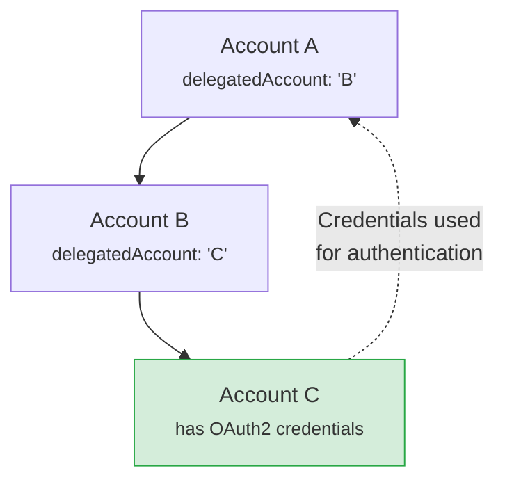

# Shared Mailboxes (Microsoft 365)

Microsoft 365 shared mailboxes are mailboxes not bound to a specific user. Multiple users can access them using their own credentials. EmailEngine supports two approaches for accessing shared mailboxes.

## Two Approaches to Shared Mailboxes

### Option 1: Direct Access (Simpler)

Add the shared mailbox directly with its own OAuth2 credentials and mark it as shared.

**Best for:**

- Single shared mailbox setups
- Testing and evaluation
- Simple use cases

**How it works:**

1. User authenticates with the shared mailbox through OAuth2
2. EmailEngine marks the account as shared
3. Account appears as a regular account in EmailEngine

### Option 2: Delegated Access (Recommended)

Add a main account normally, then add shared mailboxes that reference the main account's credentials.

**Best for:**

- Multiple shared mailboxes accessed by the same user
- Production environments
- Better credential management

**How it works:**

1. Add the main user account with OAuth2
2. Add shared mailbox accounts that reference the main account
3. EmailEngine uses the main account's credentials to access shared mailboxes

:::tip Recommendation
Use **delegated access** for production. It's more flexible and allows one user to access multiple shared mailboxes without re-authenticating.
:::

## Prerequisites

Before setting up shared mailboxes in EmailEngine:

1. **Azure AD OAuth2 Application** configured for Microsoft 365
   - See the [Outlook OAuth2 Setup Guide](/docs/accounts/outlook-365) for detailed instructions
2. **Shared Mailbox Permissions** - User must have access to the shared mailbox in Microsoft 365
3. **EmailEngine OAuth2 Configuration** - Your Outlook OAuth2 app must be configured in EmailEngine

:::info Backend Support
Both IMAP/SMTP and Microsoft Graph API backends support shared mailboxes, but Graph API provides better native support.
:::

### Microsoft Graph API Scopes

If using the Microsoft Graph API backend, you must add additional scopes to your OAuth2 application.

**Step 1: Add scopes in Azure Portal**

1. Log in to [Azure Portal](https://portal.azure.com/) and navigate to your app registration
2. Go to **API Permissions** > **Add a permission** > **Microsoft Graph** > **Delegated permissions**
3. Add these scopes:

| Scope | Purpose |
|-------|---------|
| `User.ReadBasic.All` | Read basic profile information of users in the organization. Required to resolve the shared mailbox identity. |
| `Mail.ReadWrite.Shared` | Read and write mail in shared mailboxes the user has access to. Without this, only the user's own mailbox is accessible. |
| `Mail.Send.Shared` | Send mail from shared mailboxes. Required to send emails on behalf of the shared mailbox. |

**Step 2: Add scopes in EmailEngine**

1. In EmailEngine, navigate to your OAuth2 application settings
2. Find the **Additional Scopes** field
3. Add the same scopes:
   ```
   User.ReadBasic.All
   Mail.ReadWrite.Shared
   Mail.Send.Shared
   ```
4. Save the changes

**Step 3: Refresh OAuth2 grant**

Existing accounts need to re-authenticate to get the new permissions. Either:

- **Re-add the account** - Delete and re-add the main account in EmailEngine
- **Generate new auth link** - Use the [Authentication Form API](/docs/api/post-v-1-authentication-form) with the existing account ID to generate a new authentication URL. The user must open this link and grant the new permissions.

## Option 1: Direct Access Setup

### Via Hosted Authentication Form

Use the hosted authentication form with the `delegated` flag:

```bash
curl -X POST https://your-ee.com/v1/authentication/form \
  -H "Authorization: Bearer YOUR_ACCESS_TOKEN" \
  -H "Content-Type: application/json" \
  -d '{
    "account": "shared-support",
    "name": "Support Mailbox",
    "email": "support@company.com",
    "delegated": true,
    "redirectUrl": "https://myapp.com/settings",
    "type": "AAABiCtT7XUAAAAF"
  }'
```

**Fields:**

- `account`: Account ID you want to use in EmailEngine
- `name`: Display name for the shared mailbox
- `email`: Email address of the shared mailbox (e.g., `support@company.com`)
- `delegated`: Must be `true` - indicates the authenticating user is not the mailbox owner
- `redirectUrl`: Where to redirect after authentication
- `type`: OAuth2 application ID from EmailEngine

**Authentication Flow:**

1. User visits the generated authentication URL
2. User signs in with their **own Microsoft 365 account** (not the shared mailbox)
3. This account must have access to the shared mailbox in Microsoft 365
4. EmailEngine stores the credentials associated with the shared mailbox email
5. The shared mailbox appears in EmailEngine with the shared mailbox address

:::important User Must Have Access
The authenticating user must already have permissions to access the shared mailbox in Microsoft 365. Otherwise, authentication will succeed but EmailEngine won't be able to access the mailbox.
:::

### Via Direct API

If you're managing OAuth2 tokens externally:

```bash
curl -X POST https://your-ee.com/v1/account \
  -H "Authorization: Bearer YOUR_ACCESS_TOKEN" \
  -H "Content-Type: application/json" \
  -d '{
    "account": "shared-support",
    "name": "Support Mailbox",
    "email": "support@company.com",
    "oauth2": {
      "provider": "AAABlf_0iLgAAAAQ",
      "auth": {
        "user": "admin@company.com",
        "delegatedUser": "support@company.com"
      },
      "accessToken": "EwBIA8l6...",
      "refreshToken": "M.R3_BAY..."
    }
  }'
```

**Key fields:**

- `oauth2.auth.user`: Email address of the user whose credentials are being used (the user with access)
- `oauth2.auth.delegatedUser`: Email address or Microsoft 365 user ID of the shared mailbox being accessed

:::warning One Account Per OAuth2 User
With direct access, if you authenticate `shared@company.com` using `user@company.com`, then you cannot use `user@company.com` to authenticate any other accounts, including their own primary account. This is a known limitation.

Use **delegated access** to work around this limitation.
:::

## Option 2: Delegated Access Setup (Recommended)

Delegated access allows you to add a main account once, then reference it when adding shared mailboxes.

### Step 1: Add the Main User Account

First, add the main user account normally:

```bash
curl -X POST https://your-ee.com/v1/authentication/form \
  -H "Authorization: Bearer YOUR_ACCESS_TOKEN" \
  -H "Content-Type: application/json" \
  -d '{
    "account": "my-account",
    "name": "John Doe",
    "email": "john@company.com",
    "redirectUrl": "https://myapp.com/settings",
    "type": "AAABiCtT7XUAAAAF"
  }'
```

The user completes OAuth2 authentication, and the account is added to EmailEngine.

### Step 2: Add Shared Mailboxes Using Delegation

Now add shared mailboxes that reference the main account:

```bash
curl -X POST https://your-ee.com/v1/account \
  -H "Authorization: Bearer YOUR_ACCESS_TOKEN" \
  -H "Content-Type: application/json" \
  -d '{
    "account": "shared-support",
    "name": "Support Mailbox",
    "email": "support@company.com",
    "oauth2": {
      "auth": {
        "delegatedUser": "support@company.com",
        "delegatedAccount": "my-account"
      }
    }
  }'
```

**Key fields:**

- `oauth2.auth.delegatedUser`: Email address or Microsoft 365 user ID of the shared mailbox
- `oauth2.auth.delegatedAccount`: EmailEngine account ID of the main user (from Step 1)

**What happens:**

1. EmailEngine connects to Microsoft 365 as `support@company.com`
2. Uses OAuth2 tokens from the main account `my-account`
3. No additional authentication required
4. Can add multiple shared mailboxes using the same main account

### Adding Multiple Shared Mailboxes

With delegated access, you can easily add multiple shared mailboxes:

```bash
# Add support mailbox
curl -X POST https://your-ee.com/v1/account \
  -H "Authorization: Bearer YOUR_ACCESS_TOKEN" \
  -H "Content-Type: application/json" \
  -d '{
    "account": "shared-support",
    "name": "Support",
    "email": "support@company.com",
    "oauth2": {
      "auth": {
        "delegatedUser": "support@company.com",
        "delegatedAccount": "my-account"
      }
    }
  }'

# Add sales mailbox
curl -X POST https://your-ee.com/v1/account \
  -H "Authorization: Bearer YOUR_ACCESS_TOKEN" \
  -H "Content-Type: application/json" \
  -d '{
    "account": "shared-sales",
    "name": "Sales",
    "email": "sales@company.com",
    "oauth2": {
      "auth": {
        "delegatedUser": "sales@company.com",
        "delegatedAccount": "my-account"
      }
    }
  }'

# Add info mailbox
curl -X POST https://your-ee.com/v1/account \
  -H "Authorization: Bearer YOUR_ACCESS_TOKEN" \
  -H "Content-Type: application/json" \
  -d '{
    "account": "shared-info",
    "name": "Info",
    "email": "info@company.com",
    "oauth2": {
      "auth": {
        "delegatedUser": "info@company.com",
        "delegatedAccount": "my-account"
      }
    }
  }'
```

All three shared mailboxes use the same main account credentials (`my-account`).

## Email Address vs UPN Mismatch

In Microsoft 365, a shared mailbox may have a public email address that differs from its User Principal Name (UPN). This commonly happens when:

- The organization uses a custom domain for email (e.g., `shared@contoso.com`)
- The UPN uses the default Microsoft domain (e.g., `sharedmailbox@contoso.onmicrosoft.com`)

In this case, set the `email` field to the public address and use `delegatedUser` to specify the actual UPN.

### With Direct Access

:::warning Hosted Form Limitation
The hosted authentication form (`/v1/authentication/form`) does not support this scenario. Use the `/v1/account` endpoint instead.
:::

**Using OAuth2 authorization flow:**

Request an authorization URL, then redirect the user to complete OAuth2:

```bash
curl -X POST https://your-ee.com/v1/account \
  -H "Authorization: Bearer YOUR_ACCESS_TOKEN" \
  -H "Content-Type: application/json" \
  -d '{
    "account": "shared-support",
    "name": "Support Mailbox",
    "email": "shared@contoso.com",
    "oauth2": {
      "authorize": true,
      "provider": "AAABlf_0iLgAAAAQ",
      "redirectUrl": "https://myapp.com/settings",
      "auth": {
        "delegatedUser": "sharedmailbox@contoso.onmicrosoft.com"
      }
    }
  }'
```

Response:

```json
{
  "redirect": "https://login.microsoftonline.com/..."
}
```

Redirect the user to the `redirect` URL. After they authenticate with their Microsoft account, they'll be redirected to your `redirectUrl` with the account created.

**Using existing OAuth2 tokens:**

If you manage OAuth2 tokens externally:

```bash
curl -X POST https://your-ee.com/v1/account \
  -H "Authorization: Bearer YOUR_ACCESS_TOKEN" \
  -H "Content-Type: application/json" \
  -d '{
    "account": "shared-support",
    "name": "Support Mailbox",
    "email": "shared@contoso.com",
    "oauth2": {
      "provider": "AAABlf_0iLgAAAAQ",
      "auth": {
        "user": "admin@contoso.com",
        "delegatedUser": "sharedmailbox@contoso.onmicrosoft.com"
      },
      "accessToken": "EwBIA8l6...",
      "refreshToken": "M.R3_BAY..."
    }
  }'
```

### With Delegated Access

When referencing another EmailEngine account for credentials:

```bash
curl -X POST https://your-ee.com/v1/account \
  -H "Authorization: Bearer YOUR_ACCESS_TOKEN" \
  -H "Content-Type: application/json" \
  -d '{
    "account": "shared-support",
    "name": "Support Mailbox",
    "email": "shared@contoso.com",
    "oauth2": {
      "auth": {
        "delegatedUser": "sharedmailbox@contoso.onmicrosoft.com",
        "delegatedAccount": "my-account"
      }
    }
  }'
```

### How It Works

- `email`: The public email address (`shared@contoso.com`) - used in EmailEngine for display and as the From address when sending
- `delegatedUser`: The UPN (`sharedmailbox@contoso.onmicrosoft.com`) - used internally to access the mailbox via Microsoft Graph or IMAP
- `delegatedAccount`: (optional) The main account whose OAuth2 credentials are used for authentication

This configuration ensures EmailEngine uses the correct public email address externally while accessing the mailbox through the proper Microsoft 365 UPN.

## Backend-Specific Considerations

### IMAP/SMTP Backend

**IMAP Access:**

- Works out of the box
- EmailEngine accesses shared mailbox emails via IMAP

**SMTP Limitations:**

- Shared mailboxes cannot authenticate directly via SMTP
- EmailEngine authenticates as the main user but sets the "From" address to the shared mailbox email
- Outlook SMTP automatically saves sent emails to the main account's "Sent Items" folder
- To ensure sent emails also appear in the shared mailbox, EmailEngine uploads a copy via IMAP to the shared mailbox's "Sent Items" folder

### Microsoft Graph API Backend

**Better Native Support:**

- Shared mailboxes fully supported
- No SMTP authentication workarounds needed
- Emails are sent and managed directly as the shared mailbox
- Sent emails saved only in the shared mailbox's "Sent Items" (no duplicates)

**Recommendation:** Use Microsoft Graph API backend for shared mailboxes when possible.

## Verifying Shared Mailbox Access

After adding a shared mailbox, verify it's working correctly:

1. **Check account state** - Should be "connected" in EmailEngine
2. **Verify folders are loading** - Check mailbox list API
3. **Test sending an email** - Send a message from the shared mailbox
4. **Check webhooks** - Ensure new message webhooks fire correctly

### Check Account Status

```bash
curl https://your-ee.com/v1/account/shared-support \
  -H "Authorization: Bearer YOUR_ACCESS_TOKEN"
```

**Expected response:**

```json
{
  "account": "shared-support",
  "name": "Support Mailbox",
  "email": "support@company.com",
  "type": "delegated",
  "state": "connected",
  "oauth2": {
    "auth": {
      "delegatedUser": "support@company.com",
      "delegatedAccount": "my-account"
    }
  }
}
```

### Test Sending Email

```bash
curl -X POST https://your-ee.com/v1/account/shared-support/submit \
  -H "Authorization: Bearer YOUR_ACCESS_TOKEN" \
  -H "Content-Type: application/json" \
  -d '{
    "to": [{"address": "test@example.com"}],
    "subject": "Test from shared mailbox",
    "text": "This is a test email"
  }'
```

## Comparison: Direct vs Delegated Access

| Feature                       | Direct Access             | Delegated Access               |
| ----------------------------- | ------------------------- | ------------------------------ |
| **Setup Complexity**          | Simpler                   | Slightly more complex          |
| **Multiple Shared Mailboxes** | Requires re-auth for each | Reuses main account            |
| **Credential Management**     | Separate for each         | Centralized                    |
| **Main Account Access**       | Cannot be accessed        | Fully accessible               |
| **Best For**                  | Single mailbox, testing   | Production, multiple mailboxes |

## Delegated Send Access

Beyond shared mailboxes, delegated accounts can be used for scenarios where one account needs to send emails through another account's SMTP credentials. This is useful for:

- Transactional email accounts that share SMTP credentials
- Service accounts where multiple identities send through a common relay
- Organizations with centralized email sending infrastructure

### How Delegation Works Internally

When you configure a delegated account, EmailEngine:

1. **Resolves the delegation chain** - Follows `delegatedAccount` references up to 20 hops (detecting loops)
2. **Loads credentials from the parent account** - Uses the OAuth2 tokens or IMAP/SMTP credentials from the referenced account
3. **Sets the identity from the delegated account** - Uses the `email` and `delegatedUser` fields to set the From address and IMAP user

### Delegation Chain Resolution

EmailEngine supports chained delegation where account A references account B, which references account C. The resolution follows the chain until it finds an account with actual credentials:



**Limits and safeguards:**

- Maximum 20 hops in the delegation chain
- Loop detection prevents circular references
- Clear error messages when resolution fails

### Configuring Delegated Send Access

**Step 1: Create the parent account with credentials**

```bash
curl -X POST https://your-ee.com/v1/account \
  -H "Authorization: Bearer YOUR_ACCESS_TOKEN" \
  -H "Content-Type: application/json" \
  -d '{
    "account": "smtp-relay",
    "name": "SMTP Relay Account",
    "email": "relay@company.com",
    "smtp": {
      "host": "smtp.company.com",
      "port": 587,
      "secure": false,
      "auth": {
        "user": "relay@company.com",
        "pass": "smtp-password"
      }
    }
  }'
```

**Step 2: Create delegated accounts that use the parent's SMTP**

```bash
# Sales team sends through the relay
curl -X POST https://your-ee.com/v1/account \
  -H "Authorization: Bearer YOUR_ACCESS_TOKEN" \
  -H "Content-Type: application/json" \
  -d '{
    "account": "sales-sender",
    "name": "Sales Team",
    "email": "sales@company.com",
    "oauth2": {
      "auth": {
        "delegatedUser": "sales@company.com",
        "delegatedAccount": "smtp-relay"
      }
    }
  }'

# Support team sends through the same relay
curl -X POST https://your-ee.com/v1/account \
  -H "Authorization: Bearer YOUR_ACCESS_TOKEN" \
  -H "Content-Type: application/json" \
  -d '{
    "account": "support-sender",
    "name": "Support Team",
    "email": "support@company.com",
    "oauth2": {
      "auth": {
        "delegatedUser": "support@company.com",
        "delegatedAccount": "smtp-relay"
      }
    }
  }'
```

**Step 3: Send emails from delegated accounts**

```bash
# This uses smtp-relay credentials but sends from sales@company.com
curl -X POST https://your-ee.com/v1/account/sales-sender/submit \
  -H "Authorization: Bearer YOUR_ACCESS_TOKEN" \
  -H "Content-Type: application/json" \
  -d '{
    "to": [{"address": "customer@example.com"}],
    "subject": "Sales Inquiry",
    "text": "Thank you for your interest..."
  }'
```

### Account Type and State

Delegated accounts show as type `delegated` in the API:

```bash
curl https://your-ee.com/v1/account/sales-sender \
  -H "Authorization: Bearer YOUR_ACCESS_TOKEN"
```

Response:

```json
{
  "account": "sales-sender",
  "name": "Sales Team",
  "email": "sales@company.com",
  "type": "delegated",
  "state": "connected",
  "oauth2": {
    "auth": {
      "delegatedUser": "sales@company.com",
      "delegatedAccount": "smtp-relay"
    }
  }
}
```

### Troubleshooting Delegation Issues

**"Missing account data for delegated account"**

The referenced `delegatedAccount` doesn't exist:

```bash
# Verify the parent account exists
curl https://your-ee.com/v1/account/smtp-relay \
  -H "Authorization: Bearer YOUR_ACCESS_TOKEN"
```

**"Delegation looping detected"**

Circular reference in the delegation chain. For example:

- Account A references B
- Account B references C
- Account C references A (loop!)

Fix by breaking the loop - ensure one account has actual credentials without referencing another.

**"Too many delegation hops"**

The delegation chain exceeds 20 hops. Simplify your delegation structure.

**Parent account authentication errors**

If the parent account has authentication issues (expired tokens, changed password), all delegated accounts will fail. Monitor the parent account's state and fix authentication promptly.

### Best Practices for Delegated Access

1. **Keep delegation chains short** - Prefer direct references to the credential-holding account
2. **Monitor parent accounts** - Authentication failures cascade to all delegated accounts
3. **Use descriptive names** - Make it clear which accounts are parents vs. delegated
4. **Document relationships** - Track which accounts depend on which credentials
5. **Test after credential changes** - When rotating parent account credentials, verify delegated accounts still work

## See Also

- [Outlook OAuth2 Setup Guide](/docs/accounts/outlook-365) - Setting up Azure AD OAuth2
- [Account Management](/docs/accounts/managing-accounts) - Managing accounts in EmailEngine
- [Microsoft Graph API](/docs/accounts/outlook-365#choosing-imapsmtp-vs-ms-graph-api) - Using MS Graph backend
- [Send-Only Accounts](/docs/accounts/imap-smtp#send-only-accounts) - SMTP-only configurations
