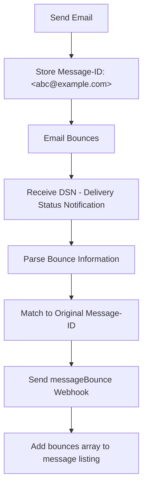

<!--
SOURCES:
- docs/usage/bounces.md
- sources/blog/2022-10-12-tracking-bounces.md
This guide covers EmailEngine's automatic bounce detection and tracking capabilities.
-->

# Bounce Detection and Handling

EmailEngine automatically detects and tracks email bounces, providing detailed bounce information through webhooks and message listings. Learn how to handle bounce notifications and maintain email list hygiene.

## Overview

Email bounces occur when a sent message cannot be delivered to the recipient. EmailEngine monitors incoming emails for bounce responses and extracts detailed bounce information, including:

- **Recipient address** that bounced
- **Bounce type** (hard bounce, soft bounce)
- **Error message** from the receiving server
- **Original message** headers and content
- **SMTP status codes** and diagnostic information

Note: EmailEngine does not use [VERP addresses](https://en.wikipedia.org/wiki/Variable_envelope_return_path). It detects bounces by parsing standard bounce message formats sent by mail servers.

## How Bounce Detection Works

EmailEngine continuously monitors the inbox for bounce messages (Delivery Status Notifications - DSN). When a bounce is detected:

1. **Parse Bounce Message** - Extract bounce information from DSN format
2. **Match Original Message** - Link bounce to sent message via Message-ID
3. **Send Webhook** - Deliver `messageBounce` webhook to your application
4. **Add to Message** - Attach bounce data to sent message in listings

### Bounce Detection Flow



## Bounce Types

### Hard Bounces

Permanent delivery failures that will not succeed on retry:

- **User unknown** - Email address doesn't exist
- **Domain not found** - Domain doesn't exist or has no MX records
- **Mailbox full** - Recipient's mailbox is over quota (often permanent)
- **Account disabled** - Recipient account has been closed

**Example error messages:**
```
550 No such user here
550 5.1.1 User unknown
550 Requested action not taken: mailbox unavailable
```

### Soft Bounces

Temporary delivery failures that might succeed on retry:

- **Mailbox temporarily unavailable** - Server issues
- **Message too large** - Exceeds recipient's size limit
- **Spam filter rejection** - Message blocked by content filter
- **Rate limiting** - Too many messages sent too quickly

**Example error messages:**
```
450 4.2.1 The user you are trying to contact is receiving mail too quickly
452 4.2.2 The email account that you tried to reach is over quota
```

### Bounce Action Codes

EmailEngine includes the DSN action code:

- `failed` - Permanent failure (hard bounce)
- `delayed` - Temporary failure (soft bounce)
- `delivered` - Successfully delivered (not a bounce)
- `relayed` - Relayed to another server
- `expanded` - Mailing list expansion

## Sending Email and Tracking Bounces

### Send an Email

Send an email and capture the Message-ID:

```bash
curl -XPOST "https://emailengine.example.com/v1/account/john@example.com/submit" \
  -H "Authorization: Bearer YOUR_TOKEN" \
  -H "Content-Type: application/json" \
  -d '{
    "to": {
      "address": "unknown@ethereal.email"
    },
    "subject": "Test message",
    "text": "This email should bounce!"
  }'
```

Response includes the Message-ID needed to track bounces:

```json
{
  "response": "Queued for delivery",
  "messageId": "<3e013ba5-3bd2-a5f6-b102-5997c7d4d843@example.com>",
  "sendAt": "2024-10-13T12:10:34.845Z",
  "queueId": "183cc1a89ddfe365bbb"
}
```

**Save this `messageId` value** - you'll need it to correlate bounce notifications.

### Receive Bounce Webhook

When the email bounces, EmailEngine sends a `messageBounce` webhook:

```json
{
  "serviceUrl": "https://emailengine.example.com",
  "account": "john@example.com",
  "date": "2024-10-13T12:10:40.980Z",
  "event": "messageBounce",
  "data": {
    "bounceMessage": "AAAADAAAByc",
    "recipient": "unknown@ethereal.email",
    "action": "failed",
    "response": {
      "source": "smtp",
      "message": "550 No such user here",
      "status": "5.0.0"
    },
    "mta": "mx.ethereal.email",
    "queueId": "B7D3F8220C",
    "messageId": "<3e013ba5-3bd2-a5f6-b102-5997c7d4d843@example.com>",
    "messageHeaders": {
      "return-path": ["<john@example.com>"],
      "content-type": ["text/plain; charset=utf-8"],
      "from": ["John Doe <john@example.com>"],
      "to": ["unknown@ethereal.email"],
      "subject": ["Test message"],
      "message-id": ["<3e013ba5-3bd2-a5f6-b102-5997c7d4d843@example.com>"],
      "date": ["Wed, 12 Oct 2022 12:10:34 +0000"]
    }
  }
}
```

### Webhook Payload Fields

| Field | Description |
|-------|-------------|
| `bounceMessage` | ID of the bounce notification message |
| `recipient` | Email address that bounced |
| `action` | DSN action: `failed`, `delayed`, etc. |
| `response.message` | Error message from receiving server |
| `response.status` | SMTP status code (e.g., `5.0.0`) |
| `response.source` | Source of error: `smtp`, `dns`, etc. |
| `mta` | Hostname of the MTA that generated the bounce |
| `queueId` | Queue ID from the bouncing MTA |
| `messageId` | Message-ID of the original sent email |
| `messageHeaders` | Original email headers |

## Checking Bounce Information

### Via Message Listing

Bounce information is also attached to sent messages in folder listings.

List sent messages:

```bash
curl "https://emailengine.example.com/v1/account/john@example.com/messages?path=Sent" \
  -H "Authorization: Bearer YOUR_TOKEN"
```

Messages with bounces include a `bounces` array:

```json
{
  "total": 472,
  "page": 0,
  "pages": 24,
  "messages": [
    {
      "id": "AAAABgAAAdk",
      "uid": 473,
      "date": "2024-10-13T12:10:34.000Z",
      "subject": "Test message",
      "from": {
        "name": "John Doe",
        "address": "john@example.com"
      },
      "to": [
        {
          "address": "unknown@ethereal.email"
        }
      ],
      "bounces": [
        {
          "message": "AAAADAAAByc",
          "recipient": "unknown@ethereal.email",
          "action": "failed",
          "response": {
            "message": "550 No such user here",
            "status": "5.0.0"
          },
          "date": "2024-10-13T12:10:40.003Z"
        }
      ]
    }
  ]
}
```

**Why an array?** Each email can have multiple recipients, and each can bounce with different errors.

### Via API Query

Get bounce information for a specific message:

```bash
curl "https://emailengine.example.com/v1/account/john@example.com/message/AAAABgAAAdk" \
  -H "Authorization: Bearer YOUR_TOKEN"
```

Response includes full bounce details in the `bounces` array.

## Handling Bounces in Your Application

### Implementation Example

```
// Pseudo code - implement in your preferred language

// Store sent message IDs
sent_messages = {}

// Send email
function send_email(to, subject, text):
  // Make HTTP POST request
  response = HTTP_POST(
    'https://emailengine.example.com/v1/account/john@example.com/submit',
    headers={
      'Authorization': 'Bearer YOUR_TOKEN',
      'Content-Type': 'application/json'
    },
    body=JSON_ENCODE({
      to: { address: to },
      subject: subject,
      text: text
    })
  )

  data = PARSE_JSON(response.body)

  // Store message ID for bounce tracking
  sent_messages[data.messageId] = {
    to: to,
    subject: subject,
    sentAt: CURRENT_TIMESTAMP(),
    bounced: false
  }

  return data.messageId
end function

// Webhook endpoint
function handle_webhook(request):
  webhook = request.body

  if webhook.event == 'messageBounce':
    message_id = webhook.data.messageId
    recipient = webhook.data.recipient
    action = webhook.data.action
    error_msg = webhook.data.response.message

    // Find original sent message
    sent_message = sent_messages[message_id]

    if sent_message exists:
      PRINT('Bounce detected for ' + recipient)
      PRINT('Original subject: ' + sent_message.subject)
      PRINT('Bounce type: ' + action)
      PRINT('Error: ' + error_msg)

      // Mark as bounced
      sent_message.bounced = true
      sent_message.bounceReason = error_msg
      sent_message.bounceAction = action

      // Handle hard bounces
      if action == 'failed':
        PRINT('Hard bounce - removing ' + recipient + ' from list')
        CALL remove_from_mailing_list(recipient)
      end if

      // Handle soft bounces
      if action == 'delayed':
        PRINT('Soft bounce - retry ' + recipient + ' later')
        CALL schedule_retry(recipient, sent_message.subject)
      end if
    end if
  end if

  RESPOND(200, { success: true })
end function

function remove_from_mailing_list(email):
  // Remove from your database
  DATABASE_UPDATE(
    table='mailing_list',
    where={ email: email },
    set={ status: 'bounced', bouncedAt: CURRENT_TIMESTAMP() }
  )
end function

function schedule_retry(email, subject):
  // Schedule retry for soft bounces
  retry_time = CURRENT_TIMESTAMP() + 3600  // Retry in 1 hour

  DATABASE_INSERT(
    table='retry_queue',
    values={
      email: email,
      subject: subject,
      retryAt: retry_time
    }
  )
end function
```

### Python Example

```python
from flask import Flask, request, jsonify
import requests
from datetime import datetime

app = Flask(__name__)

sent_messages = {}

def send_email(to, subject, text):
    """Send email and track Message-ID"""
    response = requests.post(
        'https://emailengine.example.com/v1/account/john@example.com/submit',
        headers={
            'Authorization': 'Bearer YOUR_TOKEN',
            'Content-Type': 'application/json'
        },
        json={
            'to': {'address': to},
            'subject': subject,
            'text': text
        }
    )

    data = response.json()
    message_id = data['messageId']

    # Store for bounce tracking
    sent_messages[message_id] = {
        'to': to,
        'subject': subject,
        'sent_at': datetime.now(),
        'bounced': False
    }

    return message_id

@app.route('/webhooks/emailengine', methods=['POST'])
def webhook_handler():
    webhook = request.json

    if webhook['event'] == 'messageBounce':
        data = webhook['data']
        message_id = data['messageId']
        recipient = data['recipient']
        action = data['action']
        error = data['response']['message']

        # Find original message
        sent_message = sent_messages.get(message_id)

        if sent_message:
            print(f"Bounce detected for {recipient}")
            print(f"Error: {error}")

            # Mark as bounced
            sent_message['bounced'] = True
            sent_message['bounce_reason'] = error

            # Handle hard bounces
            if action == 'failed':
                remove_from_mailing_list(recipient)

            # Handle soft bounces
            if action == 'delayed':
                schedule_retry(recipient, sent_message['subject'])

    return jsonify({'success': True})

def remove_from_mailing_list(email):
    """Remove bounced email from mailing list"""
    # Update your database
    pass

def schedule_retry(email, subject):
    """Schedule retry for soft bounce"""
    # Add to retry queue
    pass

if __name__ == '__main__':
    app.run(port=3000)
```

### PHP Example

```php
<?php
// send-email.php

function sendEmail($to, $subject, $text) {
    $data = [
        'to' => ['address' => $to],
        'subject' => $subject,
        'text' => $text
    ];

    $ch = curl_init('https://emailengine.example.com/v1/account/john@example.com/submit');
    curl_setopt($ch, CURLOPT_RETURNTRANSFER, true);
    curl_setopt($ch, CURLOPT_POST, true);
    curl_setopt($ch, CURLOPT_POSTFIELDS, json_encode($data));
    curl_setopt($ch, CURLOPT_HTTPHEADER, [
        'Authorization: Bearer YOUR_TOKEN',
        'Content-Type: application/json'
    ]);

    $response = curl_exec($ch);
    curl_close($ch);

    $result = json_decode($response, true);
    $messageId = $result['messageId'];

    // Store for bounce tracking
    $stmt = $pdo->prepare('INSERT INTO sent_messages (message_id, recipient, subject, sent_at) VALUES (?, ?, ?, NOW())');
    $stmt->execute([$messageId, $to, $subject]);

    return $messageId;
}

// webhook-handler.php

$webhook = json_decode(file_get_contents('php://input'), true);

if ($webhook['event'] === 'messageBounce') {
    $messageId = $webhook['data']['messageId'];
    $recipient = $webhook['data']['recipient'];
    $action = $webhook['data']['action'];
    $error = $webhook['data']['response']['message'];

    // Find original message
    $stmt = $pdo->prepare('SELECT * FROM sent_messages WHERE message_id = ?');
    $stmt->execute([$messageId]);
    $sentMessage = $stmt->fetch();

    if ($sentMessage) {
        error_log("Bounce detected for {$recipient}: {$error}");

        // Mark as bounced
        $stmt = $pdo->prepare('UPDATE sent_messages SET bounced = 1, bounce_reason = ?, bounce_action = ? WHERE message_id = ?');
        $stmt->execute([$error, $action, $messageId]);

        // Handle hard bounces
        if ($action === 'failed') {
            removeFromMailingList($recipient);
        }

        // Handle soft bounces
        if ($action === 'delayed') {
            scheduleRetry($recipient, $sentMessage['subject']);
        }
    }
}

echo json_encode(['success' => true]);

function removeFromMailingList($email) {
    global $pdo;
    $stmt = $pdo->prepare('UPDATE mailing_list SET status = "bounced", bounced_at = NOW() WHERE email = ?');
    $stmt->execute([$email]);
}

function scheduleRetry($email, $subject) {
    global $pdo;
    $stmt = $pdo->prepare('INSERT INTO retry_queue (email, subject, retry_at) VALUES (?, ?, DATE_ADD(NOW(), INTERVAL 1 HOUR))');
    $stmt->execute([$email, $subject]);
}
```

## SMTP Status Codes

Understanding SMTP status codes helps interpret bounces:

### 5.x.x - Permanent Failures (Hard Bounces)

| Code | Description |
|------|-------------|
| 5.1.1 | Bad destination mailbox address (user unknown) |
| 5.1.2 | Bad destination system address (domain not found) |
| 5.2.1 | Mailbox disabled, not accepting messages |
| 5.2.2 | Mailbox full |
| 5.4.4 | Unable to route (no DNS records) |
| 5.7.1 | Delivery not authorized, message refused |

### 4.x.x - Temporary Failures (Soft Bounces)

| Code | Description |
|------|-------------|
| 4.2.1 | Mailbox temporarily unavailable |
| 4.2.2 | Mailbox full (temporary - might clear space) |
| 4.4.1 | Connection timed out |
| 4.7.1 | Delivery temporarily suspended (greylisting) |

### Common Bounce Messages

```
# Hard bounces
550 5.1.1 User unknown
550 5.1.2 Host or domain name not found
550 5.2.1 Mailbox disabled
550 5.2.2 Mailbox full
550 5.7.1 Message rejected due to content

# Soft bounces
450 4.2.1 Mailbox temporarily unavailable
452 4.2.2 Mailbox full
451 4.4.1 Connection timeout
450 4.7.1 Greylisting in effect
```

