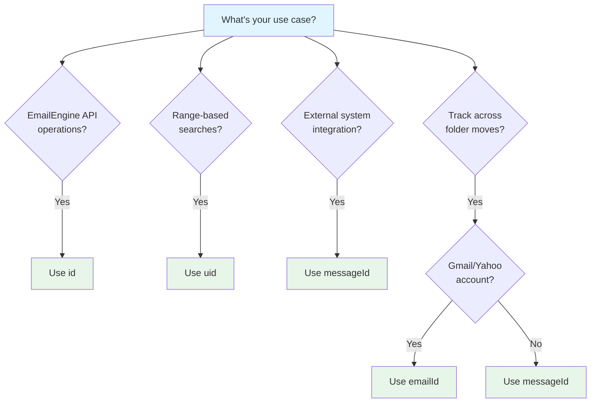

# Message IDs Explained

Learn about EmailEngine's various message identifiers - `id`, `uid`, `emailId`, `messageId`, and sequence numbers - and understand when and why to use each one.


## Overview

If you've used EmailEngine for a while, you've probably noticed an abundance of different message identifiers: `id`, `emailId`, `uid`, `messageId`, and - under the hood - a sequence number.

**Why so many identifiers?**

The answer lies in 40 years of IMAP evolution and backward compatibility. Each identifier serves a distinct role for different use cases.

## Quick Reference

| Identifier    | Stability     | Scope           | Use Case                                   |
| ------------- | ------------- | --------------- | ------------------------------------------ |
| **id**        | Within folder | EmailEngine API | Primary identifier for API requests        |
| **uid**       | Within folder | IMAP folder     | Range searches, IMAP operations            |
| **emailId**   | Permanent     | Email entity    | Tracking across folders (Gmail/Yahoo only) |
| **messageId** | Permanent     | Global          | Integration with external systems          |
| **Sequence**  | Session only  | IMAP internal   | IMAP protocol (not exposed)                |

## The `id` Property

### What It Is

The `id` is EmailEngine's primary identifier for API requests.

**Example**: `"AAAADAAAB40"`

### Characteristics

- **Stable within folder**: Never changes while message remains in the same folder
- **Changes on move**: Moving to another folder assigns a new `id`
- **Encoded identifier**: Internally encodes folder path, `UIDValidity`, and `uid`
- **API-friendly**: Short, URL-safe string

### When to Use

Use `id` for most EmailEngine API operations:

```bash
# Get message details
GET /v1/account/{account}/message/{id}

# Delete message
DELETE /v1/account/{account}/message/{id}

# Move message
PUT /v1/account/{account}/message/{id}/move
```

### How It Works

EmailEngine encodes three components into the `id`:

1. **Folder path**: Which folder contains the message
2. **UIDValidity**: IMAP folder version identifier
3. **uid**: IMAP unique identifier within folder

This encoding allows EmailEngine to locate the message on the IMAP server quickly.

### Important Limitations

**Old IDs become invalid after moves**:

```javascript
// Get message in INBOX
const message = await getMessage("account1", "AAAADAAAB40");
// id: AAAADAAAB40, path: "INBOX"

// Move to Archive
await moveMessage("account1", "AAAADAAAB40", "Archive");

// Original ID is now invalid!
// GET /v1/account/account1/message/AAAADAAAB40
// Returns 404 - message not found

// Must use new ID from move response
const newId = moveResponse.id; // New ID in Archive folder
```

**Workaround**: Use `emailId` or `messageId` for cross-folder tracking.

## The `uid` Property

### What It Is

The IMAP **Unique Identifier** (UID) is an auto-incrementing integer within each folder.

**Example**: `2240`

### Characteristics

- **Folder-specific**: Each folder has its own UID sequence
- **Auto-incrementing**: New messages get higher UIDs than existing ones
- **Never reused**: Deleted UIDs cannot be reassigned within the same folder
- **Changes on move**: Moving to another folder assigns a new UID
- **IMAP only**: UIDs are an IMAP protocol concept and are not available for API backends

:::warning IMAP Only
UID is a native IMAP protocol concept. API backends (Gmail API, MS Graph) do not support UIDs, so range-based searches using `uid` are not available for accounts connected via OAuth2 API backends. For API accounts, use `id` or provider-specific identifiers like `emailId`.
:::

### When to Use

Use `uid` for range-based operations (IMAP accounts only):

```json
{
  "search": {
    "uid": "100:500"
  }
}
```

This searches all messages with UID values from 100 to 500.

### How It Works

Think of `uid` as a database table's auto-incrementing primary key:

**Folder: INBOX (UIDValidity: 123456)**

| UID | Subject  | From    | Notes |
|-----|----------|---------|-------|
| 100 | Hello    | john@   | |
| 101 | Welcome  | jane@   | |
| 105 | Update   | bob@    | UIDs 102-104 were deleted |
| 106 | Reminder | alice@  | |

**Key point**: UIDs 102-104 were deleted and will never be reused in this folder.

### UID and Folder Moves

When you move a message:

1. Original UID is deleted (becomes invalid)
2. Message appears in destination folder with new UID
3. Both old and new UIDs are unique and never reused

**Example: Move message UID 105 from INBOX to Archive**

| Folder | Before Move | After Move |
|--------|-------------|------------|
| **INBOX** | UID 105 (to be moved) | UID 106<br/>UID 107 |
| **Archive** | UID 50<br/>UID 51 | UID 50<br/>UID 51<br/>UID 52 (same message, new UID) |

**What happened:**
- INBOX: UID 105 was deleted
- Archive: Message appeared as new UID 52

## The `emailId` Property

### What It Is

A **stable identifier for the email entity itself** that never changes, even when moved or copied.

**Example**: `"187a29df5a2"`

### Characteristics

- **Permanent**: Never changes throughout email's lifetime
- **Cross-folder**: Same ID for all copies of the message
- **Provider-specific**: Requires special IMAP extensions
- **Limited availability**: Gmail, Yahoo, Fastmail, some others

### When to Use

Use `emailId` when you need to track messages across folders:

```javascript
// Track message regardless of folder location
const message1 = await getMessage("account1", id1);
const message2 = await getMessage("account1", id2);

if (message1.emailId === message2.emailId) {
  console.log("Same email in different folders");
}
```

### Availability

**Supported providers**:

- Gmail (via X-GM-MSGID)
- Yahoo
- Fastmail
- iCloud (sometimes)
- Some modern IMAP servers

**Not supported**:

- Microsoft Exchange
- Most traditional IMAP servers
- Self-hosted email servers (unless using specific extensions)

**Checking availability**:

```javascript
if (message.emailId) {
  // Use emailId for tracking
} else {
  // Fall back to messageId
}
```

### Example: Cross-Folder Tracking

```javascript
// User moves email from INBOX to Archive
// Webhook 1: messageDeleted from INBOX
{
  "event": "messageDeleted",
  "path": "INBOX",
  "data": {
    "id": "AAAADAAAB40",
    "emailId": "187a29df5a2"
  }
}

// Webhook 2: messageNew in Archive
{
  "event": "messageNew",
  "path": "Archive",
  "data": {
    "id": "AAAAFAAAC12",  // Different id
    "emailId": "187a29df5a2"  // Same emailId!
  }
}

// Can detect this is a move, not delete+new
```

## The `messageId` Property

### What It Is

The value from the email's `Message-ID` header, intended to be globally unique.

**Example**: `"<01000187a29df5a2@example.com>"`

### Characteristics

- **From email header**: Standard RFC 5322 Message-ID header
- **Globally unique** (in theory): Intended to be unique across all emails
- **Permanent**: Never changes
- **Not enforced**: Senders can reuse IDs or omit them
- **Universally available**: Present in all standard emails

### When to Use

Use `messageId` for:

1. **Integration with external systems**: Many systems use Message-ID
2. **Deduplication**: Detect duplicate email processing
3. **Thread tracking**: Link to `inReplyTo` and `references` headers
4. **CRM integrations**: Track emails across multiple accounts

### Example: Deduplication

```javascript
const processedIds = new Set();

function processWebhook(webhook) {
  const messageId = webhook.data.messageId;

  // Skip if no messageId (spam indicator)
  if (!messageId) {
    return;
  }

  // Check if already processed
  if (processedIds.has(messageId)) {
    console.log("Duplicate - already processed");
    return;
  }

  // Process email
  processedIds.add(messageId);
  handleNewEmail(webhook.data);
}
```

### Reliability Considerations

**Good indicators**:

- Properly formatted: `<unique-id@domain.com>`
- Domain matches sender domain
- Unique across your system

**Spam indicators**:

- Missing Message-ID
- Duplicate Message-ID across different emails
- Malformed format
- Suspiciously generic IDs

```javascript
function isValidMessageId(messageId) {
  if (!messageId) {
    return false; // Missing
  }

  if (!messageId.match(/^<.+@.+>$/)) {
    return false; // Malformed
  }

  // Further validation...
  return true;
}
```

### Searching by Message-ID

Use header search to find emails by Message-ID:

```bash
POST /v1/account/{account}/search
Content-Type: application/json

{
  "search": {
    "header": {
      "Message-ID": "<123@abc.example.com>"
    }
  }
}
```

### Thread Tracking

The `messageId` property works with related headers:

```javascript
{
  "messageId": "<current-message@example.com>",
  "inReplyTo": "<parent-message@example.com>",
  "references": [
    "<original-message@example.com>",
    "<parent-message@example.com>"
  ]
}
```

**Building a thread**:

1. Start with `messageId` of first message
2. Find replies where `inReplyTo` matches
3. Follow `references` chain
4. Build complete conversation thread

## Sequence Numbers

### What They Are

IMAP sequence numbers represent a message's position within a folder (1, 2, 3, ...).

### Characteristics

- **Core to IMAP protocol**: Used internally by IMAP
- **Session-specific**: Can change between sessions
- **Position-based**: Message at position 1, 2, 3, etc.
- **Not stable**: Changes when messages are added/deleted
- **Not exposed**: EmailEngine doesn't expose them through public API

### Why EmailEngine Doesn't Use Them

Sequence numbers are unreliable for API use:

```
INBOX before:           INBOX after delete:
Seq 1: Message A        Seq 1: Message B  ← Was Seq 2!
Seq 2: Message B        Seq 2: Message C  ← Was Seq 3!
Seq 3: Message C        Seq 3: Message D  ← Was Seq 4!
Seq 4: Message D
```

**Problem**: Deleting Seq 1 changes all subsequent sequence numbers.

**Solution**: EmailEngine uses `uid` instead, which never changes.

:::info Internal Implementation
While EmailEngine doesn't expose sequence numbers through the API, it must still handle them internally. IMAP servers push update and delete notifications using sequence numbers (e.g., `123 EXPUNGE` means the message at position 123 was deleted, and message 124 is now 123). EmailEngine maintains sequence-to-UID mappings to correctly translate these notifications into stable UID-based operations.
:::

## Choosing the Right Identifier

### Decision Tree



### Use Case Examples

**1. Display message in UI**

```javascript
// User clicks message in inbox
const messageId = "AAAADAAAB40"; // From list API

// Fetch full details
const message = await fetch(`/v1/account/${account}/message/${messageId}`);

// Display to user
showMessage(message);
```

**Use**: `id`

**2. Sync messages to database**

```javascript
// Initial sync
const messages = await listMessages(account, "INBOX");

messages.forEach((msg) => {
  db.upsert({
    account: account,
    messageId: msg.messageId, // Primary key
    emailId: msg.emailId || null,
    subject: msg.subject,
    // ... other fields
  });
});
```

**Use**: `messageId` (primary), `emailId` (if available)

**3. Track email in CRM**

```javascript
// New email webhook
function handleWebhook(webhook) {
  const messageId = webhook.data.messageId;

  // Check if already in CRM
  const existing = crm.findEmail(messageId);

  if (existing) {
    // Update existing record
    crm.updateEmail(messageId, webhook.data);
  } else {
    // Create new record
    crm.createEmail(messageId, webhook.data);
  }
}
```

**Use**: `messageId`

**4. Detect folder moves**

```javascript
// Gmail/Yahoo account
function handleMessageDeleted(webhook) {
  const emailId = webhook.data.emailId;

  // Wait briefly for messageNew event
  setTimeout(() => {
    const newLocation = findByEmailId(emailId);

    if (newLocation) {
      console.log("Message moved to:", newLocation.path);
    } else {
      console.log("Message permanently deleted");
    }
  }, 1000);
}
```

**Use**: `emailId` (Gmail/Yahoo only)

**5. Bulk operations**

```bash
# Delete all messages with UID between 100 and 500
PUT /v1/account/{account}/messages/delete

{
  "search": {
    "uid": "100:500"
  }
}
```

**Use**: `uid`

## Common Pitfalls

### 1. Reusing Old IDs After Moves

```javascript
// WRONG
const message = await getMessage(account, oldId);
await moveMessage(account, oldId, "Archive");

// Try to update (will fail!)
await updateMessage(account, oldId, { seen: true });
// Error: Message not found

// CORRECT
const moveResponse = await moveMessage(account, oldId, "Archive");
const newId = moveResponse.id;

await updateMessage(account, newId, { seen: true });
```

### 2. Assuming emailId is Always Available

```javascript
// WRONG
function trackMessage(message) {
  db.save({
    id: message.emailId, // undefined for most providers!
    // ...
  });
}

// CORRECT
function trackMessage(message) {
  const trackingId = message.emailId || message.messageId || message.id;
  db.save({
    id: trackingId,
    // ...
  });
}
```

### 3. Not Validating messageId

```javascript
// WRONG - spam emails might have no messageId
processedIds.add(message.messageId); // Adds 'undefined'!

// CORRECT
if (message.messageId) {
  processedIds.add(message.messageId);
} else {
  console.log("Skipping email with no Message-ID (likely spam)");
}
```

## Summary

| Identifier    | When to Use                 | Stability            | Availability         |
| ------------- | --------------------------- | -------------------- | -------------------- |
| **id**        | EmailEngine API calls       | Stable within folder | Always               |
| **uid**       | Range searches, IMAP ops    | Stable within folder | IMAP only            |
| **emailId**   | Cross-folder tracking       | Permanent            | Gmail/Yahoo/Fastmail |
| **messageId** | External integration, dedup | Permanent            | Almost always        |
| **Sequence**  | Don't use                   | Session-only         | Internal only        |

**General guidance**:

- **Use `id`** for most EmailEngine API operations
- **Use `uid`** for range-based searches
- **Use `emailId`** for cross-folder tracking (if available)
- **Use `messageId`** for external integration and deduplication
- **Store all identifiers** in your database for maximum flexibility
