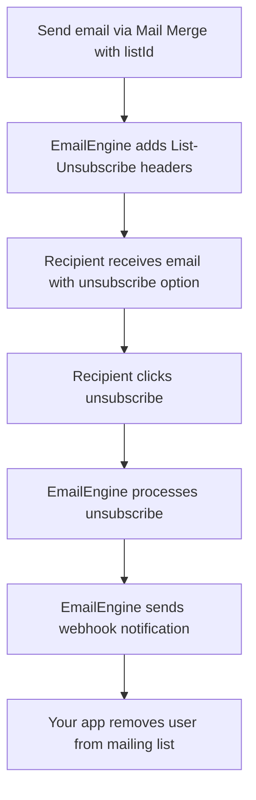

<!--
SOURCE: docs/usage/virtual-mailing-lists.md
This guide covers EmailEngine's virtual mailing lists feature for List-Unsubscribe support.
-->

# Virtual Mailing Lists

EmailEngine's virtual mailing lists provide List-Unsubscribe functionality for bulk email campaigns without requiring a full-featured mailing list manager. Focus on your core application while EmailEngine handles unsubscribe management.

## Overview

### What Are Virtual Mailing Lists?

Virtual mailing lists are a lightweight feature that provides **only** the unsubscribe functionality:

**What's included:**
- `List-Unsubscribe` header generation
- Unsubscribe link hosting
- One-click unsubscribe (RFC 8058)
- Unsubscribe webhook notifications

**What's NOT included:**
- Contact list management
- Segmentation rules
- Sending history
- Analytics and reporting
- Bounce management
- Template management

Virtual lists are perfect when you already have contact management in your application but need to comply with unsubscribe requirements for bulk emails.

### Why Use Virtual Lists?

**Legal compliance:**
- Required by CAN-SPAM Act (USA)
- Required by GDPR (EU)
- Required by CASL (Canada)
- Expected by email service providers

**Deliverability benefits:**
- Gmail requires List-Unsubscribe for bulk senders
- Improves sender reputation
- Reduces spam complaints
- Better inbox placement

**User experience:**
- One-click unsubscribe in email clients
- No need to visit external website
- Instant unsubscribe processing

## How It Works

### Sending Flow



### List-Unsubscribe Headers

EmailEngine automatically adds these headers to emails sent with a `listId`:

```
List-Unsubscribe: <https://emailengine.app/unsubscribe/abc123>, <mailto:unsubscribe@example.com?subject=unsubscribe>
List-Unsubscribe-Post: List-Unsubscribe=One-Click
```

**Two unsubscribe methods:**

1. **One-Click (HTTPS)** - Preferred by Gmail, instant processing
2. **Mailto** - Fallback for older email clients

## Sending Emails with Virtual Lists

### Basic Mail Merge with listId

Use [Mail Merge](/docs/sending/mail-merge) with a `listId` parameter:

```bash
curl -XPOST "http://localhost:3000/v1/account/sender@example.com/submit" \
  -H "Authorization: Bearer YOUR_TOKEN" \
  -H "Content-Type: application/json" \
  -d '{
    "subject": "Weekly Newsletter - {{date}}",
    "text": "Hello {{name}},\n\nHere is this week'\''s newsletter...\n\n{{content}}",
    "listId": "newsletter-weekly",
    "mergeList": [
      {
        "to": {"address": "john@example.com"},
        "params": {
          "name": "John",
          "date": "October 13, 2024",
          "content": "Newsletter content here..."
        }
      },
      {
        "to": {"address": "jane@example.com"},
        "params": {
          "name": "Jane",
          "date": "October 13, 2024",
          "content": "Newsletter content here..."
        }
      }
    ]
  }'
```

**Key field:** `listId` - Identifies this as a virtual mailing list campaign.

### Implementation Example

```
// Pseudo code - implement in your preferred language

function send_newsletter(recipients, subject, content):
  // Build merge list
  merge_list = []

  for each recipient in recipients:
    APPEND(merge_list, {
      to: { address: recipient.email },
      params: {
        name: recipient.name,
        date: FORMAT_DATE(CURRENT_DATE())
      }
    })
  end for

  // Make HTTP POST request
  response = HTTP_POST(
    'http://localhost:3000/v1/account/sender@example.com/submit',
    headers={
      'Authorization': 'Bearer YOUR_TOKEN',
      'Content-Type': 'application/json'
    },
    body=JSON_ENCODE({
      subject: subject,
      text: content,
      listId: 'newsletter-weekly',  // Enable virtual list
      mergeList: merge_list
    })
  )

  return PARSE_JSON(response.body)
end function

// Usage
send_newsletter(
  [
    { email: 'john@example.com', name: 'John' },
    { email: 'jane@example.com', name: 'Jane' }
  ],
  'Weekly Newsletter',
  'Hello {{name}}, here is your newsletter for {{date}}...'
)
```

### Python Example

```python
import requests

def send_newsletter(recipients, subject, content):
    response = requests.post(
        'http://localhost:3000/v1/account/sender@example.com/submit',
        headers={
            'Authorization': 'Bearer YOUR_TOKEN',
            'Content-Type': 'application/json'
        },
        json={
            'subject': subject,
            'text': content,
            'listId': 'newsletter-weekly',
            'mergeList': [
                {
                    'to': {'address': r['email']},
                    'params': {
                        'name': r['name'],
                        'date': '2024-10-13'
                    }
                }
                for r in recipients
            ]
        }
    )

    return response.json()

# Usage
send_newsletter(
    [
        {'email': 'john@example.com', 'name': 'John'},
        {'email': 'jane@example.com', 'name': 'Jane'}
    ],
    'Weekly Newsletter',
    'Hello {{name}}, here is your newsletter for {{date}}...'
)
```

### PHP Example

```php
<?php

function sendNewsletter($recipients, $subject, $content) {
    $mergeList = array_map(function($recipient) {
        return [
            'to' => ['address' => $recipient['email']],
            'params' => [
                'name' => $recipient['name'],
                'date' => date('Y-m-d')
            ]
        ];
    }, $recipients);

    $data = [
        'subject' => $subject,
        'text' => $content,
        'listId' => 'newsletter-weekly',
        'mergeList' => $mergeList
    ];

    $ch = curl_init('http://localhost:3000/v1/account/sender@example.com/submit');
    curl_setopt($ch, CURLOPT_RETURNTRANSFER, true);
    curl_setopt($ch, CURLOPT_POST, true);
    curl_setopt($ch, CURLOPT_POSTFIELDS, json_encode($data));
    curl_setopt($ch, CURLOPT_HTTPHEADER, [
        'Authorization: Bearer YOUR_TOKEN',
        'Content-Type: application/json'
    ]);

    $response = curl_exec($ch);
    curl_close($ch);

    return json_decode($response, true);
}

// Usage
sendNewsletter(
    [
        ['email' => 'john@example.com', 'name' => 'John'],
        ['email' => 'jane@example.com', 'name' => 'Jane']
    ],
    'Weekly Newsletter',
    'Hello {{name}}, here is your newsletter for {{date}}...'
);
```

## Handling Unsubscribes

### Unsubscribe Webhook

When a recipient unsubscribes, EmailEngine sends a webhook notification:

```json
{
  "serviceUrl": "https://emailengine.example.com",
  "account": "sender@example.com",
  "date": "2024-10-13T14:23:45.678Z",
  "event": "listUnsubscribe",
  "data": {
    "listId": "newsletter-weekly",
    "recipient": "john@example.com",
    "method": "https",
    "timestamp": "2024-10-13T14:23:45.678Z"
  }
}
```

**Webhook fields:**

| Field | Description |
|-------|-------------|
| `event` | Always `listUnsubscribe` |
| `data.listId` | The list ID from the original email |
| `data.recipient` | Email address that unsubscribed |
| `data.method` | Unsubscribe method: `https` (one-click) or `mailto` |
| `data.timestamp` | When unsubscribe occurred |

### Webhook Handler Example

```
// Pseudo code - implement in your preferred language

function handle_webhook(request):
  webhook = request.body

  if webhook.event == 'listUnsubscribe':
    list_id = webhook.data.listId
    recipient = webhook.data.recipient
    method = webhook.data.method

    PRINT('Unsubscribe: ' + recipient + ' from list ' + list_id + ' via ' + method)

    // Remove from your database
    DATABASE_UPDATE(
      table='mailing_list',
      where={ email: recipient, listId: list_id },
      set={ subscribed: false, unsubscribedAt: CURRENT_TIMESTAMP() }
    )

    // Log unsubscribe
    DATABASE_INSERT(
      table='unsubscribe_logs',
      values={
        email: recipient,
        listId: list_id,
        method: method,
        unsubscribedAt: CURRENT_TIMESTAMP()
      }
    )

    // Send confirmation email (optional)
    CALL send_unsubscribe_confirmation(recipient, list_id)

    PRINT('Successfully unsubscribed ' + recipient + ' from ' + list_id)
  end if

  RESPOND(200, { success: true })
end function

function send_unsubscribe_confirmation(email, list_id):
  HTTP_POST(
    'http://localhost:3000/v1/account/sender@example.com/submit',
    headers={
      'Authorization': 'Bearer YOUR_TOKEN',
      'Content-Type': 'application/json'
    },
    body=JSON_ENCODE({
      to: { address: email },
      subject: 'Unsubscribe Confirmation',
      text: 'You have been unsubscribed from ' + list_id + '. You will no longer receive these emails.'
    })
  )
end function
```

### Python Webhook Handler

```python
from flask import Flask, request, jsonify
from datetime import datetime

app = Flask(__name__)

@app.route('/webhooks/emailengine', methods=['POST'])
def webhook_handler():
    webhook = request.json

    if webhook['event'] == 'listUnsubscribe':
        data = webhook['data']
        list_id = data['listId']
        recipient = data['recipient']
        method = data['method']

        print(f"Unsubscribe: {recipient} from {list_id} via {method}")

        # Update database
        db.mailing_list.update(
            {'email': recipient, 'listId': list_id},
            {'subscribed': False, 'unsubscribedAt': datetime.now()}
        )

        # Log unsubscribe
        db.unsubscribe_logs.insert({
            'email': recipient,
            'listId': list_id,
            'method': method,
            'unsubscribedAt': datetime.now()
        })

        print(f"Successfully unsubscribed {recipient}")

    return jsonify({'success': True})

if __name__ == '__main__':
    app.run(port=3000)
```

### PHP Webhook Handler

```php
<?php
// webhook-handler.php

$webhook = json_decode(file_get_contents('php://input'), true);

if ($webhook['event'] === 'listUnsubscribe') {
    $listId = $webhook['data']['listId'];
    $recipient = $webhook['data']['recipient'];
    $method = $webhook['data']['method'];

    error_log("Unsubscribe: {$recipient} from {$listId} via {$method}");

    // Update database
    $stmt = $pdo->prepare('UPDATE mailing_list SET subscribed = 0, unsubscribed_at = NOW() WHERE email = ? AND list_id = ?');
    $stmt->execute([$recipient, $listId]);

    // Log unsubscribe
    $stmt = $pdo->prepare('INSERT INTO unsubscribe_logs (email, list_id, method, unsubscribed_at) VALUES (?, ?, ?, NOW())');
    $stmt->execute([$recipient, $listId, $method]);

    error_log("Successfully unsubscribed {$recipient}");
}

echo json_encode(['success' => true]);
```

## List Management

### Multiple Lists

Use different `listId` values for different campaigns:

```
// Pseudo code - implement in your preferred language

CALL send_email({ listId: 'newsletter-weekly' })
CALL send_email({ listId: 'newsletter-monthly' })
CALL send_email({ listId: 'product-updates' })
CALL send_email({ listId: 'promotional' })
```

### Subscribe Management in Your App

Keep subscription status in your database:

```sql
CREATE TABLE mailing_list (
  id SERIAL PRIMARY KEY,
  email VARCHAR(255) NOT NULL,
  list_id VARCHAR(100) NOT NULL,
  subscribed BOOLEAN DEFAULT true,
  subscribed_at TIMESTAMP DEFAULT CURRENT_TIMESTAMP,
  unsubscribed_at TIMESTAMP NULL,
  UNIQUE(email, list_id)
);

CREATE INDEX idx_subscribed ON mailing_list(email, list_id, subscribed);
```

### Query Subscribers

```
// Pseudo code - implement in your preferred language

function get_subscribers(list_id):
  return DATABASE_FIND(
    table='mailing_list',
    where={ listId: list_id, subscribed: true }
  )
end function

function is_subscribed(email, list_id):
  subscriber = DATABASE_FIND_ONE(
    table='mailing_list',
    where={ email: email, listId: list_id }
  )

  return subscriber exists AND subscriber.subscribed == true
end function

function unsubscribe(email, list_id):
  DATABASE_UPDATE(
    table='mailing_list',
    where={ email: email, listId: list_id },
    set={ subscribed: false, unsubscribedAt: CURRENT_TIMESTAMP() }
  )
end function
```

### Prevent Sending to Unsubscribed

Filter unsubscribed recipients before sending:

```
// Pseudo code - implement in your preferred language

function send_to_list(list_id, subject, content):
  // Get all subscribers
  all_subscribers = DATABASE_FIND(
    table='mailing_list',
    where={ listId: list_id }
  )

  // Filter only subscribed
  active_subscribers = FILTER(all_subscribers WHERE subscribed == true)

  // Send
  CALL send_newsletter(active_subscribers, subject, content)

  unsubscribed_count = LENGTH(all_subscribers) - LENGTH(active_subscribers)
  PRINT('Sent to ' + LENGTH(active_subscribers) + ' subscribers (' + unsubscribed_count + ' unsubscribed)')
end function
```

## Compliance

### CAN-SPAM Act (USA)

| Requirement | Provided By |
|-------------|-------------|
| Include unsubscribe mechanism | Virtual lists |
| Honor unsubscribes within 10 business days | You must implement |
| Include physical postal address in emails | You must add |
| Identify message as advertisement | You must add if applicable |

### GDPR (EU)

| Requirement | Provided By |
|-------------|-------------|
| Obtain consent before sending | You must implement |
| Provide easy unsubscribe method | Virtual lists |
| Honor unsubscribes immediately | You must implement |
| Keep records of consent and unsubscribes | You must implement |

### CASL (Canada)

| Requirement | Provided By |
|-------------|-------------|
| Obtain express consent | You must implement |
| Include unsubscribe mechanism | Virtual lists |
| Honor unsubscribes within 10 days | You must implement |
| Include sender information | You must add |

## Limitations

### What Virtual Lists Don't Do

**Not a full mailing list manager:**
- [NO] No contact storage
- [NO] No segmentation
- [NO] No sending history
- [NO] No bounce management
- [NO] No analytics/reporting
- [NO] No A/B testing
- [NO] No email templates

**You must implement:**
- Subscriber database
- Subscription forms
- Consent management
- List segmentation
- Send scheduling
- Analytics tracking
- Bounce handling

### When to Use a Full Mailing List Service

Consider a dedicated service (Mailchimp, SendGrid, etc.) if you need:

- Advanced segmentation
- Detailed analytics
- A/B testing
- Template editors
- Automation workflows
- Landing pages
- Signup forms

EmailEngine virtual lists are best when you already have these features in your app and just need compliant unsubscribe handling.
