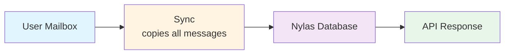
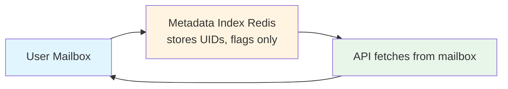

# EmailEngine vs Nylas: Which Email API is Right for You?

Looking for a **Nylas alternative**? This developer-focused comparison covers features, pricing, and deployment options to help you choose the right email API for your project.

:::info Summary

- **Nylas:** Fully managed SaaS with advanced features and higher cost
- **EmailEngine:** Self-hosted solution with flat pricing and data sovereignty

Choose based on your priorities: operational overhead vs control and cost.
:::

## Quick Comparison Table

| Feature                  | EmailEngine                 | Nylas                              |
| ------------------------ | --------------------------- | ---------------------------------- |
| **Hosting**              | Self-hosted                 | Fully managed SaaS                 |
| **Data Storage**         | Metadata only (in Redis)    | Full message copies in Nylas cloud |
| **Pricing Model**        | Flat yearly license         | Per-account (from $1.50/month)     |
| **Setup Time**           | 5-10 minutes                | Instant (signup)                   |
| **Data Residency**       | Your infrastructure         | Nylas cloud                        |
| **Webhook Latency**      | Near-instant                | Similar                            |
| **Read Performance**     | Slightly slower (on-demand) | Very fast (cached)                 |
| **Parallelism**          | Queued per mailbox          | Full parallelism                   |
| **Advanced AI Features** | None                        | Sentiment, categorization, etc.    |
| **Compliance**           | Full control                | SOC 2, ISO 27001                   |
| **Support**              | Community + Direct          | Enterprise support                 |

## Key Architectural Differences

### Hosting Model

**Nylas:**

- Cloud-hosted service
- No infrastructure management
- Automatic scaling
- Geographic availability built-in
- **Trade-off:** Vendor dependency, data leaves your network

**EmailEngine:**

- Self-hosted on your infrastructure
- You manage servers, scaling, backups
- Full control over deployment
- **Trade-off:** Operational responsibility

**Best for:**

- **Nylas:** Teams without DevOps capacity
- **EmailEngine:** Teams with existing infrastructure or strict data requirements

---

### Data Storage Architecture

**Nylas:**

- **Stores:** Complete message copies, attachments, metadata
- **Retention:** 90-day rolling window for IMAP accounts
- **Advantages:** Fast reads, full-text search, offline access
- **Disadvantages:** Data stored on third-party servers

**EmailEngine:**

- **Stores:** Message UIDs, flags, folder structure only
- **Advantages:** Minimal data exposure, no third-party storage
- **Disadvantages:** Slightly slower first-time reads

**Best for:**

- **Nylas:** Performance-critical applications, heavy search
- **EmailEngine:** Privacy-critical applications, compliance requirements

### Concurrent Requests

**Nylas:**

- Fully parallel on Nylas API layer - no queueing
- Multiple threads can read same mailbox simultaneously
- Underlying provider limits still apply (e.g., Microsoft Graph: 4 concurrent connections)

**EmailEngine:**

- One request at a time per mailbox
- Subsequent requests wait in queue
- Direct exposure to IMAP server limits

## Feature Comparison

### Core Email Features

| Feature          | EmailEngine                    | Nylas           |
| ---------------- | ------------------------------ | --------------- |
| IMAP/SMTP        | Yes                            | Yes             |
| Gmail API        | Yes                            | Yes             |
| Outlook/Exchange | Yes                            | Yes             |
| OAuth2           | Yes                            | Yes             |
| Webhooks         | Yes                            | Yes             |
| Send emails      | Yes                            | Yes             |
| Attachments      | Yes                            | Yes             |
| Search           | Yes (IMAP search)              | Yes (Advanced)  |
| Labels/Tags      | Yes                            | Yes             |
| Threading        | Partial (Gmail/MS Graph/Yahoo) | Yes (Universal) |

:::info EmailEngine Threading Support
EmailEngine only provides native threading support for specific providers:

- **Gmail** (IMAP + OAuth2 or Gmail API): Full native threading with `threadId`
- **Microsoft 365** (Graph API only): Full native threading - IMAP backend does NOT support threading
- **Yahoo/AOL/Verizon** (IMAP): Native threading via OBJECTID extension (RFC 8474)
- **Other IMAP providers**: No native threading - must build threads manually from Message-ID headers

Nylas provides universal threading across all email providers by managing thread relationships server-side.

See [Threading Documentation](/docs/sending/threading/provider-support) for details.
:::

### Integration Features

| Feature          | EmailEngine                    | Nylas                         |
| ---------------- | ------------------------------ | ----------------------------- |
| REST API         | Yes                            | Yes                           |
| Webhooks         | Yes                            | Yes                           |
| Webhook retry    | Yes                            | Yes                           |
| Batch operations | Yes (mail merge, bulk updates) | Yes                           |
| Rate limiting    | Configure yourself             | Built-in                      |
| SDKs             | Community                      | Official (multiple languages) |

## Pricing Deep Dive

### EmailEngine Pricing

**Structure:**

- **Annual license:** See [postalsys.com/plans](https://postalsys.com/plans) for current pricing
- **Unlimited mailboxes**
- **Unlimited API calls**
- **Unlimited instances**

**Your costs:**

| Cost Component      | Amount                                                       |
| ------------------- | ------------------------------------------------------------ |
| EmailEngine License | Flat annual fee (see [pricing](https://postalsys.com/plans)) |
| Infrastructure      | Variable (VPS/cloud)                                         |
| DevOps Time         | Variable                                                     |

**Cost scales with infrastructure, not mailbox count.**

---

### Nylas Pricing

:::info Pricing as of 9 December 2025
Pricing may change. Check [nylas.com/pricing](https://www.nylas.com/pricing/) for current rates.
:::

**Pricing Tiers:**

1. **Sandbox (Free)**

   - Cost: $0
   - Accounts: 5 connected accounts
   - Purpose: Testing and development

2. **Calendar Only**

   - Base: $10/month (includes 5 connected accounts)
   - Additional accounts: $1/account/month
   - Features: Calendar sync, scheduling, recurring events

3. **Full Platform**

   - Base: $15/month (includes 5 connected accounts)
   - Additional accounts: $1.50/account/month
   - Features: Email, Calendar, and full communication stack

4. **Custom/Enterprise**
   - Contact sales for volume discounts
   - Features: Full communication suite, dedicated support, uptime guarantees
   - BAA available for HIPAA compliance (contract plans only)

**Cost scales with connected account count.**

:::info Volume Pricing
Enterprise customers can negotiate volume discounts with annual contracts.
:::

---

**Choose Nylas if:**

- You have very few mailboxes (under 20)
- You value zero DevOps time at extremely high premium
- You need advanced AI features (sentiment, categorization)
- You prefer fully managed SaaS

**Choose EmailEngine if:**

- You have 30+ mailboxes
- You have DevOps capacity or existing infrastructure
- Data sovereignty and privacy are priorities
- You want predictable, flat-rate pricing

## Operational Considerations

### Scaling

| Aspect                 | EmailEngine                                        | Nylas                              |
| ---------------------- | -------------------------------------------------- | ---------------------------------- |
| **Vertical Scaling**   | Increase server resources (CPU, RAM)               | Automatic, transparent             |
| **Horizontal Scaling** | NOT SUPPORTED (no built-in coordination)           | Automatic, transparent             |
| **Manual Sharding**    | Possible but complex (separate Redis per instance) | Not needed                         |
| **Bottleneck**         | Usually Redis or network to IMAP servers           | API rate limits (generous)         |
| **Max Scale**          | Several thousand mailboxes per instance            | Hundreds of thousands of mailboxes |
| **Scaling Effort**     | Manual configuration required                      | Zero configuration                 |

**Best for:**

- **EmailEngine:** Small to medium scale (under 5,000 mailboxes per instance)
- **Nylas:** Any scale, especially large enterprises

---

### Data Sovereignty and Compliance

| Aspect                        | EmailEngine             | Nylas                |
| ----------------------------- | ----------------------- | -------------------- |
| **Data Location**             | Your infrastructure     | Nylas cloud          |
| **Encryption Key Control**    | You control             | Nylas controls       |
| **Data Retention Control**    | You control             | Nylas manages        |
| **GDPR Compliance**           | Easier (no third-party) | Yes (with DPA)       |
| **HIPAA Suitable**            | Yes (with proper setup) | Yes (BAA available)  |
| **SOC 2 Type II**             | You must implement      | Certified            |
| **ISO 27001**                 | You must implement      | Certified            |
| **Compliance Implementation** | Your responsibility     | Professional support |
| **Audit Support**             | Self-managed            | Provided             |

**Best for:**

- **EmailEngine:** Strict data residency requirements (banking, healthcare, EU), full data control
- **Nylas:** Need pre-certified compliance, professional audit support

## Use Case Recommendations

### Choose EmailEngine If:

**- You have DevOps capacity**

- In-house infrastructure team
- Comfortable with Docker/Kubernetes
- Can monitor and maintain services

**- Data sovereignty is critical**

- Banking, healthcare, legal
- European companies with GDPR concerns
- Government contracts

**- Cost is a major factor**

- High mailbox count (500+)
- Predictable flat pricing needed
- Limited budget

**- You need real-time webhooks**

- Chat-like applications
- Instant notification requirements
- Time-critical workflows

**- You want source-available code**

- Want to audit and inspect code
- Source code available for review
- Licensed under commercial license (not open source)
- Requires paid subscription to use

---

### Choose Nylas If:

**- Zero DevOps overhead desired**

- Small team focused on product
- No infrastructure expertise
- Want fully managed solution

**- You need advanced AI features**

- Sentiment analysis (native)
- Smart categorization (native)
- Signature extraction (extracts contact data from email signatures)
- Event detection

**- You need parallel performance**

- High concurrent request volume
- Multiple users per mailbox
- Performance-critical application

**- You want enterprise support**

- SLA guarantees
- Dedicated support team
- Professional services
- Compliance documentation

**- You're building a calendar app**

- Calendar API needed
- Scheduler integration
- Complex meeting workflows

## Bottom Line

**EmailEngine is best for:**

- Cost-sensitive deployments
- Data sovereignty requirements
- Real-time webhook needs
- Teams with DevOps capability

**Nylas is best for:**

- Zero-ops preference
- Advanced AI/ML features
- Calendar-heavy applications
- Enterprise compliance needs

**Both are excellent products** - choose based on your specific constraints and priorities, not generic "best" claims.
