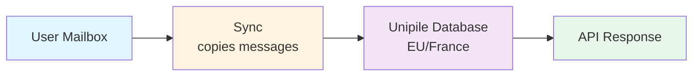
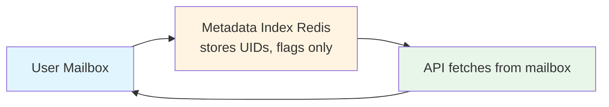

# EmailEngine vs Unipile: Email API Comparison

Comparing **email-focused self-hosted API** (EmailEngine) vs **multi-channel managed service** (Unipile). This guide helps you choose the right solution for your project.

:::info Summary

- **Unipile:** Fully managed SaaS with multi-channel messaging (Email + LinkedIn + WhatsApp)
- **EmailEngine:** Self-hosted email-focused solution with flat pricing and data sovereignty

Choose based on your priorities: multi-channel integration vs control and cost.
:::

## Quick Comparison Table

| Feature                  | EmailEngine                 | Unipile                                 |
| ------------------------ | --------------------------- | --------------------------------------- |
| **Hosting**              | Self-hosted                 | Fully managed SaaS                      |
| **Data Storage**         | Metadata only (in Redis)    | Full message copies in Unipile cloud    |
| **Pricing Model**        | Flat yearly license         | Per-account (3-5 EUR/month)             |
| **Setup Time**           | 5-10 minutes                | Instant (signup)                        |
| **Data Residency**       | Your infrastructure         | EU (France - Scaleway)                  |
| **Multi-Channel**        | Email only                  | Email + LinkedIn + WhatsApp + more      |
| **Calendar**             | No                          | Yes (Google/Outlook only)               |
| **Webhook Latency**      | Near-instant                | Similar                                 |
| **Compliance**           | Full control                | SOC 2, GDPR                             |
| **Support**              | Community + Direct          | Enterprise support                      |

## Key Architectural Differences

### Hosting Model

**Unipile:**

- Cloud-hosted service (SaaS only)
- No infrastructure management
- Automatic scaling
- EU-based data centers (Scaleway, France)
- **Trade-off:** Vendor dependency, no self-hosted option

**EmailEngine:**

- Self-hosted on your infrastructure
- You manage servers, scaling, backups
- Full control over deployment
- **Trade-off:** Operational responsibility

**Best for:**

- **Unipile:** Teams without DevOps capacity, need multi-channel messaging
- **EmailEngine:** Teams with existing infrastructure or strict data requirements

---

### Data Storage Architecture

**Unipile:**

- **Stores:** Message copies, metadata, attachments
- **Location:** EU-based servers (Scaleway, France)
- **Advantages:** Fast reads, unified multi-channel inbox
- **Disadvantages:** Data stored on third-party servers

**EmailEngine:**

- **Stores:** Message UIDs, flags, folder structure only
- **Advantages:** Minimal data exposure, no third-party storage
- **Disadvantages:** Slightly slower first-time reads

**Best for:**

- **Unipile:** Multi-channel communication apps, EU data residency requirements
- **EmailEngine:** Maximum privacy, full data control on your own infrastructure

---

### Scope of Integration

**Unipile:**

- Email (Gmail, Outlook, IMAP)
- LinkedIn messaging (including Recruiter & Sales Navigator)
- WhatsApp (Classic and Business)
- Instagram Direct
- Facebook Messenger
- Calendar (Google, Outlook)
- X (Twitter) messaging

**EmailEngine:**

- Email only (Gmail, Outlook, IMAP/SMTP)
- Deep email protocol integration
- Advanced email features (bounce detection, delivery tracking)

**Best for:**

- **Unipile:** Sales outreach, recruiting, CRM integrations needing multiple channels
- **EmailEngine:** Email-focused applications requiring maximum control

## Feature Comparison

### Core Email Features

| Feature          | EmailEngine                    | Unipile            |
| ---------------- | ------------------------------ | ------------------ |
| IMAP/SMTP        | Yes                            | Yes                |
| Gmail API        | Yes                            | Yes (OAuth2)       |
| Outlook/Exchange | Yes                            | Yes (OAuth2)       |
| OAuth2           | Yes                            | Yes                |
| Webhooks         | Yes                            | Yes                |
| Send emails      | Yes                            | Yes                |
| Attachments      | Yes                            | Yes                |
| Search           | Yes (IMAP search)              | Yes                |
| Labels/Tags      | Yes                            | Yes                |
| Threading        | Partial (Gmail/MS Graph/Yahoo) | Yes                |
| Bounce Detection | Yes                            | No                 |
| Mail Merge       | Yes                            | No                 |
| Templates        | Yes (server-side)              | No                 |

### Beyond Email

| Feature            | EmailEngine | Unipile                  |
| ------------------ | ----------- | ------------------------ |
| LinkedIn Messaging | No          | Yes (full integration)   |
| WhatsApp           | No          | Yes                      |
| Instagram DM       | No          | Yes                      |
| Facebook Messenger | No          | Yes                      |
| Calendar Sync      | No          | Yes (Google/Outlook)     |
| Meeting Scheduling | No          | Yes                      |

### Integration Features

| Feature          | EmailEngine                    | Unipile                       |
| ---------------- | ------------------------------ | ----------------------------- |
| REST API         | Yes                            | Yes (500+ endpoints)          |
| Webhooks         | Yes                            | Yes                           |
| Webhook retry    | Yes                            | Yes                           |
| Batch operations | Yes (mail merge, bulk updates) | Limited                       |
| Rate limiting    | Configure yourself             | No Unipile limits (provider limits apply) |
| SDKs             | Community                      | Official (Node.js, PHP)         |

## Pricing Deep Dive

### EmailEngine Pricing

**Structure:**

- **Annual license:** See [postalsys.com/plans](https://postalsys.com/plans) for current pricing
- **Unlimited mailboxes**
- **Unlimited API calls**
- **Unlimited instances**

**Your costs:**

| Cost Component      | Amount                                                       |
| ------------------- | ------------------------------------------------------------ |
| EmailEngine License | Flat annual fee (see [pricing](https://postalsys.com/plans)) |
| Infrastructure      | Variable (VPS/cloud)                                         |
| DevOps Time         | Variable                                                     |

**Cost scales with infrastructure, not mailbox count.**

---

### Unipile Pricing

:::info Pricing as of 9 December 2025
Pricing may change. Check [unipile.com/pricing-api](https://www.unipile.com/pricing-api/) for current rates.
:::

**Structure:** Per connected account per month with volume discounts.

**Pricing Tiers:**

| Connected Accounts | EUR/Account/Month | USD/Account/Month (approx.) |
| ------------------ | ----------------- | --------------------------- |
| Up to 10           | 49 EUR flat total | ~$55 flat total             |
| 11-50              | 5.00 EUR          | ~$5.50                      |
| 51-200             | 4.50 EUR          | ~$5.00                      |
| 201-1,000          | 4.00 EUR          | ~$4.50                      |
| 1,001-5,000        | 3.50 EUR          | ~$4.00                      |
| 5,001+             | 3.00 EUR          | ~$3.50                      |

**What's Included (All Tiers):**

- All features (Email, LinkedIn, WhatsApp, Calendar, etc.)
- Unlimited API calls
- Real-time webhooks
- Official SDKs
- No commitment required

**Free Trial:**

- 7 days
- All features included
- No credit card required

**Cost scales with connected account count.**

---

**Choose Unipile if:**

- You need multi-channel messaging (LinkedIn, WhatsApp, etc.)
- You want EU-hosted data (GDPR compliance)
- You don't need to self-host
- You're building a CRM, ATS, or sales outreach tool

**Choose EmailEngine if:**

- You only need email integration
- You want to self-host for maximum control
- You have many mailboxes and want predictable flat pricing
- Data must stay on your own infrastructure

## Operational Considerations

### Scaling

| Aspect                 | EmailEngine                                        | Unipile                              |
| ---------------------- | -------------------------------------------------- | ------------------------------------ |
| **Vertical Scaling**   | Increase server resources (CPU, RAM)               | Automatic, transparent               |
| **Horizontal Scaling** | NOT SUPPORTED (no built-in coordination)           | Automatic, transparent               |
| **Bottleneck**         | Usually Redis or network to IMAP servers           | Provider API limits                  |
| **Max Scale**          | Several thousand mailboxes per instance            | Unlimited (provider limits apply)    |
| **Scaling Effort**     | Manual configuration required                      | Zero configuration                   |

**Best for:**

- **EmailEngine:** Small to medium scale (under 5,000 mailboxes per instance)
- **Unipile:** Any scale, especially when multi-channel is needed

---

### Provider Rate Limits

Unipile does not impose its own rate limits, but underlying providers do:

| Provider  | Limit                                              |
| --------- | -------------------------------------------------- |
| Gmail     | 500 emails/day (personal), 2,000/day (Workspace)   |
| LinkedIn  | ~100 connection requests/day, ~150 messages/day    |
| WhatsApp  | ~50 messages/day recommended                       |

EmailEngine exposes you directly to IMAP server limits, which you must manage yourself.

---

### Data Sovereignty and Compliance

| Aspect                        | EmailEngine             | Unipile               |
| ----------------------------- | ----------------------- | --------------------- |
| **Data Location**             | Your infrastructure     | EU (France/Scaleway)  |
| **Encryption Key Control**    | You control             | Unipile controls      |
| **Data Retention Control**    | You control             | Unipile manages       |
| **GDPR Compliance**           | Easier (no third-party) | Yes (EU-hosted)       |
| **SOC 2 Type II**             | You must implement      | Certified             |
| **Compliance Implementation** | Your responsibility     | Professional support  |

**Best for:**

- **EmailEngine:** Maximum data control, no third-party data storage
- **Unipile:** EU data residency requirements with managed compliance

## Use Case Recommendations

### Choose EmailEngine If:

**- You only need email**

- No LinkedIn, WhatsApp, or calendar requirements
- Deep email protocol features needed (bounce detection, mail merge)
- Email-focused application

**- Data sovereignty is critical**

- Banking, healthcare, legal
- Government contracts
- Data must never leave your infrastructure

**- Cost is a major factor**

- High mailbox count (500+)
- Predictable flat pricing needed
- No per-account fees

**- You want source-available code**

- Want to audit and inspect code
- Source code available for review

---

### Choose Unipile If:

**- You need multi-channel messaging**

- LinkedIn outreach automation
- WhatsApp business messaging
- Unified inbox across channels

**- You're building a CRM or ATS**

- Sales outreach tools
- Recruiting platforms
- Customer communication hubs

**- Zero DevOps overhead desired**

- No infrastructure to manage
- Small team focused on product
- Want fully managed solution

**- EU data residency is sufficient**

- GDPR compliance needed
- EU-based data hosting acceptable
- SOC 2 Type II certification required

## Bottom Line

**EmailEngine is best for:**

- Email-only applications
- Self-hosted requirements
- Cost-sensitive deployments with many mailboxes
- Maximum data control

**Unipile is best for:**

- Multi-channel communication (Email + LinkedIn + WhatsApp)
- CRM/ATS/outreach tool development
- EU data residency with managed compliance
- Zero-ops preference

**Key difference:** EmailEngine is email-focused and self-hosted; Unipile is multi-channel and cloud-only. If you only need email and want full control, choose EmailEngine. If you need LinkedIn, WhatsApp, and other channels with managed hosting, choose Unipile.
