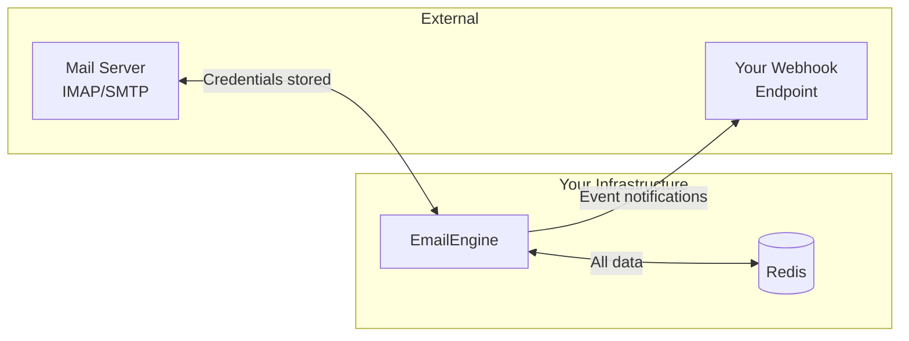

# Compliance and Data Handling

This page documents what data EmailEngine stores, how it handles sensitive information, and guidance for compliance requirements including GDPR and Google OAuth verification.

## Data Storage Overview

### What EmailEngine Stores

EmailEngine stores the following data in [Redis](/docs/configuration/redis):

| Data Category | Examples | Encrypted* | Retention |
|--------------|----------|-----------|-----------|
| **Account credentials** | IMAP/SMTP passwords, OAuth tokens | Yes | Until account deleted |
| **Account metadata** | Email address, account ID, connection state | No | Until account deleted |
| **Message index** | Message UIDs, flags, folder structure | No | Until account deleted or [flushed](/docs/api/put-v-1-account-account-flush) |
| **OAuth configuration** | Client IDs, client secrets | Yes | Until removed |
| **Application settings** | Webhook URLs, [API tokens](/docs/api-reference/access-tokens) | No | Persistent |
| **Queue jobs** | Pending emails, webhook deliveries | No | Until processed (typically minutes) |
| **Logs** | Connection events, errors | No | [Configurable](/docs/advanced/logging) (default: 10,000 entries) |

\* Encryption requires [`EENGINE_SECRET`](/docs/advanced/encryption) to be configured. Without it, all data is stored in cleartext.

### What EmailEngine Does NOT Store

- **Email content** - Message bodies are fetched on-demand from the mail server and not cached
- **Attachments** - Retrieved directly from mail server when requested
- **Email headers** - Only specific headers included in webhooks (configurable)
- **Historical message content** - No email archive or backup functionality
- **User browsing data** - No cookies or tracking outside admin interface session

### No Developer Access

EmailEngine is fully self-hosted. EmailEngine developers have no access to your instance, data, or credentials. There is no remote management, telemetry collection, or backdoor access.

**Outbound connections:** EmailEngine makes limited outbound requests for operational purposes:

- `postalsys.com` - License key validation (required)
- `api.github.com` - Version update checks (optional, for admin dashboard notifications)

These requests contain no user data, email content, or account information. See [Outbound Connection Whitelist](/docs/deployment/security#outbound-connection-whitelist) for the complete list of external domains.

### Data Flow



1. **Credentials** flow from user to EmailEngine to Redis (encrypted)
2. **Email content** flows from mail server through EmailEngine to your application (not stored)
3. **[Webhook](/docs/webhooks/overview) payloads** contain metadata and optionally message content (sent to your endpoint)

## Encryption

EmailEngine supports **AES-256-GCM** field-level encryption for all sensitive data.

**Encrypted when [`EENGINE_SECRET`](/docs/advanced/encryption) is set:**
- IMAP/SMTP passwords
- OAuth access and refresh tokens
- OAuth client secrets (Gmail, Outlook)
- API secrets and service keys
- OpenAI API key

**Not encrypted:**
- Account IDs and email addresses
- Message UIDs and folder names
- Application settings (URLs, feature flags)

See [Secret Encryption](/docs/advanced/encryption) for setup instructions.

## GDPR Compliance

EmailEngine provides API endpoints to support GDPR data subject rights:

### Right to Access (Data Export)

Retrieve all stored data for an account:

```bash
# Get account information
curl -X GET "https://your-ee.com/v1/account/user123" \
  -H "Authorization: Bearer YOUR_TOKEN"
```

See [Get Account](/docs/api/get-v-1-account-account) API reference. The response includes all stored account data, connection state, and settings.

### Right to Erasure (Deletion)

Delete an account and all associated data:

```bash
curl -X DELETE "https://your-ee.com/v1/account/user123" \
  -H "Authorization: Bearer YOUR_TOKEN"
```

See [Delete Account](/docs/api/delete-v-1-account-account) API reference. This removes:
- Account credentials
- OAuth tokens
- Message index
- Connection state
- Queue jobs for this account

:::note
Deletion removes data from EmailEngine only. Emails remain on the mail server.
:::

### Right to Rectification

Update account information:

```bash
curl -X PUT "https://your-ee.com/v1/account/user123" \
  -H "Authorization: Bearer YOUR_TOKEN" \
  -H "Content-Type: application/json" \
  -d '{
    "name": "Updated Name",
    "email": "new-email@example.com"
  }'
```

See [Update Account](/docs/api/put-v-1-account-account) API reference.

### Data Portability

Account data can be exported via the API and imported to another EmailEngine instance using the same account creation endpoints.

## Google OAuth Verification

If your application uses Gmail OAuth and will be used by external users (not just within your Google Workspace organization), you need Google verification.

### When Verification is Required

| Scenario | Verification Required |
|----------|----------------------|
| Internal app (same Google Workspace domain) | No |
| External app, under 100 users | Limited (unverified warning shown) |
| External app, over 100 users | Yes |
| Using sensitive scopes (gmail.modify, mail.google.com) | Yes, with security assessment |

### Data Handling Documentation

Google requires documentation of your data handling practices. Key points for EmailEngine deployments:

**What data is accessed:**
- Email metadata (subject, sender, recipients, dates)
- Email content (when fetched via API or webhooks)
- Folder/label structure

**How data is used:**
- Document your specific use case (CRM sync, support tickets, automation, etc.)

**Where data is stored:**
- Self-hosted Redis instance (specify your hosting location)
- Credentials encrypted with AES-256-GCM

**Data retention:**
- Credentials: Until account deleted
- Email content: Not stored (fetched on demand)
- Logs: Configurable retention

**Who has access:**
- Only your application via API tokens
- No third-party access
- No EmailEngine developer access (self-hosted)

### Security Assessment

For sensitive scopes, Google requires a third-party security assessment. Prepare by:

1. **Enable encryption** - Set [`EENGINE_SECRET`](/docs/advanced/encryption) for all credential encryption
2. **Secure Redis** - [Authentication, network isolation](/docs/configuration/redis), TLS if remote
3. **Use HTTPS** - TLS for all API and webhook traffic
4. **Implement access controls** - [API tokens](/docs/api-reference/access-tokens), admin password, [IP restrictions](/docs/deployment/security#admin-interface-access-control)
5. **Enable logging** - For audit trail

See [Security Best Practices](/docs/deployment/security) for detailed configuration.

### Scope Justification

Document why your application needs each OAuth scope:

| Scope | Use Case Example |
|-------|-----------------|
| `gmail.readonly` | Read emails for CRM integration, support ticket creation |
| `gmail.modify` | Mark emails as read, apply labels, move messages |
| `gmail.send` | Send emails on behalf of user |
| `mail.google.com` | Full IMAP access (rarely approved for new apps) |

:::tip Minimize Scopes
Request only the scopes your application needs. Broader scopes require more justification and stricter security review.
:::

## Compliance Certifications

Since EmailEngine is self-hosted software, compliance certifications (SOC 2, ISO 27001, HIPAA) apply to **your deployment**, not to EmailEngine itself.

### Your Responsibilities

| Requirement | How EmailEngine Helps |
|-------------|----------------------|
| Encryption at rest | AES-256-GCM field encryption |
| Encryption in transit | TLS support for all connections |
| Access control | API tokens, admin authentication, IP restrictions |
| Audit logging | Structured JSON logs, configurable retention |
| Data deletion | API endpoints for complete account removal |
| Data residency | Self-hosted in your chosen location |

### Audit Support

For compliance audits, EmailEngine provides:

- **Structured logs** - JSON format compatible with SIEM systems
- **API access logs** - Track all API operations
- **Webhook delivery logs** - Record of all notifications sent
- **Account activity** - Connection states and sync history

Configure log retention and forwarding in [Logging](/docs/advanced/logging).

## See Also

- [Security Best Practices](/docs/deployment/security) - Production security configuration
- [Secret Encryption](/docs/advanced/encryption) - Enable field-level encryption
- [Gmail OAuth2 Setup](/docs/accounts/gmail-imap) - Configure Gmail access
- [Managing Accounts](/docs/accounts/managing-accounts) - Account lifecycle management
