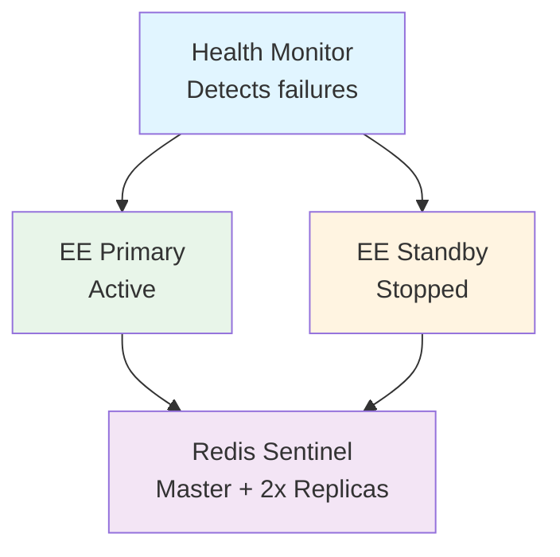
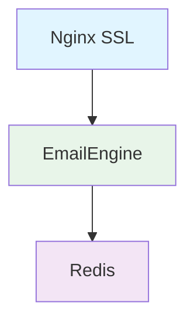
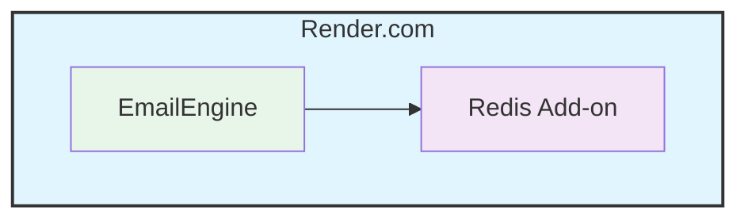
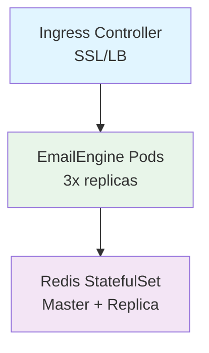

# Deploying EmailEngine

This guide helps you choose the right deployment method and provides best practices for production deployments.

## Deployment Options

EmailEngine can be deployed in various ways depending on your infrastructure and requirements:

| Method | Complexity | Best For | Scaling |
|--------|------------|----------|---------|
| [Docker](#docker) | Low | Quick start, containers | Vertical |
| [Docker Compose](#docker-compose) | Low | Development, small teams | Limited |
| [Kubernetes](#kubernetes) | High | Enterprise, cloud-native | Vertical |
| [SystemD Service](#systemd) | Medium | Bare metal, VPS | Vertical |
| [Render.com](#rendercom) | Low | Managed hosting | Vertical |
| [Nginx Reverse Proxy](#nginx-proxy) | Medium | Production with SSL | N/A |

## Quick Comparison

### Docker
**Pros:**
- Quick to set up
- Isolated environment
- Easy updates
- Portable

**Cons:**
- Requires Docker knowledge
- Single container limitations

**When to use:** Quick start, development, simple production

[Docker deployment guide →](./docker.md)

---

### Docker Compose
**Pros:**
- Multi-container orchestration
- Easy configuration
- Development-friendly
- Includes Redis setup

**Cons:**
- Not production-grade at scale
- Limited high-availability options

**When to use:** Development, staging, small production

[Docker Compose setup →](./docker.md#docker-compose)

---

### Kubernetes
**Pros:**
- Production-ready
- High availability
- Auto-scaling
- Self-healing

**Cons:**
- Complex setup
- Requires K8s knowledge
- Higher resource overhead

**When to use:** Enterprise, large scale, cloud deployments

[Kubernetes deployment →](./docker.md#kubernetes)

---

### SystemD Service
**Pros:**
- Native Linux integration
- No containerization overhead
- Full system access
- Easy log management

**Cons:**
- Manual dependency management
- OS-specific
- Manual updates

**When to use:** VPS, bare metal, traditional Linux servers

[SystemD service guide →](./systemd.md)

---

### Render.com
**Pros:**
- Fully managed
- Zero DevOps
- Auto SSL
- Built-in monitoring

**Cons:**
- Vendor lock-in
- Cost at scale
- Limited customization

**When to use:** Quick deployment, prototyping, small teams

[Render deployment →](./render.md)

---

### Nginx Reverse Proxy
**Pros:**
- SSL/TLS termination
- Load balancing
- Security hardening
- Rate limiting

**Cons:**
- Additional component
- Configuration complexity

**When to use:** Production deployments requiring HTTPS

[Nginx proxy setup →](./nginx-proxy.md)

## Choosing the Right Method

### For Development

**Recommended:** Docker Compose

```yaml
version: '3.8'
services:
  redis:
    image: redis:7-alpine
  emailengine:
    image: postalsys/emailengine:latest
    ports:
      - "3000:3000"
    environment:
      - REDIS_URL=redis://redis:6379
```

**Why:** Quick setup, easy to tear down, includes all dependencies.

### For Production (Small Scale)

**Recommended:** Docker + Render.com OR SystemD + Nginx

**Docker on Render:**
- Managed hosting
- Auto SSL
- Simple deployment

**SystemD + Nginx:**
- Full control
- Cost-effective
- VPS-friendly

### For Production (Large Scale)

**Recommended:** Kubernetes

**Features needed:**
- High availability
- Auto-scaling
- Load balancing
- Health checks
- Rolling updates

## Production Checklist

Before deploying to production, ensure you have:

### Infrastructure

- [ ] Redis 6.0+ deployed with persistence enabled
- [ ] Sufficient memory (1-2 MB per mailbox)
- [ ] Fast network connection to Redis (< 5ms latency)
- [ ] HTTPS/TLS configured
- [ ] Firewall rules configured

### Configuration

- [ ] Strong `EENGINE_SECRET` (32+ characters)
- [ ] `EENGINE_SECRET` for field encryption
- [ ] OAuth2 credentials configured
- [ ] Webhook endpoints configured
- [ ] Base URL set correctly
- [ ] License key activated

### Monitoring

- [ ] Prometheus metrics enabled
- [ ] Log aggregation configured
- [ ] Health check endpoints monitored
- [ ] Alerts configured for errors
- [ ] Backup strategy for Redis

### Security

- [ ] Secrets stored securely (not in code)
- [ ] Network access restricted
- [ ] API tokens rotated regularly
- [ ] Redis password protected
- [ ] Regular security updates

[Complete security checklist →](./security.md)

## Scaling Strategies

### Vertical Scaling (Only Supported Method)

:::warning No Horizontal Scaling
EmailEngine does NOT support running multiple instances against the same Redis. Each instance would independently sync all accounts, causing conflicts and resource waste.
:::

**Increase resources on single instance:**

- More CPU cores (increase `EENGINE_WORKERS`)
- More RAM (more concurrent accounts)
- Faster network (reduce latency)

**Configuration:**
```bash
EENGINE_WORKERS=16           # Match CPU cores
EENGINE_MAX_CONNECTIONS=20
EENGINE_WORKERS_WEBHOOKS=8
EENGINE_WORKERS_SUBMIT=4
```

**Good for:** Several thousand accounts per instance

**Manual Sharding (Advanced):** For very large deployments, you can run completely separate EmailEngine instances with separate Redis databases and manually distribute accounts across them. This requires your application to route requests appropriately.

[Scaling guide →](../advanced/performance-tuning.md)

## High Availability

### Redis HA (Recommended Approach)

Since EmailEngine doesn't support multiple instances, focus on Redis high availability:

**Requirements:**

1. **Single EmailEngine instance** (primary)
2. **Standby EmailEngine instance** (cold standby, not running)
3. **Redis Sentinel or Cluster** (auto-failover)
4. **Persistent storage** for Redis
5. **Health monitoring** to detect failures

### Architecture Example



**Failover Process:**
1. Health monitor detects primary failure
2. Manually start standby instance (or use orchestration tool)
3. Standby connects to Redis Sentinel (gets current master)
4. Service resumes with minimal downtime

### Health Check Endpoint

```bash
curl http://localhost:3000/health
```

**Response:**
```json
{
  "status": "ok",
  "redis": "connected",
  "accounts": 42,
  "uptime": 86400
}
```

## Environment-Specific Configuration

### Development

```bash
# .env.development
NODE_ENV=development
EENGINE_LOG_LEVEL=trace
EENGINE_PORT=3001
REDIS_URL=redis://localhost:6379/8
```

### Staging

```bash
# .env.staging
NODE_ENV=production
EENGINE_LOG_LEVEL=debug
EENGINE_BASE_URL=https://staging-email.example.com
REDIS_URL=redis://staging-redis:6379
```

### Production

```bash
# .env.production
NODE_ENV=production
EENGINE_LOG_LEVEL=info
EENGINE_BASE_URL=https://emailengine.example.com
REDIS_URL=redis://prod-redis:6379
EENGINE_SECRET=${ENCRYPTION_KEY}
```

## Common Deployment Patterns

### Pattern 1: Single Server

**Use case:** Small teams, < 100 accounts



[Setup guide →](./nginx-proxy.md)

---

### Pattern 2: Managed Platform

**Use case:** Quick deployment, minimal DevOps



[Render deployment →](./render.md)

---

### Pattern 3: Kubernetes Cluster

**Use case:** Enterprise, high availability



[Kubernetes guide →](./docker.md#kubernetes)

## Migration & Updates

### Version Updates

**Docker:**
```bash
docker pull postalsys/emailengine:latest
docker stop emailengine
docker rm emailengine
docker run ... postalsys/emailengine:latest
```

**SystemD:**
```bash
# Download new version
wget https://github.com/postalsys/emailengine/releases/latest/download/emailengine.tar.gz
tar xzf emailengine.tar.gz
sudo mv emailengine /usr/local/bin/
sudo chmod +x /usr/local/bin/emailengine

# Restart service
systemctl restart emailengine
```

**Kubernetes:**
```bash
kubectl set image deployment/emailengine \
  emailengine=postalsys/emailengine:latest
```

### Zero-Downtime Updates

**Kubernetes rolling update:**
```yaml
spec:
  strategy:
    type: RollingUpdate
    rollingUpdate:
      maxSurge: 1
      maxUnavailable: 0
```

**Docker Compose:**
```bash
docker-compose up -d --no-deps --build emailengine
```

### Backup Before Updates

```bash
# Backup Redis data
redis-cli --rdb /backup/dump.rdb

# Or use BGSAVE
redis-cli BGSAVE
cp /var/lib/redis/dump.rdb /backup/
```

## Monitoring & Observability

### Metrics

**Prometheus endpoint:**
```bash
EENGINE_METRICS_PORT=9090
```

**Access metrics:**
```bash
curl http://localhost:9090/metrics
```

### Logging

**Docker logs:**
```bash
docker logs -f emailengine
```

**SystemD logs:**
```bash
journalctl -u emailengine -f
```

**Log aggregation:**
- ELK Stack (Elasticsearch, Logstash, Kibana)
- Grafana Loki
- Datadog
- CloudWatch

[Monitoring setup →](../advanced/monitoring.md)

