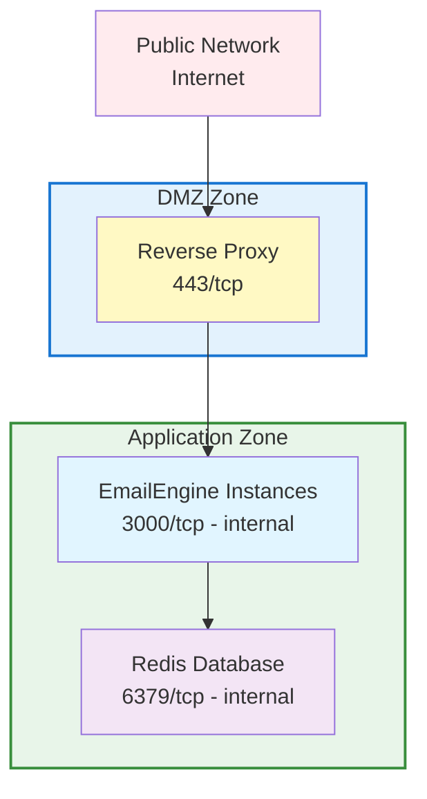

# Production Security Guide

Comprehensive security practices for deploying EmailEngine in production environments.

:::warning Security First
EmailEngine handles sensitive data including email credentials, OAuth tokens, and message content. Proper security configuration is critical.
:::

## Overview

This guide covers:

- Network security and firewall configuration
- Authentication and access control
- Encryption at rest and in transit
- API security
- Redis security
- GDPR compliance

## Network Security

### Firewall Configuration

**Only expose necessary ports:**

```bash
# Ubuntu/Debian (ufw)
sudo ufw allow 22/tcp      # SSH
sudo ufw allow 80/tcp      # HTTP (for Let's Encrypt)
sudo ufw allow 443/tcp     # HTTPS
sudo ufw deny 3000/tcp     # Block direct EmailEngine access
sudo ufw deny 6379/tcp     # Block direct Redis access
sudo ufw enable

# CentOS/RHEL (firewalld)
sudo firewall-cmd --permanent --add-service=ssh
sudo firewall-cmd --permanent --add-service=http
sudo firewall-cmd --permanent --add-service=https
sudo firewall-cmd --reload
```

**Block EmailEngine and Redis from external access:**

```bash
# iptables rules
sudo iptables -A INPUT -p tcp --dport 3000 -s 127.0.0.1 -j ACCEPT
sudo iptables -A INPUT -p tcp --dport 3000 -j DROP
sudo iptables -A INPUT -p tcp --dport 6379 -s 127.0.0.1 -j ACCEPT
sudo iptables -A INPUT -p tcp --dport 6379 -j DROP
```

### VPN Setup

For secure remote access to the admin interface, consider using a VPN:

```bash
# WireGuard example
sudo apt install wireguard

# Generate keys
wg genkey | tee privatekey | wg pubkey > publickey

# Configure /etc/wireguard/wg0.conf
[Interface]
Address = 10.0.0.1/24
PrivateKey = <server-private-key>
ListenPort = 51820

[Peer]
PublicKey = <client-public-key>
AllowedIPs = 10.0.0.2/32
```

Once your VPN is configured, restrict admin interface access to VPN IP ranges using the methods described in [Admin Interface Access Control](#admin-interface-access-control) below.

### Network Segmentation

**Isolate EmailEngine and Redis:**



## Authentication Security

### EENGINE_SECRET

EmailEngine uses `EENGINE_SECRET` as the master encryption key for all sensitive data stored in Redis. This environment variable is critical for security and data recovery.

:::danger Critical - Store This Secret Permanently
The `EENGINE_SECRET` must be stored permanently in your configuration. If lost, you cannot decrypt any stored credentials and must re-authenticate all accounts. Never generate it inline with `export EENGINE_SECRET=$(openssl rand -hex 32)` as the secret will be lost when the session ends.
:::

**What EENGINE_SECRET encrypts:**

- Account passwords (IMAP/SMTP credentials)
- OAuth2 access tokens
- OAuth2 refresh tokens
- OAuth2 application client secrets

**Generate a secure secret:**

```bash
# Generate a 32-byte (256-bit) secret
openssl rand -hex 32
# Example output: a1b2c3d4e5f6...64 hex characters
```

**Store permanently (choose one method):**

```bash
# Option 1: SystemD service file (recommended for Linux servers)
# Edit /etc/systemd/system/emailengine.service
[Service]
Environment="EENGINE_SECRET=your-generated-secret-here"

# Then reload and restart:
sudo systemctl daemon-reload
sudo systemctl restart emailengine

# Option 2: Environment file
echo "EENGINE_SECRET=your-generated-secret-here" >> /etc/emailengine/.env

# Option 3: Secret management service (production)
# AWS Secrets Manager, HashiCorp Vault, Azure Key Vault, etc.
```

**Requirements:**

- Minimum 32 characters (64 hex characters recommended)
- Must remain constant across restarts
- Must be backed up securely
- Same secret required for all EmailEngine instances sharing the same Redis database

For migrating existing data, rotating secrets, and detailed encryption procedures, see the [Secret Encryption](/docs/advanced/encryption) guide.

### API Token Management

EmailEngine supports two types of tokens:

1. **System-wide tokens**: Full access to all accounts and endpoints
2. **Account-specific tokens**: Restricted to a single account

**Generate tokens via web UI:**

1. Log in to EmailEngine admin interface
2. Navigate to **Settings** → **Access Tokens**
3. Click **Generate New Token**
4. Set description and permissions
5. Copy the token immediately (shown only once)

**Generate tokens via CLI:**

```bash
# System-wide token
emailengine tokens issue -d "Admin token" -s "*" --dbs.redis="redis://127.0.0.1:6379/8"

# Account-specific token
emailengine tokens issue -d "User token" -s "api" -a "account_id" --dbs.redis="redis://127.0.0.1:6379/8"
```

For complete token management details including scopes, export/import, and revocation, see [Access Tokens](/docs/api-reference/access-tokens).

**Store tokens securely:**

```bash
# Environment variables (not in code!)
export EMAILENGINE_API_TOKEN=your-generated-token

# Or use secret management service
# AWS Secrets Manager, HashiCorp Vault, etc.
```

### OAuth2 Security

EmailEngine supports multiple OAuth2 applications, configured through the web UI or API. OAuth2 credentials are stored encrypted in Redis, not in environment variables.

**Managing OAuth2 applications:**

- **Web UI:** Navigate to **Settings** > **OAuth2** to create and manage OAuth2 apps
- **API:** Use the `/v1/oauth2` endpoints to create, list, update, and delete OAuth2 apps

**Creating an OAuth2 app via API:**

```bash
curl -X POST https://emailengine.example.com/v1/oauth2 \
  -H "Authorization: Bearer TOKEN" \
  -H "Content-Type: application/json" \
  -d '{
    "name": "My Gmail App",
    "provider": "gmail",
    "clientId": "xxx.apps.googleusercontent.com",
    "clientSecret": "GOCSPX-xxx",
    "enabled": true
  }'
```

:::info OAuth2 Credential Storage
OAuth2 app credentials are encrypted at rest using [`EENGINE_SECRET`](#eengine_secret). EmailEngine automatically manages access tokens, refresh tokens, and handles token refresh.
:::

**OAuth2 redirect URI restrictions:**

| Redirect URI | Allowed | Reason |
|--------------|---------|--------|
| `https://emailengine.example.com/oauth` | Yes | Valid HTTPS endpoint |
| `https://emailengine.example.com/oauth/callback` | Yes | Valid HTTPS callback |
| `http://emailengine.example.com/oauth` | No | Missing HTTPS |
| `https://*/oauth` | No | Wildcards not permitted |
| `http://localhost/oauth` | Dev only | Acceptable for local development |

**Microsoft Graph webhook subscriptions:**

When using Microsoft Graph API for Outlook accounts, Microsoft sends webhook notifications to EmailEngine for real-time updates. These URLs must be publicly accessible:

| Endpoint | Purpose |
|----------|---------|
| `/oauth/msg/notification` | Receives change notifications for messages |
| `/oauth/msg/lifecycle` | Receives subscription lifecycle events |

By default, EmailEngine uses `serviceUrl` for these webhook URLs. If EmailEngine is fully firewalled but you need to expose only the webhook endpoints, configure a separate `notificationBaseUrl`:

```bash
# In Settings > Service Configuration, or via API:
# serviceUrl: https://internal.example.com (firewalled)
# notificationBaseUrl: https://webhooks.example.com (publicly accessible)
```

This allows you to:
- Keep EmailEngine's main interface and API behind a firewall
- Expose only `/oauth/msg/*` endpoints via a dedicated reverse proxy
- Use a separate domain specifically for Microsoft webhook callbacks

### Admin Interface Access Control

Restrict access to the EmailEngine admin interface (`/admin/*` routes) using IP-based filtering. You can use EmailEngine's built-in filtering, reverse proxy rules, or both for defense in depth.

import Tabs from '@theme/Tabs';
import TabItem from '@theme/TabItem';

<Tabs>
<TabItem value="emailengine" label="EmailEngine Built-in" default>

Use the `EENGINE_ADMIN_ACCESS_ADDRESSES` environment variable to restrict admin interface access:

```bash
# Allow only specific IPs and CIDRs to access admin interface
EENGINE_ADMIN_ACCESS_ADDRESSES=127.0.0.0/8,163.11.23.156

# Multiple addresses separated by commas
EENGINE_ADMIN_ACCESS_ADDRESSES=10.0.0.0/8,192.168.1.0/24,203.0.113.42
```

**How it works:**

- Only IP addresses matching the list can access admin pages
- Non-matching visitors receive an error message
- API endpoints are not affected (protected by API tokens instead)
- Supports both individual IPs and CIDR notation

**Common use cases:**

```bash
# Localhost only (development)
EENGINE_ADMIN_ACCESS_ADDRESSES=127.0.0.1

# Office network + VPN
EENGINE_ADMIN_ACCESS_ADDRESSES=203.0.113.0/24,10.8.0.0/24

# Multiple specific IPs
EENGINE_ADMIN_ACCESS_ADDRESSES=198.51.100.1,198.51.100.2,198.51.100.3
```

**SystemD service configuration:**

```bash
# /etc/systemd/system/emailengine.service
[Service]
Environment="EENGINE_SECRET=your-secret-here"
Environment="EENGINE_ADMIN_ACCESS_ADDRESSES=127.0.0.0/8,10.0.0.0/8"
Environment="EENGINE_REDIS=redis://localhost:6379/8"
```

</TabItem>
<TabItem value="nginx" label="Nginx">

If using Nginx as a reverse proxy, you can restrict access at the proxy level:

```nginx
# Nginx configuration
location /admin {
    allow 10.0.0.0/8;      # VPN network
    allow 203.0.113.0/24;  # Office network
    allow 127.0.0.1;       # Localhost
    deny all;
    proxy_pass http://localhost:3000;
}
```

</TabItem>
<TabItem value="caddy" label="Caddy">

If using Caddy as a reverse proxy, use the `remote_ip` matcher:

```caddyfile
emailengine.example.com {
    @blocked_admin {
        path /admin/*
        not remote_ip 127.0.0.1 10.0.0.0/24 203.0.113.0/24
    }
    respond @blocked_admin 403

    reverse_proxy localhost:3000
}
```

</TabItem>
</Tabs>

:::tip Defense in Depth
For production deployments, combine `EENGINE_ADMIN_ACCESS_ADDRESSES` with reverse proxy IP restrictions. This provides multiple layers of protection in case one layer is misconfigured.
:::

## Encryption

### Encryption at Rest

EmailEngine encrypts all sensitive credentials using the [`EENGINE_SECRET`](#eengine_secret) environment variable. All account passwords, OAuth2 tokens, and application secrets are automatically encrypted before storage in Redis using AES-256-GCM.

For detailed information on enabling encryption, migrating existing data, rotating secrets, and secret management best practices, see the [Secret Encryption](/docs/advanced/encryption) guide.

### Encryption in Transit

**Enforce TLS/SSL everywhere:**

```nginx
# Nginx: Redirect HTTP to HTTPS
server {
    listen 80;
    return 301 https://$server_name$request_uri;
}

# Strong SSL configuration
server {
    listen 443 ssl http2;

    ssl_protocols TLSv1.2 TLSv1.3;
    ssl_ciphers ECDHE-ECDSA-AES128-GCM-SHA256:ECDHE-RSA-AES128-GCM-SHA256;
    ssl_prefer_server_ciphers off;

    # HSTS
    add_header Strict-Transport-Security "max-age=63072000; includeSubDomains; preload" always;
}
```

**IMAP/SMTP connection security:**

```bash
# EmailEngine automatically uses TLS for IMAP/SMTP connections
# Verify in logs:
grep "Connection established" /var/log/emailengine/app.log
```

### Redis Encryption

**Enable Redis TLS:**

```bash
# redis.conf
port 0  # Disable non-TLS port
tls-port 6379
tls-cert-file /etc/redis/redis.crt
tls-key-file /etc/redis/redis.key
tls-ca-cert-file /etc/redis/ca.crt
```

**Configure EmailEngine to use Redis TLS:**

```bash
EENGINE_REDIS=rediss://localhost:6379  # Note: rediss:// (with 's')
```

### Secret Management

For `EENGINE_SECRET` storage options (SystemD, environment files, etc.), see [EENGINE_SECRET](#eengine_secret).

**Production secret management with external services:**

```bash
#!/bin/bash
# fetch-secrets.sh - Example using AWS Secrets Manager

# Fetch secrets from AWS
aws secretsmanager get-secret-value \
  --secret-id emailengine/production \
  --query SecretString \
  --output text > /tmp/secrets.json

# Write to .env file (EmailEngine loads .env from current directory)
echo "EENGINE_SECRET=$(jq -r .secret /tmp/secrets.json)" > .env
echo "EENGINE_REDIS=$(jq -r .redis /tmp/secrets.json)" >> .env

# Clean up
rm /tmp/secrets.json

# Start EmailEngine (will load .env automatically)
/usr/local/bin/emailengine
```

Similar patterns apply to HashiCorp Vault, Azure Key Vault, and Google Secret Manager.

## API Security

:::tip Internal API
The EmailEngine API is designed to be an internal resource, accessed only by your backend services. It should not be exposed directly to the public internet. Keep the API behind a firewall or restrict access to trusted IP addresses. With this architecture, API rate limiting is typically unnecessary.
:::

### Per-Token Rate Limiting

If you need to expose the API with account-specific tokens (rare use case), EmailEngine supports optional per-token rate limiting. Configure rate limits when creating access tokens:

```bash
curl -X POST http://localhost:3000/v1/token \
  -H "Authorization: Bearer ADMIN_TOKEN" \
  -H "Content-Type: application/json" \
  -d '{
    "account": "user123",
    "description": "Rate-limited user token",
    "scopes": ["api"],
    "restrictions": {
      "rateLimit": {
        "maxRequests": 100,
        "timeWindow": 60
      }
    }
  }'
```

| Field | Description |
|-------|-------------|
| `maxRequests` | Maximum requests allowed in the time window |
| `timeWindow` | Time window duration in seconds |

When rate limited, the API returns `429 Too Many Requests` with headers:

| Header | Description |
|--------|-------------|
| `X-RateLimit-Limit` | Maximum requests per window |
| `X-RateLimit-Remaining` | Requests remaining in window |
| `X-RateLimit-Reset` | Seconds until limit resets |

### IP Whitelisting

**Restrict API access by IP:**

```nginx
# Nginx geo module
geo $allowed_ip {
    default 0;
    203.0.113.0/24 1;    # Office network
    198.51.100.0/24 1;   # Data center
    10.0.0.0/8 1;        # VPN network
}

server {
    location /v1/ {
        if ($allowed_ip = 0) {
            return 403;
        }
        proxy_pass http://localhost:3000;
    }
}
```

### API Request Examples

**Using account IDs (not email addresses):**

```bash
# CORRECT: Use account ID
curl https://emailengine.example.com/v1/account/account_1234 \
  -H "Authorization: Bearer TOKEN"

# INCORRECT: Cannot use email address
# curl https://emailengine.example.com/v1/account/user@example.com

# Account ID might be same as email, but usually is different
# Always use the account ID returned during account creation
```

**Common API operations:**

```bash
# List accounts
curl https://emailengine.example.com/v1/accounts \
  -H "Authorization: Bearer TOKEN"

# Get account info (returns account ID)
curl https://emailengine.example.com/v1/account/account_1234 \
  -H "Authorization: Bearer TOKEN"

# Delete account
curl -X DELETE https://emailengine.example.com/v1/account/account_1234 \
  -H "Authorization: Bearer TOKEN"
```

## Redis Security

### Authentication

**Enable Redis authentication:**

```bash
# redis.conf
requirepass $(openssl rand -hex 32)

# Or use ACLs (Redis 6+)
user emailengine on >strongpassword ~* &* +@all
user default off
```

**Configure EmailEngine with Redis password:**

```bash
EENGINE_REDIS=redis://:password@localhost:6379
```

### Network Binding

**Bind Redis to localhost only:**

```bash
# redis.conf
bind 127.0.0.1 ::1

# Or specific internal IP
bind 10.0.1.100
```

### Redis Commands

EmailEngine uses `KEYS` and `CONFIG` commands internally. Do not disable these commands.

**Disable only dangerous commands:**

```bash
# redis.conf
rename-command FLUSHDB ""
rename-command FLUSHALL ""
rename-command SHUTDOWN "SHUTDOWN_12345"
```

:::warning Keep KEYS and CONFIG
EmailEngine requires `KEYS` and `CONFIG` Redis commands to function properly. Only disable commands like `FLUSHDB`, `FLUSHALL`, and `SHUTDOWN`.
:::

### Redis ACLs (Redis 6+)

```bash
# Create user with full access (EmailEngine needs most commands)
ACL SETUSER emailengine on >password ~* +@all -flushdb -flushall

# Verify
ACL LIST
```

## Compliance

### GDPR Compliance

**Right to deletion:**

```bash
# API endpoint to delete account and all data
curl -X DELETE https://emailengine.example.com/v1/account/account_1234 \
  -H "Authorization: Bearer TOKEN"

# This deletes:
# - Account credentials
# - OAuth tokens
# - Account sync state
```

:::info What EmailEngine Stores
EmailEngine stores account credentials, OAuth tokens, and sync state in Redis. Email messages themselves are not stored - EmailEngine reads them from the mail server on demand.

Optionally, EmailEngine can be configured to retain the last N queue job entries (including webhook deliveries) as a FIFO buffer for debugging. By default, no job history is stored.
:::

## Security Checklist

### Pre-Deployment

- [ ] Generate strong `EENGINE_SECRET` (32+ characters)
- [ ] Store `EENGINE_SECRET` permanently (critical!)
- [ ] Configure Redis authentication
- [ ] Enable Redis persistence with `noeviction` policy
- [ ] Set up firewall rules
- [ ] Configure SSL/TLS certificates
- [ ] Set up secret management service
- [ ] Configure log rotation
- [ ] Plan backup strategy

### Post-Deployment

- [ ] Verify HTTPS is enforced
- [ ] Test firewall rules
- [ ] Verify Redis is not publicly accessible
- [ ] Check SSL certificate auto-renewal
- [ ] Configure log aggregation
- [ ] Perform security scan
- [ ] Document security procedures
- [ ] Train team on security practices

### Ongoing Maintenance

- [ ] Update EmailEngine regularly
- [ ] Update system packages weekly
- [ ] Review access logs weekly
- [ ] Check for security advisories monthly
- [ ] Test backups monthly
- [ ] Review firewall rules quarterly
- [ ] Audit user access quarterly
- [ ] Update SSL certificates (automatic with Let's Encrypt)
