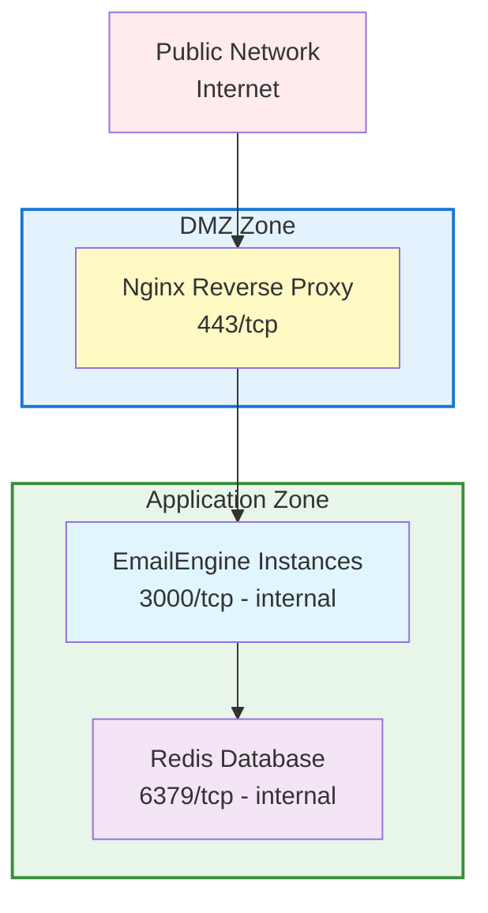

# Production Security Guide

Comprehensive security practices for deploying EmailEngine in production environments.

:::warning Security First
EmailEngine handles sensitive data including email credentials, OAuth tokens, and message content. Proper security configuration is critical.
:::

## Overview

This guide covers:

- Network security and firewall configuration
- Authentication and access control
- Encryption at rest and in transit
- API security
- Redis security
- GDPR compliance

## Network Security

### Firewall Configuration

**Only expose necessary ports:**

```bash
# Ubuntu/Debian (ufw)
sudo ufw allow 22/tcp      # SSH
sudo ufw allow 80/tcp      # HTTP (for Let's Encrypt)
sudo ufw allow 443/tcp     # HTTPS
sudo ufw deny 3000/tcp     # Block direct EmailEngine access
sudo ufw deny 6379/tcp     # Block direct Redis access
sudo ufw enable

# CentOS/RHEL (firewalld)
sudo firewall-cmd --permanent --add-service=ssh
sudo firewall-cmd --permanent --add-service=http
sudo firewall-cmd --permanent --add-service=https
sudo firewall-cmd --reload
```

**Block EmailEngine and Redis from external access:**

```bash
# iptables rules
sudo iptables -A INPUT -p tcp --dport 3000 -s 127.0.0.1 -j ACCEPT
sudo iptables -A INPUT -p tcp --dport 3000 -j DROP
sudo iptables -A INPUT -p tcp --dport 6379 -s 127.0.0.1 -j ACCEPT
sudo iptables -A INPUT -p tcp --dport 6379 -j DROP
```

### VPN Access

**Use VPN for admin access:**

```bash
# WireGuard example
sudo apt install wireguard

# Generate keys
wg genkey | tee privatekey | wg pubkey > publickey

# Configure /etc/wireguard/wg0.conf
[Interface]
Address = 10.0.0.1/24
PrivateKey = <server-private-key>
ListenPort = 51820

[Peer]
PublicKey = <client-public-key>
AllowedIPs = 10.0.0.2/32
```

**Restrict admin interface to VPN:**

```nginx
# Nginx configuration
location /admin {
    allow 10.0.0.0/24;  # VPN network
    deny all;
    proxy_pass http://localhost:3000;
}
```

### Network Segmentation

**Isolate EmailEngine and Redis:**



## Authentication Security

### EENGINE_SECRET

EmailEngine uses `EENGINE_SECRET` for encrypting stored credentials and OAuth tokens.

**Generate and store secret:**

```bash
# Generate secret
openssl rand -hex 32

# Store permanently in SystemD service file
# Edit /etc/systemd/system/emailengine.service
[Service]
Environment="EENGINE_SECRET=your-generated-secret-here"

# Then reload and restart:
sudo systemctl daemon-reload
sudo systemctl restart emailengine

# Or use secret management service
# AWS Secrets Manager, HashiCorp Vault, etc.
```

**What EENGINE_SECRET encrypts:**

- Account passwords
- OAuth2 access tokens
- OAuth2 refresh tokens
- SMTP credentials

### API Token Management

**API tokens are always bound to specific email accounts.**

All management tokens must be generated from the web UI. You cannot create account-level API tokens programmatically.

**Generate tokens via web UI:**

1. Log in to EmailEngine admin interface
2. Navigate to **Settings** → **Access Tokens**
3. Click **Generate New Token**
4. Set description and permissions
5. Copy the token immediately (shown only once)

**Store tokens securely:**

```bash
# Environment variables (not in code!)
export EMAILENGINE_API_TOKEN=your-generated-token

# Or use secret management service
# AWS Secrets Manager, HashiCorp Vault, etc.
```

### OAuth2 Security

EmailEngine manages OAuth2 credentials internally. You only need to configure OAuth2 client credentials once via environment variables.

**Configure OAuth2 app credentials:**

```bash
# Gmail
EENGINE_GMAIL_CLIENT_ID=xxx.apps.googleusercontent.com
EENGINE_GMAIL_CLIENT_SECRET=GOCSPX-xxx

# Outlook
EENGINE_OUTLOOK_CLIENT_ID=xxx
EENGINE_OUTLOOK_CLIENT_SECRET=xxx
```

:::info OAuth2 Credential Storage
Once users authenticate via OAuth2, EmailEngine automatically stores and manages access tokens, refresh tokens, and handles token refresh. You do not need to manage these tokens manually.
:::

**OAuth2 redirect URI restrictions:**

```
Allowed redirect URIs:
YES: https://emailengine.example.com/oauth
YES: https://emailengine.example.com/oauth/callback

Not allowed:
NO: http://emailengine.example.com/oauth  (no HTTPS)
NO: https://*/oauth  (wildcard)
NO: http://localhost/oauth  (except for development)
```

### Access Control

**Restrict admin interface access by IP:**

EmailEngine provides built-in IP address filtering for admin pages using the `EENGINE_ADMIN_ACCESS_ADDRESSES` environment variable.

```bash
# Allow only specific IPs and CIDRs to access admin interface
EENGINE_ADMIN_ACCESS_ADDRESSES=127.0.0.0/8,163.11.23.156

# Multiple addresses separated by commas
EENGINE_ADMIN_ACCESS_ADDRESSES=10.0.0.0/8,192.168.1.0/24,203.0.113.42
```

**How it works:**

- Only IP addresses matching the list can access admin pages
- Non-matching visitors receive an error message
- API endpoints are not affected (use Nginx for API access control)
- Supports both individual IPs and CIDR notation

**Example configuration:**

```bash
# /etc/systemd/system/emailengine.service
[Service]
Environment="EENGINE_SECRET=your-secret-here"
Environment="EENGINE_ADMIN_ACCESS_ADDRESSES=127.0.0.0/8,10.0.0.0/8"
Environment="EENGINE_REDIS=redis://localhost:6379"
```

**Common use cases:**

```bash
# Localhost only (development)
EENGINE_ADMIN_ACCESS_ADDRESSES=127.0.0.1

# Office network + VPN
EENGINE_ADMIN_ACCESS_ADDRESSES=203.0.113.0/24,10.8.0.0/24

# Multiple specific IPs
EENGINE_ADMIN_ACCESS_ADDRESSES=198.51.100.1,198.51.100.2,198.51.100.3
```

:::tip Combine with Nginx
For production, combine `EENGINE_ADMIN_ACCESS_ADDRESSES` with Nginx IP restrictions for defense in depth.
:::

**Nginx additional protection:**

```nginx
# Nginx configuration
location /admin {
    allow 10.0.0.0/8;      # VPN network
    allow 203.0.113.0/24;  # Office network
    deny all;
    proxy_pass http://localhost:3000;
}
```

## Encryption

### Encryption at Rest

**Enable field encryption:**

```bash
# Generate encryption secret (minimum 32 characters)
openssl rand -hex 32

# Add to your .env file or configuration
echo "EENGINE_SECRET=generated-value-here" >> .env
```

:::danger Store Secret Permanently
This secret must be stored permanently in your configuration file or .env file. If lost, you cannot decrypt stored credentials. Never use `export` with `$(openssl rand)` as the secret will be lost when the session ends.
:::

**Encrypted fields:**

- Account passwords
- OAuth2 access tokens
- OAuth2 refresh tokens
- SMTP credentials

### Encryption in Transit

**Enforce TLS/SSL everywhere:**

```nginx
# Nginx: Redirect HTTP to HTTPS
server {
    listen 80;
    return 301 https://$server_name$request_uri;
}

# Strong SSL configuration
server {
    listen 443 ssl http2;

    ssl_protocols TLSv1.2 TLSv1.3;
    ssl_ciphers ECDHE-ECDSA-AES128-GCM-SHA256:ECDHE-RSA-AES128-GCM-SHA256;
    ssl_prefer_server_ciphers off;

    # HSTS
    add_header Strict-Transport-Security "max-age=63072000; includeSubDomains; preload" always;
}
```

**IMAP/SMTP connection security:**

```bash
# EmailEngine automatically uses TLS for IMAP/SMTP connections
# Verify in logs:
grep "Connection established" /var/log/emailengine/app.log
```

### Redis Encryption

**Enable Redis TLS:**

```bash
# redis.conf
port 0  # Disable non-TLS port
tls-port 6379
tls-cert-file /etc/redis/redis.crt
tls-key-file /etc/redis/redis.key
tls-ca-cert-file /etc/redis/ca.crt
```

**Configure EmailEngine to use Redis TLS:**

```bash
EENGINE_REDIS=rediss://localhost:6379  # Note: rediss:// (with 's')
```

### Secret Management

**Use SystemD service file (basic):**

```bash
# Edit /etc/systemd/system/emailengine.service
[Service]
Environment="EENGINE_SECRET=your-permanent-secret-here"
Environment="EENGINE_REDIS=redis://localhost:6379"

# Then reload and restart
sudo systemctl daemon-reload
sudo systemctl restart emailengine
```

**Use secret management service (production):**

```bash
#!/bin/bash
# fetch-secrets.sh

# AWS Secrets Manager
aws secretsmanager get-secret-value \
  --secret-id emailengine/production \
  --query SecretString \
  --output text > /tmp/secrets.json

# Write to .env file (EmailEngine loads .env from current directory)
echo "EENGINE_SECRET=$(jq -r .secret /tmp/secrets.json)" > .env

# Clean up
rm /tmp/secrets.json

# Start EmailEngine (will load .env automatically)
/usr/local/bin/emailengine
```

## API Security

### Rate Limiting

**Nginx rate limiting:**

```nginx
limit_req_zone $binary_remote_addr zone=api_limit:10m rate=10r/s;
limit_req_zone $http_authorization zone=token_limit:10m rate=100r/s;

server {
    location /v1/ {
        limit_req zone=api_limit burst=20 nodelay;
        limit_req zone=token_limit burst=200 nodelay;
        proxy_pass http://localhost:3000;
    }
}
```

:::info No Built-in Rate Limiting
EmailEngine does not have built-in rate limiting. Implement rate limiting at the reverse proxy level (Nginx, HAProxy) or API gateway.
:::

### IP Whitelisting

**Restrict API access by IP:**

```nginx
# Nginx geo module
geo $allowed_ip {
    default 0;
    203.0.113.0/24 1;    # Office network
    198.51.100.0/24 1;   # Data center
    10.0.0.0/8 1;        # VPN network
}

server {
    location /v1/ {
        if ($allowed_ip = 0) {
            return 403;
        }
        proxy_pass http://localhost:3000;
    }
}
```

### API Request Examples

**Using account IDs (not email addresses):**

```bash
# CORRECT: Use account ID
curl https://emailengine.example.com/v1/account/account_1234 \
  -H "Authorization: Bearer TOKEN"

# INCORRECT: Cannot use email address
# curl https://emailengine.example.com/v1/account/user@example.com

# Account ID might be same as email, but usually is different
# Always use the account ID returned during account creation
```

**Common API operations:**

```bash
# List accounts
curl https://emailengine.example.com/v1/accounts \
  -H "Authorization: Bearer TOKEN"

# Get account info (returns account ID)
curl https://emailengine.example.com/v1/account/account_1234 \
  -H "Authorization: Bearer TOKEN"

# Delete account
curl -X DELETE https://emailengine.example.com/v1/account/account_1234 \
  -H "Authorization: Bearer TOKEN"
```

## Redis Security

### Authentication

**Enable Redis authentication:**

```bash
# redis.conf
requirepass $(openssl rand -hex 32)

# Or use ACLs (Redis 6+)
user emailengine on >strongpassword ~* &* +@all
user default off
```

**Configure EmailEngine with Redis password:**

```bash
EENGINE_REDIS=redis://:password@localhost:6379
```

### Network Binding

**Bind Redis to localhost only:**

```bash
# redis.conf
bind 127.0.0.1 ::1

# Or specific internal IP
bind 10.0.1.100
```

### Redis Commands

EmailEngine uses `KEYS` and `CONFIG` commands internally. Do not disable these commands.

**Disable only dangerous commands:**

```bash
# redis.conf
rename-command FLUSHDB ""
rename-command FLUSHALL ""
rename-command SHUTDOWN "SHUTDOWN_12345"
```

:::warning Keep KEYS and CONFIG
EmailEngine requires `KEYS` and `CONFIG` Redis commands to function properly. Only disable commands like `FLUSHDB`, `FLUSHALL`, and `SHUTDOWN`.
:::

### Redis ACLs (Redis 6+)

```bash
# Create user with full access (EmailEngine needs most commands)
ACL SETUSER emailengine on >password ~* +@all -flushdb -flushall

# Verify
ACL LIST
```

## Compliance

### GDPR Compliance

**Right to deletion:**

```bash
# API endpoint to delete account and all data
curl -X DELETE https://emailengine.example.com/v1/account/account_1234 \
  -H "Authorization: Bearer TOKEN"

# This deletes:
# - Account credentials
# - OAuth tokens
# - Webhook history
```

:::info No Built-in Data Retention
EmailEngine does not implement automatic data retention policies. Email messages are not stored by EmailEngine - it only maintains account credentials and webhook delivery history. Implement data retention policies at your application level if needed.
:::

## Security Checklist

### Pre-Deployment

- [ ] Generate strong `EENGINE_SECRET` (32+ characters)
- [ ] Store `EENGINE_SECRET` permanently (critical!)
- [ ] Configure Redis authentication
- [ ] Enable Redis persistence with `noeviction` policy
- [ ] Set up firewall rules
- [ ] Configure SSL/TLS certificates
- [ ] Set up secret management service
- [ ] Configure log rotation
- [ ] Plan backup strategy

### Post-Deployment

- [ ] Verify HTTPS is enforced
- [ ] Test firewall rules
- [ ] Verify Redis is not publicly accessible
- [ ] Check SSL certificate auto-renewal
- [ ] Configure log aggregation
- [ ] Perform security scan
- [ ] Document security procedures
- [ ] Train team on security practices

### Ongoing Maintenance

- [ ] Update EmailEngine regularly
- [ ] Update system packages weekly
- [ ] Review access logs weekly
- [ ] Check for security advisories monthly
- [ ] Test backups monthly
- [ ] Review firewall rules quarterly
- [ ] Audit user access quarterly
- [ ] Update SSL certificates (automatic with Let's Encrypt)
