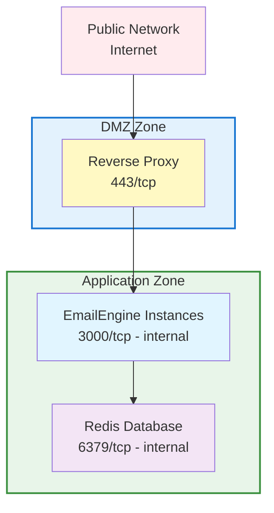

# Production Security Guide

What to lock down before an EmailEngine instance faces the network.

:::warning Security First
EmailEngine handles sensitive data including email credentials, OAuth tokens, and message content. Proper security configuration is critical.
:::

## Overview

This guide covers:

- Network security and firewall configuration
- Admin password, API token requirement, and token scopes
- Admin interface access control by address
- Encryption at rest and in transit
- API security and the security headers
- Redis security

## Network Security

### Firewall Configuration

EmailEngine binds its API and admin interface to `127.0.0.1` unless `EENGINE_HOST` (or `api.host` in a config file) says otherwise, so on a single host nothing reaches port 3000 except through the reverse proxy. The Docker image sets `EENGINE_HOST=0.0.0.0` because the container network needs it; there, the firewall rules below are what keep the port private.

**Only expose necessary ports:**

```bash
# Ubuntu/Debian (ufw)
sudo ufw allow 22/tcp      # SSH
sudo ufw allow 80/tcp      # HTTP (for Let's Encrypt)
sudo ufw allow 443/tcp     # HTTPS
sudo ufw deny 3000/tcp     # Block direct EmailEngine access
sudo ufw deny 6379/tcp     # Block direct Redis access
sudo ufw enable

# CentOS/RHEL (firewalld)
sudo firewall-cmd --permanent --add-service=ssh
sudo firewall-cmd --permanent --add-service=http
sudo firewall-cmd --permanent --add-service=https
sudo firewall-cmd --reload
```

**Block EmailEngine and Redis from external access:**

```bash
# iptables rules
sudo iptables -A INPUT -p tcp --dport 3000 -s 127.0.0.1 -j ACCEPT
sudo iptables -A INPUT -p tcp --dport 3000 -j DROP
sudo iptables -A INPUT -p tcp --dport 6379 -s 127.0.0.1 -j ACCEPT
sudo iptables -A INPUT -p tcp --dport 6379 -j DROP
```

:::tip Outbound Connections
These rules control inbound traffic. If your firewall also restricts outbound connections, see [Outbound Connection Whitelist](#outbound-connection-whitelist) for domains that EmailEngine needs to reach.
:::

### VPN Setup

For secure remote access to the admin interface, consider using a VPN:

```bash
# WireGuard example
sudo apt install wireguard

# Generate keys
wg genkey | tee privatekey | wg pubkey > publickey

# Configure /etc/wireguard/wg0.conf
[Interface]
Address = 10.0.0.1/24
PrivateKey = <server-private-key>
ListenPort = 51820

[Peer]
PublicKey = <client-public-key>
AllowedIPs = 10.0.0.2/32
```

Once your VPN is configured, restrict admin interface access to VPN IP ranges using the methods described in [Admin Interface Access Control](#admin-interface-access-control) below.

### Network Segmentation

**Isolate EmailEngine and Redis:**


```mermaid
graph TB
    Internet[Public Network<br/>Internet]

    subgraph DMZ["DMZ Zone"]
        Proxy[Reverse Proxy<br/>443/tcp]
    end

    subgraph AppZone["Application Zone"]
        EmailEngine[EmailEngine Instances<br/>3000/tcp - internal]
        Redis[Redis Database<br/>6379/tcp - internal]
    end

    Internet --> Proxy
    Proxy --> EmailEngine
    EmailEngine --> Redis

    style Internet fill:#ffebee
    style DMZ fill:#e3f2fd,stroke:#1976d2,stroke-width:2px
    style AppZone fill:#e8f5e9,stroke:#388e3c,stroke-width:2px
    style Proxy fill:#fff9c4
    style EmailEngine fill:#e1f5ff
    style Redis fill:#f3e5f5
```

### Outbound Connection Whitelist

If EmailEngine is deployed behind a firewall that blocks outbound connections, you must whitelist the following domains for EmailEngine to function correctly.

:::info Reaching these through a proxy
Since v2.79.9, EmailEngine's [proxy settings](/docs/accounts/imap-smtp#proxy-configuration) cover HTTP requests as well as IMAP and SMTP, so the domains below can be reached through the proxy instead of being whitelisted at the firewall. Up to v2.79.8 they required direct network access or the separate HTTP proxy settings.
:::

#### Required Domains

These domains are required for core EmailEngine functionality:

| Domain | Port | Purpose |
|--------|------|---------|
| `postalsys.com` | 443 | License validation and trial provisioning. Required for all licensed installations. |
| `sentry.emailengine.dev` | 443 | Error reporting, only while `sentryEnabled` is on with no DSN of your own. A trial license turns it on by default; see [Error reporting](/docs/configuration/environment-variables#logging--monitoring) for how to keep reports in-house or off. |

#### OAuth2 Provider Domains

Required based on which OAuth2 providers you use:

**Google (Gmail):**

| Domain | Port | Purpose |
|--------|------|---------|
| `oauth2.googleapis.com` | 443 | OAuth2 token exchange and refresh for Gmail accounts |
| `www.googleapis.com` | 443 | Profile lookup after authorization (`/oauth2/v2/userinfo`) |
| `gmail.googleapis.com` | 443 | Gmail API for message operations (when using API mode) |
| `pubsub.googleapis.com` | 443 | Gmail push notifications for real-time updates (when using Pub/Sub) |
| `iamcredentials.googleapis.com` | 443 | Service account apps using external account (workload identity) authentication |

**Microsoft (Outlook/Office 365):**

| Domain | Port | Purpose |
|--------|------|---------|
| `login.microsoftonline.com` | 443 | OAuth2 token exchange and refresh for Outlook accounts |
| `graph.microsoft.com` | 443 | Microsoft Graph API for mail operations (when using API mode) |

**Microsoft Government Cloud (GCC-High):**

| Domain | Port | Purpose |
|--------|------|---------|
| `login.microsoftonline.us` | 443 | OAuth2 tokens for GCC-High/DoD environments |
| `graph.microsoft.us` | 443 | Microsoft Graph API for GCC-High |
| `dod-graph.microsoft.us` | 443 | Microsoft Graph API for DoD |

**Microsoft China (21Vianet):**

| Domain | Port | Purpose |
|--------|------|---------|
| `login.chinacloudapi.cn` | 443 | OAuth2 tokens for Microsoft China |
| `microsoftgraph.chinacloudapi.cn` | 443 | Microsoft Graph API for China |

**Mail.ru:**

| Domain | Port | Purpose |
|--------|------|---------|
| `oauth.mail.ru` | 443 | OAuth2 token exchange, refresh, and user info retrieval |

#### Optional Feature Domains

These domains are only needed if you use specific features:

| Domain | Port | Purpose |
|--------|------|---------|
| `autoconfig.thunderbird.net` | 443 | Mozilla ISP database for automatic IMAP/SMTP server detection. Used when adding accounts without manual server configuration. |
| `api.github.com` | 443 | Checks for new EmailEngine releases. Used by the update notification feature in the admin dashboard. Disable with `EENGINE_UPDATE_CHECK_DISABLED=true` (since v2.76.0). |
| `api.nodemailer.com` | 443 | SMTP delivery testing service. Used by the "Test Delivery" feature to verify SMTP configuration. |
| `acme-v02.api.letsencrypt.org` | 443 | Let's Encrypt ACME protocol. Required only if using EmailEngine's built-in TLS certificate provisioning. |
| `*.okta.com` | 443 | Okta SSO authentication. Required only if using Okta single sign-on for the admin interface. |
| Your OIDC provider | 443 | OpenID Connect discovery, token exchange, and userinfo requests. Required only if using OIDC single sign-on for the admin interface. |

#### User-Configured Endpoints

These endpoints depend on your specific configuration:

| Endpoint Type | Purpose |
|---------------|---------|
| Webhook URLs | URLs configured in EmailEngine settings for webhook delivery. Whitelist your webhook receiver endpoints. |
| Elasticsearch URLs | Only on releases before v2.82.0 that use the Document Store, which was removed in that release. Whitelist your Elasticsearch cluster while it is in use. |
| IMAP/SMTP servers | Mail servers for connected accounts. Typically ports 993 (IMAPS), 465/587 (SMTPS/submission), 143 (IMAP), 25 (SMTP). |

#### Minimal Whitelist Example

For a typical deployment using Gmail and Outlook OAuth2 with IMAP:

```bash
# Required
postalsys.com:443

# Gmail OAuth2
oauth2.googleapis.com:443

# Outlook OAuth2
login.microsoftonline.com:443

# Your webhook endpoint
webhooks.yourcompany.com:443

# Mail servers (examples)
imap.gmail.com:993
smtp.gmail.com:465
outlook.office365.com:993
smtp.office365.com:587
```

### Destinations EmailEngine Refuses to Reach

Webhook deliveries and the IMAP/SMTP autodiscovery lookups (`GET` and `POST /v1/autoconfig`, and the hosted setup form) are the places where EmailEngine connects to an address a caller supplied. `EENGINE_WEBHOOK_EGRESS_POLICY` decides which destinations they may reach:

| Value | Refused |
|-------|---------|
| `link-local` (default) | The link-local range, where every cloud provider serves its instance metadata |
| `private` | Link-local, plus RFC 1918, loopback, carrier-grade NAT and IPv6 unique-local addresses |
| `off` | Nothing |

The policy is applied to the URL before the request and again to the addresses the connection is actually made to, so a hostname that resolves to a refused address is refused as well. Under any value other than `off`, a webhook delivery does not follow redirects, since a permitted host could otherwise redirect to a refused one; autodiscovery follows redirects one checked hop at a time. Behind an outbound proxy only the check on the URL applies. See [Webhook Delivery](/docs/configuration/environment-variables#webhook-delivery).

## Authentication Security

### EENGINE_SECRET

EmailEngine uses `EENGINE_SECRET` as the master encryption key for all sensitive data stored in Redis. This environment variable is critical for security and data recovery.

:::danger Critical - Store This Secret Permanently
The `EENGINE_SECRET` must be stored permanently in your configuration. If lost, you cannot decrypt any stored credentials and must re-authenticate all accounts.
:::

**What EENGINE_SECRET encrypts:**

- Account passwords (IMAP/SMTP credentials)
- OAuth2 access tokens
- OAuth2 refresh tokens
- OAuth2 application client secrets

**Generate a secure secret:**

```bash
# Generate a 32-byte (256-bit) secret, printed as 64 hex characters
openssl rand -hex 32
```

**Store permanently (choose one method):**

- **systemd environment file.** A root-only file named by `EnvironmentFile=` in the unit, as shown in [SystemD Service](/docs/deployment/systemd#3-write-the-environment-file). Unit files themselves are world-readable, so do not put the secret in an `Environment=` line
- **`.env` in the working directory.** EmailEngine loads a `.env` file from the directory it starts in; this is how the [source](/docs/installation/source) and [Docker Compose](/docs/installation/docker) layouts carry it
- **`EENGINE_SECRET_FILE`.** Points at a file holding the value, for Docker and Kubernetes secrets; see [Loading Values From Files](/docs/configuration/environment-variables#loading-values-from-files)
- **A secret manager.** Fetched at start and exported into the environment; an example is under [Secret Management](#secret-management)

**Requirements:**

- Minimum 32 characters (64 hex characters recommended)
- Must remain constant across restarts
- Must be backed up securely
- Same secret required for all EmailEngine instances sharing the same Redis database

For migrating existing data, rotating secrets, and detailed encryption procedures, see the [Secret Encryption](/docs/deployment/encryption) guide.

### Admin Password and API Authentication

A fresh instance has no admin password: the admin interface opens without a login for anyone who can reach the port, and refuses to issue access tokens until one is set. Set it before the instance faces a network. How to set it, how to add TOTP or a passkey, and how to put the admin interface behind single sign-on is on [Admin Authentication](/docs/deployment/admin-authentication).

API requests require a bearer token by default. The switch that turns this off is the `disableTokens` setting, shown as **Configuration** > **Security** in the admin interface. `EENGINE_REQUIRE_API_AUTH=false` sets it on first start only, for a development instance that has never run before; on an instance that already has the setting stored, the environment variable does nothing. While tokens are disabled, a request that presents no credential at all is accepted, and the dashboard shows a warning. See [Disabling Authentication](/docs/api-reference/access-tokens#disabling-authentication-development-only).

### API Token Management

A token carries a scope and, optionally, a narrowing on top of it:

1. **System-wide tokens** with scope `*` reach every account and every endpoint, including settings and the token endpoints themselves
2. **Account-bound tokens** name one account and are refused for any other. The CLI's `-a` flag and the API's `account` field create them
3. **Narrowed tokens** carry a `permissions` record that subtracts actions or endpoint groups from what the scope allows. Only the API creates them

The scopes are `*`, `api`, `metrics`, `smtp`, `imap-proxy` and `mcp`. `metrics` reaches only `/metrics`; `smtp` and `imap-proxy` authenticate to the [SMTP](/docs/sending/smtp-interface) and [IMAP proxy](/docs/configuration/environment-variables#imap-proxy-server) servers rather than the REST API; `mcp` reaches the [MCP endpoint](/docs/mcp). [Token Scopes](/docs/api-reference/access-tokens#token-scopes) has the full matrix.

**Generate tokens in the admin interface:**

1. Open **Integrations** > **Access Tokens** in the sidebar
2. Click **Create access token**. The form only appears once an admin password is set
3. Enter a description, choose the scope and, optionally, an account and restrictions
4. Click **Generate a token** and copy it: it is shown once and never again

**Generate tokens with the CLI:**

```bash
# System-wide token
emailengine tokens issue -d "Admin token" -s "*" --dbs.redis="redis://127.0.0.1:6379/8"

# Account-bound token
emailengine tokens issue -d "User token" -s "api" -a "account_id" --dbs.redis="redis://127.0.0.1:6379/8"
```

The CLI writes the token straight into Redis, so `--dbs.redis` must name the database the service uses. The API can also mint tokens, but only account-bound or narrowed ones; see [Creating Tokens](/docs/api-reference/access-tokens#creating-tokens) for the three methods, and the same page for export, import and revocation.

**Store tokens securely:**

```bash
# Environment variables (not in code!)
export EMAILENGINE_API_TOKEN=your-generated-token

# Or use secret management service
# AWS Secrets Manager, HashiCorp Vault, etc.
```

### OAuth2 Security

EmailEngine supports multiple OAuth2 applications, configured through the web UI or API. OAuth2 credentials are stored encrypted in Redis, not in environment variables.

**Managing OAuth2 applications:**

- **Web UI:** Navigate to **Integrations** > **OAuth2 Apps** to create and manage OAuth2 applications
- **API:** Use the `/v1/oauth2` endpoints to create, list, update, and delete OAuth2 apps

**Creating an OAuth2 app via API:**

```bash
curl -X POST https://emailengine.example.com/v1/oauth2 \
  -H "Authorization: Bearer TOKEN" \
  -H "Content-Type: application/json" \
  -d '{
    "name": "My Gmail App",
    "provider": "gmail",
    "clientId": "1234567890-abcdefghijklmnop.apps.googleusercontent.com",
    "clientSecret": "GOCSPX-abcdefghijklmnopqrstuvwxyz",
    "redirectUrl": "https://emailengine.example.com/oauth",
    "enabled": true
  }'
```

:::info OAuth2 Credential Storage
OAuth2 app credentials are encrypted at rest using [`EENGINE_SECRET`](#eengine_secret). EmailEngine automatically manages access tokens, refresh tokens, and handles token refresh.
:::

**Redirect URL:** EmailEngine receives the provider's callback at `/oauth` under the Service URL, so the redirect URL registered at Google or Microsoft must be exactly `https://<serviceUrl>/oauth`, and `redirectUrl` on the application must carry the same value. Providers refuse plain `http` outside `localhost`, which is why the Service URL has to be the public HTTPS address. See [OAuth2 Setup](/docs/accounts/oauth2-setup).

**Microsoft Graph webhook subscriptions:**

When using Microsoft Graph API for Outlook accounts, Microsoft sends webhook notifications to EmailEngine for real-time updates. These URLs must be publicly accessible:

| Endpoint | Purpose |
|----------|---------|
| `/oauth/msg/notification` | Receives change notifications for messages |
| `/oauth/msg/lifecycle` | Receives subscription lifecycle events |

By default, EmailEngine uses `serviceUrl` for these webhook URLs. If EmailEngine is fully firewalled but you need to expose only the webhook endpoints, configure a separate `notificationBaseUrl`:

```bash
# In Configuration > General, or via API:
# serviceUrl: https://internal.example.com (firewalled)
# notificationBaseUrl: https://webhooks.example.com (publicly accessible)
```

This allows you to:
- Keep EmailEngine's main interface and API behind a firewall
- Expose only `/oauth/msg/*` endpoints via a dedicated reverse proxy
- Use a separate domain specifically for Microsoft webhook callbacks

### Admin Interface Access Control

Restrict access to the EmailEngine admin interface (`/admin/*` routes) using IP-based filtering. You can use EmailEngine's built-in filtering, reverse proxy rules, or both for defense in depth.

import Tabs from '@theme/Tabs';
import TabItem from '@theme/TabItem';

<Tabs>
<TabItem value="emailengine" label="EmailEngine Built-in" default>

Use the `EENGINE_ADMIN_ACCESS_ADDRESSES` environment variable to restrict admin interface access:

```bash
# Allow only specific IPs and CIDRs to access admin interface
EENGINE_ADMIN_ACCESS_ADDRESSES=127.0.0.0/8,163.11.23.156

# Multiple addresses separated by commas
EENGINE_ADMIN_ACCESS_ADDRESSES=10.0.0.0/8,192.168.1.0/24,203.0.113.42
```

**How it works:**

- Only IP addresses matching the list can access admin pages
- Non-matching visitors receive an error page, and the attempt is logged as `Blocked access from unlisted IP address` with the address it came from
- API endpoints are not affected (protected by API tokens instead)
- Supports both individual IPs and CIDR notation

**Common use cases:**

```bash
# Localhost only (development)
EENGINE_ADMIN_ACCESS_ADDRESSES=127.0.0.1

# Office network + VPN
EENGINE_ADMIN_ACCESS_ADDRESSES=203.0.113.0/24,10.8.0.0/24

# Multiple specific IPs
EENGINE_ADMIN_ACCESS_ADDRESSES=198.51.100.1,198.51.100.2,198.51.100.3
```

**SystemD service configuration:**

```bash
# /etc/systemd/system/emailengine.service
[Service]
Environment="EENGINE_SECRET=your-secret-here"
Environment="EENGINE_ADMIN_ACCESS_ADDRESSES=127.0.0.0/8,10.0.0.0/8"
Environment="EENGINE_REDIS=redis://localhost:6379/8"
```

</TabItem>
<TabItem value="nginx" label="Nginx">

If using Nginx as a reverse proxy, you can restrict access at the proxy level:

```nginx
# Nginx configuration
location /admin {
    allow 10.0.0.0/8;      # VPN network
    allow 203.0.113.0/24;  # Office network
    allow 127.0.0.1;       # Localhost
    deny all;
    proxy_pass http://localhost:3000;
}
```

</TabItem>
<TabItem value="caddy" label="Caddy">

If using Caddy as a reverse proxy, use the `remote_ip` matcher:

```caddyfile
emailengine.example.com {
    @blocked_admin {
        path /admin/*
        not remote_ip 127.0.0.1 10.0.0.0/24 203.0.113.0/24
    }
    respond @blocked_admin 403

    reverse_proxy localhost:3000
}
```

</TabItem>
</Tabs>

:::tip Defense in Depth
For production deployments, combine `EENGINE_ADMIN_ACCESS_ADDRESSES` with reverse proxy IP restrictions. This provides multiple layers of protection in case one layer is misconfigured.
:::

:::warning Running behind a reverse proxy
If you also set `EENGINE_API_PROXY=true`, EmailEngine matches this allowlist against the address in the `X-Forwarded-For` header rather than the connecting socket. Declare which peers are your proxies:

```bash
EENGINE_API_PROXY=true
EENGINE_API_PROXY_ADDRESSES=10.0.0.0/8
```

Without `EENGINE_API_PROXY_ADDRESSES`, EmailEngine trusts the header from any peer, so a client that can reach the port directly can present whatever address the allowlist expects and walk straight through it. See [Trusted Proxy Addresses](/docs/configuration/environment-variables#trusted-proxy-addresses).
:::

### Passkeys, TOTP and Single Sign-On

Passkey (WebAuthn) sign-in, TOTP two-factor authentication, single sign-on through OpenID Connect or Okta, the login rate limits and the authentication audit log are documented on [Admin Authentication](/docs/deployment/admin-authentication).

## Encryption

### Encryption at Rest

EmailEngine encrypts all sensitive credentials using the [`EENGINE_SECRET`](#eengine_secret) environment variable. All account passwords, OAuth2 tokens, and application secrets are automatically encrypted before storage in Redis using AES-256-GCM.

For detailed information on enabling encryption, migrating existing data, rotating secrets, and secret management best practices, see the [Secret Encryption](/docs/deployment/encryption) guide. The key derivation and every other algorithm in use are ones a FIPS provider allows; see [FIPS Mode](/docs/deployment/fips-mode) for running on such a host.

### Encryption in Transit

**Enforce TLS/SSL everywhere:**

```nginx
# Nginx: Redirect HTTP to HTTPS
server {
    listen 80;
    return 301 https://$server_name$request_uri;
}

# Strong SSL configuration
server {
    listen 443 ssl http2;

    ssl_protocols TLSv1.2 TLSv1.3;
    ssl_ciphers ECDHE-ECDSA-AES128-GCM-SHA256:ECDHE-RSA-AES128-GCM-SHA256;
    ssl_prefer_server_ciphers off;

    # HSTS: EmailEngine already sends max-age=31536000 for this host once the service URL
    # setting is https. Add it here only for includeSubDomains or preload, and then replace
    # EmailEngine's header instead of sending two
    proxy_hide_header Strict-Transport-Security;
    add_header Strict-Transport-Security "max-age=63072000; includeSubDomains; preload" always;
}
```

**TLS on the API port itself:**

A reverse proxy is the usual place to terminate TLS. When EmailEngine has to serve HTTPS directly, `EENGINE_API_TLS=true` turns it on, and the certificate material comes from variables with the `EENGINE_API_TLS_` prefix: `EENGINE_API_TLS_KEY`, `EENGINE_API_TLS_CERT`, `EENGINE_API_TLS_CA`, plus `_CIPHERS`, `_MIN_VERSION`, `_MAX_VERSION`, `_ECDH_CURVE`, `_DHPARAM` and `_PASSPHRASE` for the corresponding Node.js TLS options. The same prefix scheme with `EENGINE_SMTP_TLS_` and `EENGINE_IMAPPROXY_TLS_` covers the SMTP and IMAP proxy servers. See [TLS Configuration](/docs/configuration/environment-variables#tls-configuration).

Leave those variables unset and EmailEngine supplies the certificate itself, ordering one from Let's Encrypt or falling back to a self-signed certificate so the listener starts either way. [TLS Certificates](/docs/deployment/tls-certificates) covers the sources, their precedence, and how renewal works.

**IMAP and SMTP connections to mail servers:**

Whether a connection to a mail server is encrypted is decided per account: `secure: true` on the IMAP or SMTP settings opens a TLS connection, and the [SSL/TLS settings](/docs/accounts/imap-smtp#ssltls-configuration) on the same page cover STARTTLS and certificate checking. The floor for outbound IMAP TLS is set instance-wide with `EENGINE_TLS_MIN_VERSION` (default `TLSv1`), `EENGINE_TLS_MIN_DH_SIZE` (default `1024`) and `EENGINE_TLS_CIPHERS` (default `DEFAULT@SECLEVEL=0`). The defaults are permissive so that old mail servers still connect; raise them where every server you connect to supports TLS 1.2:

```bash
EENGINE_TLS_MIN_VERSION=TLSv1.2
```

### Redis Encryption

**Enable Redis TLS:**

```bash
# redis.conf
port 0  # Disable non-TLS port
tls-port 6379
tls-cert-file /etc/redis/redis.crt
tls-key-file /etc/redis/redis.key
tls-ca-cert-file /etc/redis/ca.crt
```

**Configure EmailEngine to use Redis TLS:**

```bash
EENGINE_REDIS=rediss://localhost:6379  # Note: rediss:// (with 's')
```

### Secret Management

For `EENGINE_SECRET` storage options (SystemD, environment files, etc.), see [EENGINE_SECRET](#eengine_secret).

**Production secret management with external services:**

```bash
#!/bin/bash
# fetch-secrets.sh - Example using AWS Secrets Manager

# Fetch secrets from AWS
aws secretsmanager get-secret-value \
  --secret-id emailengine/production \
  --query SecretString \
  --output text > /tmp/secrets.json

# Write to .env file (EmailEngine loads .env from current directory)
echo "EENGINE_SECRET=$(jq -r .secret /tmp/secrets.json)" > .env
echo "EENGINE_REDIS=$(jq -r .redis /tmp/secrets.json)" >> .env

# Clean up
rm /tmp/secrets.json

# Start EmailEngine (will load .env automatically)
/usr/local/bin/emailengine
```

Similar patterns apply to HashiCorp Vault, Azure Key Vault, and Google Secret Manager.

## API Security

:::tip Internal API
The EmailEngine API is designed to be an internal resource, accessed only by your backend services. It should not be exposed directly to the public internet. Keep the API behind a firewall or restrict access to trusted IP addresses. With this architecture, API rate limiting is typically unnecessary.
:::

### Per-Token Rate Limiting

If you need to expose the API with account-specific tokens (rare use case), EmailEngine supports optional per-token rate limiting. Configure rate limits when creating access tokens:

```bash
curl -X POST https://emailengine.example.com/v1/tokens \
  -H "Authorization: Bearer ADMIN_TOKEN" \
  -H "Content-Type: application/json" \
  -d '{
    "account": "user123",
    "description": "Rate-limited user token",
    "scopes": ["api"],
    "restrictions": {
      "rateLimit": {
        "maxRequests": 100,
        "timeWindow": 60
      }
    }
  }'
```

| Field | Description |
|-------|-------------|
| `maxRequests` | Maximum requests allowed in the time window |
| `timeWindow` | Time window duration in seconds |

Every accepted request from such a token carries `X-RateLimit-Limit`, `X-RateLimit-Remaining` and `X-RateLimit-Reset` headers. Once the window is used up, the API answers `429 Too Many Requests` with `X-RateLimit-Limit` and `X-RateLimit-Reset` (seconds until the window resets) and a `ttl` field in the error body carrying the same number. The denial is also recorded in the [token audit log](/docs/api-reference/access-tokens#audit-log). Restrictions can also pin a token to source addresses and referrers; see [Token Restrictions](/docs/api-reference/access-tokens#token-restrictions).

### Security Headers

Since v2.79.9 EmailEngine sends the browser security headers itself, chosen per surface, so a reverse proxy needs no `add_header` lines for them:

| Surface | Headers |
|---------|---------|
| Admin console (`/admin`) | A nonce-based `Content-Security-Policy` (only scripts and stylesheets the server rendered with the request's nonce run, framed by the same origin only), `X-Frame-Options: SAMEORIGIN`, `Cross-Origin-Opener-Policy: same-origin`, `Cross-Origin-Resource-Policy: same-origin`, `Permissions-Policy`, `Cache-Control: no-store` |
| REST API (`/v1`, `/mcp`, `/metrics`, `/swagger.json`) | `Content-Security-Policy: default-src 'none'; frame-ancestors 'none'`, `X-Frame-Options: DENY`, `Permissions-Policy`, `Cache-Control: no-store` |
| Public pages (hosted authentication form, unsubscribe, error pages) | A relaxed policy that allows inline scripts and styles and `https:` sources, so the markup you add through the branding settings keeps working; the pages stay embeddable in your own application |
| Static files (`/static`) | No `Content-Security-Policy`, because the webhook function editor's evaluation worker is served from there and runs operator code |
| Every response | `X-Content-Type-Options: nosniff`, `Referrer-Policy: strict-origin-when-cross-origin`, `X-Permitted-Cross-Domain-Policies: none`, and `Strict-Transport-Security: max-age=31536000` once the service URL setting is `https://` |

The policy can be switched to report-only or off with `EENGINE_CSP_MODE` (see [Advanced Settings](/docs/configuration/environment-variables#advanced-settings)): in report-only mode violations show in the browser console without blocking anything, which is the way to check a customised deployment before enforcing.

#### CDNs that rewrite the page {#csp-and-html-rewriting}

The admin policy names a nonce that changes on every request, and only the scripts EmailEngine itself rendered carry it. A CDN or proxy that rewrites the HTML between EmailEngine and the browser strips that connection: it re-creates the script elements, and the elements it creates have no nonce, so the browser refuses them.

Cloudflare's Rocket Loader is the case operators hit. It rewrites the `type` of every script on the page so the browser skips it, then runs the scripts itself. Under the admin policy the external files still load, so the page renders and looks completely normal, while every inline script on it is blocked. The symptom is an admin interface where buttons do nothing and panels stay empty, with `Executing inline script violates the following Content Security Policy directive 'script-src ...'` repeated in the browser console.

Turn the optimizer off for the hostname EmailEngine is served from - on Cloudflare, Rocket Loader is under **Speed** > **Optimization**, and a Configuration Rule can scope the change to one hostname without touching the rest of the zone. `EENGINE_CSP_MODE=off` also restores the pre-v2.79.9 behavior, at the cost of the protection.

Since v2.80.1 EmailEngine marks its own script tags `data-cfasync="false"`, which is Cloudflare's documented opt-out, so Rocket Loader leaves them alone. Other rewriting proxies have their own opt-out or none at all.

### Cross-Origin Requests

The API sends no CORS headers unless `EENGINE_CORS_ORIGIN` lists the origins that may call it from a browser. Leave it unset for a backend-only API; a browser client would otherwise have to carry an access token, which the [restrictions](#per-token-rate-limiting) above can bound but not make safe to publish. See [CORS Configuration](/docs/configuration/environment-variables#cors-configuration).

### IP Whitelisting

**Restrict API access by IP:**

```nginx
# Nginx geo module
geo $allowed_ip {
    default 0;
    203.0.113.0/24 1;    # Office network
    198.51.100.0/24 1;   # Data center
    10.0.0.0/8 1;        # VPN network
}

server {
    location /v1/ {
        if ($allowed_ip = 0) {
            return 403;
        }
        proxy_pass http://localhost:3000;
    }
}
```

## Redis Security

### Authentication

**Enable Redis authentication:**

```bash
# redis.conf
requirepass $(openssl rand -hex 32)

# Or use ACLs (Redis 6+)
user emailengine on >strongpassword ~* &* +@all
user default off
```

**Configure EmailEngine with Redis password:**

```bash
EENGINE_REDIS=redis://:password@localhost:6379
```

### Network Binding

**Bind Redis to localhost only:**

```bash
# redis.conf
bind 127.0.0.1 ::1

# Or specific internal IP
bind 10.0.1.100
```

### Redis Commands

EmailEngine uses `SCAN` (via `scanStream()`) for safe key iteration and `INFO` for statistics. It does not use the potentially dangerous `KEYS` command.

**Disable dangerous commands:**

```bash
# redis.conf
rename-command FLUSHDB ""
rename-command FLUSHALL ""
rename-command SHUTDOWN "SHUTDOWN_12345"
rename-command KEYS ""
```

:::tip Safe Key Operations
EmailEngine uses `SCAN` instead of `KEYS` for key iteration, which is the recommended approach for production Redis deployments. You can safely disable the `KEYS` command.
:::

### Redis ACLs (Redis 6+)

```bash
# Create user with restricted access (disable dangerous commands)
ACL SETUSER emailengine on >password ~* +@all -flushdb -flushall -keys

# Verify
ACL LIST
```

## Security Checklist

### Pre-Deployment

- [ ] Generate strong `EENGINE_SECRET` (32+ characters)
- [ ] Store `EENGINE_SECRET` permanently (critical!)
- [ ] Set the admin password
- [ ] Leave API tokens required (`EENGINE_REQUIRE_API_AUTH` unset)
- [ ] Configure Redis authentication
- [ ] Enable Redis persistence with `noeviction` policy
- [ ] Set up firewall rules
- [ ] Configure SSL/TLS certificates
- [ ] Set up secret management service
- [ ] Configure log rotation
- [ ] Plan backup strategy

### Post-Deployment

- [ ] Verify HTTPS is enforced
- [ ] Test firewall rules
- [ ] Verify Redis is not publicly accessible
- [ ] Check SSL certificate auto-renewal
- [ ] Register passkeys for admin accounts, or put the admin interface behind SSO; see [Admin Authentication](/docs/deployment/admin-authentication)
- [ ] Configure log aggregation, including the [authentication audit log](/docs/deployment/admin-authentication#audit-logging)
- [ ] Perform security scan
- [ ] Document security procedures
- [ ] Train team on security practices

### Ongoing Maintenance

- [ ] Update EmailEngine regularly
- [ ] Update system packages weekly
- [ ] Review access logs weekly
- [ ] Review the [token audit log](/docs/api-reference/access-tokens#audit-log) for denied requests
- [ ] Check for security advisories monthly
- [ ] Test backups monthly
- [ ] Review firewall rules quarterly
- [ ] Audit issued tokens quarterly and revoke what is unused
- [ ] Update SSL certificates (automatic with Let's Encrypt)

## See Also

- [Admin Authentication](/docs/deployment/admin-authentication) - Password, TOTP, passkeys, SSO and the login audit log
- [Compliance and data handling](/docs/deployment/compliance) - What is stored, the GDPR endpoints, and what a vendor review asks for
- [Access tokens](/docs/api-reference/access-tokens) - Scopes, restrictions, and the audit log
- [Secret encryption](/docs/deployment/encryption) - Enabling and rotating `EENGINE_SECRET`
- [Nginx reverse proxy](/docs/deployment/nginx-proxy) - Terminating TLS in front of EmailEngine
