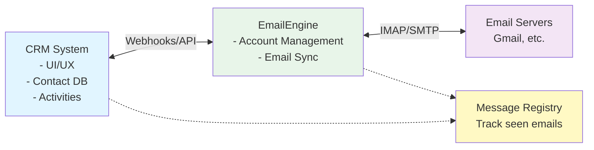

# CRM Integration Guide

Learn how to integrate EmailEngine with CRM systems to provide seamless email synchronization, contact activity tracking, and direct email sending capabilities.


## Overview

EmailEngine is frequently utilized by smaller, niche CRM systems for email integration, such as those designed for managing donations at a church or coordinating influencers for marketing campaigns.

When integrating email with a CRM system, it typically involves connecting the CRM users' email accounts to the platform. This integration provides two key benefits:

1. **Outbound**: Users can send emails directly from the CRM to their contacts while maintaining their personal identity
2. **Inbound**: The CRM actively monitors connected email accounts, identifying and tracking email exchanges with CRM contacts

## Architecture Overview



### Data Flow

1. **User Authentication**: CRM user connects their email account via EmailEngine
2. **Initial Sync**: EmailEngine performs initial mailbox synchronization
3. **Webhook Notifications**: EmailEngine sends webhooks for new incoming and sent emails
4. **Contact Matching**: CRM matches email addresses with contacts
5. **Activity Logging**: Email interactions are logged as CRM activities
6. **Outbound Sending**: CRM users send emails through EmailEngine's API

## Connecting Email Accounts

### Using the Authentication Form

Instead of requesting credentials through your CRM UI, use EmailEngine's built-in authentication form feature. This approach is more convenient and secure:

```bash
curl -XPOST \
  "https://ee.example.com/v1/authentication/form" \
  -H "Authorization: Bearer <TOKEN>" \
  -H "Content-Type: application/json" \
  -d '{
    "account": "USER_ID",
    "name": "User Name",
    "email": "user@example.com",
    "subconnections": [
      "\\Sent"
    ],
    "redirectUrl": "https://myapp/account/settings.php"
  }'
```

**Parameters**:

| Parameter | Description |
|-----------|-------------|
| `account` | User ID from your CRM system (for consistency) |
| `name` | User's display name |
| `email` | User's email address |
| `subconnections` | Additional folders for instant notifications (see below) |
| `redirectUrl` | URL to redirect user after authentication |

**Response**:

```json
{
  "url": "https://ee.example.com/accounts/new?data=eyJhY2NvdW50Ijo..."
}
```

Redirect the user's browser to this URL to initiate authentication.

### Benefits of Authentication Form

1. **No Password Handling**: Your application never handles passwords or OAuth tokens
2. **OAuth2 Support**: Users can authenticate via OAuth2 providers (Gmail, Outlook, etc.)
3. **Secure Storage**: EmailEngine encrypts and stores credentials internally
4. **User-Friendly**: Provides a guided authentication flow

### Authentication Flow

The user will see:

1. **Account Type Selection**: Choose between IMAP, OAuth2 (Gmail, Outlook), etc.
2. **Credentials Entry**: Enter server details or complete OAuth2 authorization
3. **Confirmation**: See connection status
4. **Redirect**: Automatically redirected back to your CRM

After authentication completes and initial synchronization finishes, the account reaches "connected" state and is ready to use.

## Sub-Connections for Sent Mail

Email servers immediately notify EmailEngine about new emails in the primary folder (Inbox), but for secondary folders like Sent Mail, EmailEngine relies on polling. This can cause delays in detecting sent emails.

**Problem**: If a CRM user sends an email and receives a response within minutes, EmailEngine might detect the reply but not the initial sent email (hasn't polled the Sent folder yet).

**Solution**: Use **sub-connections** to treat additional folders as primary, enabling instant notifications.

### Configuring Sub-Connections

```json
{
  "account": "USER_ID",
  "name": "User Name",
  "email": "user@example.com",
  "subconnections": [
    "\\Sent"
  ],
  "redirectUrl": "https://myapp/account/settings.php"
}
```

Using the special use flag `\Sent` allows EmailEngine to automatically determine the correct Sent Mail folder path for different email providers.

### Important Considerations

- Sub-connections open additional IMAP sessions
- Parallel IMAP connections per account are typically limited (3-5)
- Only list folders you genuinely need for instant notifications
- Don't include all folders "just in case"

**Read more**: [Sub-connections and Virtual Lists](/docs/advanced/virtual-lists)

## Listening for Webhooks

### Configure Webhook URL

Set up your webhook endpoint in EmailEngine's configuration:

1. Navigate to "Settings" → "Webhooks" in EmailEngine
2. Enter your CRM webhook endpoint URL
3. Select event types (recommend "New email" only to reduce load)

**Event Types**:
- **messageNew**: New email added to a folder (covers both incoming and sent)
- **messageDeleted**: Email deleted
- **messageBounce**: Email bounced
- **accountAdded**: Account connected
- And others...

**Best Practice**: Select only "New email" (messageNew) to minimize webhook volume. This event covers both incoming and sent emails.

### Create Webhook Handler

Create an endpoint in your CRM that accepts JSON payloads:

```php
<?php
// webhook-handler.php

// Read webhook payload
$payload = json_decode(file_get_contents('php://input'), true);

// Return 2xx quickly, process asynchronously
http_response_code(200);

// Queue for background processing
queueWebhook($payload);

function queueWebhook($payload) {
    // Add to job queue (Redis, database, etc.)
    // Process later by background worker
}
```

**Important**: Always return HTTP 2xx status quickly. Process webhooks asynchronously to avoid blocking EmailEngine.

## Classifying New Emails

### Understanding Email States

Every email added to a folder appears as "new," even if moved between folders. This creates challenges:

- Moving email from Inbox to Spam: Appears as deletion + new email
- Moving back to Inbox: Appears as another new email
- Email IDs change when messages move between folders

### Using Message IDs for Deduplication

**Solution**: Use the `messageId` property (from the Message-ID header) to track processed emails.

**Example Webhook Payload**:

```json
{
  "account": "USER_ID",
  "date": "2023-04-21T08:08:47.884Z",
  "path": "INBOX",
  "specialUse": "\\Inbox",
  "event": "messageNew",
  "data": {
    "id": "AAAARgAACMA",
    "uid": 2240,
    "from": {
      "name": "Sender Name",
      "address": "sender@example.com"
    },
    "to": [
      {
        "name": "",
        "address": "user@example.com"
      }
    ],
    "subject": "Hello world!",
    "messageId": "<01000187a29df5a2@example.com>",
    "messageSpecialUse": "\\Inbox",
    "threadId": "3d3e3d89-fc5b-4336-a454-a3ce280d849c"
  }
}
```

### Key Properties

1. **`data.messageSpecialUse`**: Primary special folder for the email
   - `\Inbox`: Incoming email
   - `\Sent`: Sent email
   - `\Junk`: Spam/Junk
   - `\Trash`: Deleted
   - `null`: User-created folder

2. **`data.messageId`**: Unique identifier from Message-ID header
   - Use for deduplication
   - Remains constant across folders
   - Empty messageId usually indicates spam

### Identifying Email Direction

```javascript
function classifyEmail(payload) {
  const specialUse = payload.data.messageSpecialUse;

  if (specialUse === '\\Inbox') {
    return 'incoming';
  } else if (specialUse === '\\Sent') {
    return 'sent';
  } else if (specialUse === '\\Draft') {
    return 'draft'; // ignore drafts
  } else if (specialUse === '\\Junk' || specialUse === '\\Trash') {
    return 'ignore';
  } else {
    // User folder - could be incoming via filter
    return 'incoming';
  }
}
```

**Note**: Some users have email filters that move specific emails to custom folders. Consider treating non-special folders as incoming emails.

### Gmail and Yahoo Exception

Gmail and Yahoo provide a unique `emailId` property that persists across folders:

```json
{
  "data": {
    "emailId": "187a29df5a2",
    "messageId": "<01000187a29df5a2@example.com>"
  }
}
```

Use `emailId` for Gmail/Yahoo if available, fall back to `messageId` for other providers.

## Building a Message Registry

Create a registry to track processed emails and prevent duplicates.

### Database Schema

```sql
CREATE TABLE message_registry (
  id INT PRIMARY KEY AUTO_INCREMENT,
  user_id VARCHAR(255),
  message_id VARCHAR(255),
  processed_at TIMESTAMP DEFAULT CURRENT_TIMESTAMP,
  UNIQUE KEY user_message_idx (user_id, message_id)
);
```

### Check for New Messages

```sql
INSERT IGNORE INTO message_registry (user_id, message_id)
  VALUES ('USER_ID', '<01000187a29df5a2@example.com>');
```

**Result**:
- **1 row added**: Email is new, process it
- **0 rows added**: Email already seen, ignore it

### Processing Logic

```php
<?php

function processWebhook($payload) {
    $userId = $payload['account'];
    $messageId = $payload['data']['messageId'];

    // Skip if no messageId (spam indicator)
    if (empty($messageId)) {
        return;
    }

    // Check if already processed
    $result = $db->query(
        "INSERT IGNORE INTO message_registry (user_id, message_id)
         VALUES (?, ?)",
        [$userId, $messageId]
    );

    if ($result->affectedRows === 0) {
        // Already processed
        return;
    }

    // New email - process it
    $direction = classifyEmailDirection($payload);

    if ($direction === 'incoming') {
        processIncomingEmail($payload);
    } elseif ($direction === 'sent') {
        processSentEmail($payload);
    }
}
```

## Processing Incoming Emails

Focus on the **From** address to identify the contact:

```php
<?php

function processIncomingEmail($payload) {
    $fromAddress = $payload['data']['from']['address'];

    // Skip if no from address (system messages)
    if (empty($fromAddress)) {
        return;
    }

    // Match with CRM contact
    $contact = findContactByEmail($fromAddress);

    if ($contact) {
        // Log email activity for this contact
        logEmailActivity([
            'contact_id' => $contact['id'],
            'user_id' => $payload['account'],
            'direction' => 'incoming',
            'subject' => $payload['data']['subject'],
            'date' => $payload['date'],
            'message_id' => $payload['data']['messageId'],
        ]);
    }
}
```

### Handling Multiple From Addresses

EmailEngine normalizes the From header into a single entry (not an array), even if the email technically has multiple From addresses (rare).

## Processing Sent Emails

Sent emails are more complex because they can have multiple recipients:

```php
<?php

function processSentEmail($payload) {
    $recipients = [];

    // Collect all recipients from To and CC
    if (isset($payload['data']['to'])) {
        foreach ($payload['data']['to'] as $address) {
            $recipients[] = $address['address'];
        }
    }

    if (isset($payload['data']['cc'])) {
        foreach ($payload['data']['cc'] as $address) {
            $recipients[] = $address['address'];
        }
    }

    // Match each recipient with CRM contacts
    foreach ($recipients as $recipientEmail) {
        $contact = findContactByEmail($recipientEmail);

        if ($contact) {
            // Log sent email activity
            logEmailActivity([
                'contact_id' => $contact['id'],
                'user_id' => $payload['account'],
                'direction' => 'sent',
                'subject' => $payload['data']['subject'],
                'date' => $payload['date'],
                'message_id' => $payload['data']['messageId'],
            ]);
        }
    }
}
```

### Multi-Participant Activities

Depending on your CRM's data model:

- **Option 1**: Create separate activity for each matching contact
- **Option 2**: Create one activity linking multiple contacts (if CRM supports it)

## Sending Emails from CRM

Enable users to send emails directly from the CRM interface using EmailEngine's submission API:

```php
<?php

function sendEmailFromCRM($userId, $toEmail, $subject, $body) {
    $ee = new EmailEngine([
        'access_token' => getenv('EMAILENGINE_TOKEN'),
        'ee_base_url' => getenv('EMAILENGINE_URL'),
    ]);

    try {
        $response = $ee->request('post', "/v1/account/$userId/submit", [
            'to' => [
                ['address' => $toEmail],
            ],
            'subject' => $subject,
            'html' => $body,
        ]);

        return [
            'success' => true,
            'messageId' => $response['messageId'],
        ];
    } catch (Exception $e) {
        return [
            'success' => false,
            'error' => $e->getMessage(),
        ];
    }
}
```

### Submission vs Outbox

- **Submit API**: Immediate sending (use for one-off emails)
- **Outbox API**: Queued sending (use for bulk or scheduled sends)

**Read more**: [Sending Emails](/docs/sending)

## Handling Sent Mail Folder Detection

EmailEngine tries to automatically detect the Sent Mail folder, but it may not always be accurate:

**Problem**: User has multiple sent-related folders (Sent, Sent Messages, Sent Emails, etc.)

**Solution**: Allow users to select the correct folder and set it explicitly:

```php
<?php

$ee->request('put', "/v1/account/$userId", [
    'imap' => [
        'sentMailPath' => 'Sent Messages', // User-selected folder
    ],
]);
```

This ensures EmailEngine uses the correct folder for sent mail detection.

## Complete Integration Example

Here's a complete webhook processing system:

```php
<?php

class CRMEmailIntegration
{
    private $db;
    private $ee;

    public function __construct($db, $eeToken, $eeUrl)
    {
        $this->db = $db;
        $this->ee = new EmailEngine([
            'access_token' => $eeToken,
            'ee_base_url' => $eeUrl,
        ]);
    }

    public function processWebhook($payload)
    {
        // Validate webhook
        if ($payload['event'] !== 'messageNew') {
            return;
        }

        $userId = $payload['account'];
        $messageId = $payload['data']['messageId'] ?? null;

        // Skip spam indicators
        if (empty($messageId)) {
            return;
        }

        // Check deduplication
        if (!$this->markMessageAsSeen($userId, $messageId)) {
            return; // Already processed
        }

        // Classify and process
        $direction = $this->classifyDirection($payload);

        if ($direction === 'incoming') {
            $this->handleIncoming($payload);
        } elseif ($direction === 'sent') {
            $this->handleSent($payload);
        }
    }

    private function markMessageAsSeen($userId, $messageId)
    {
        $result = $this->db->query(
            "INSERT IGNORE INTO message_registry (user_id, message_id)
             VALUES (?, ?)",
            [$userId, $messageId]
        );

        return $result->affectedRows > 0;
    }

    private function classifyDirection($payload)
    {
        $specialUse = $payload['data']['messageSpecialUse'] ?? null;

        if ($specialUse === '\\Inbox') {
            return 'incoming';
        } elseif ($specialUse === '\\Sent') {
            return 'sent';
        } elseif ($specialUse === '\\Draft') {
            return 'draft';
        } elseif (in_array($specialUse, ['\\Junk', '\\Trash'])) {
            return 'ignore';
        }

        // User folders - treat as incoming
        return 'incoming';
    }

    private function handleIncoming($payload)
    {
        $fromEmail = $payload['data']['from']['address'] ?? null;

        if (empty($fromEmail)) {
            return;
        }

        $contact = $this->findContact($fromEmail);

        if ($contact) {
            $this->logActivity([
                'contact_id' => $contact['id'],
                'user_id' => $payload['account'],
                'direction' => 'incoming',
                'from' => $fromEmail,
                'subject' => $payload['data']['subject'] ?? '',
                'date' => $payload['date'],
                'message_id' => $payload['data']['messageId'],
                'thread_id' => $payload['data']['threadId'] ?? null,
            ]);
        }
    }

    private function handleSent($payload)
    {
        $recipients = $this->extractRecipients($payload);

        foreach ($recipients as $email) {
            $contact = $this->findContact($email);

            if ($contact) {
                $this->logActivity([
                    'contact_id' => $contact['id'],
                    'user_id' => $payload['account'],
                    'direction' => 'sent',
                    'to' => $email,
                    'subject' => $payload['data']['subject'] ?? '',
                    'date' => $payload['date'],
                    'message_id' => $payload['data']['messageId'],
                    'thread_id' => $payload['data']['threadId'] ?? null,
                ]);
            }
        }
    }

    private function extractRecipients($payload)
    {
        $recipients = [];

        foreach (['to', 'cc'] as $field) {
            if (isset($payload['data'][$field])) {
                foreach ($payload['data'][$field] as $addr) {
                    if (!empty($addr['address'])) {
                        $recipients[] = $addr['address'];
                    }
                }
            }
        }

        return array_unique($recipients);
    }

    private function findContact($email)
    {
        return $this->db->queryOne(
            "SELECT * FROM contacts WHERE email = ? LIMIT 1",
            [$email]
        );
    }

    private function logActivity($data)
    {
        $this->db->query(
            "INSERT INTO email_activities
             (contact_id, user_id, direction, subject, email_date, message_id, thread_id, created_at)
             VALUES (?, ?, ?, ?, ?, ?, ?, NOW())",
            [
                $data['contact_id'],
                $data['user_id'],
                $data['direction'],
                $data['subject'],
                $data['date'],
                $data['message_id'],
                $data['thread_id'],
            ]
        );
    }

    public function sendEmail($userId, $toEmail, $subject, $body, $attachments = [])
    {
        try {
            $payload = [
                'to' => [['address' => $toEmail]],
                'subject' => $subject,
                'html' => $body,
            ];

            if (!empty($attachments)) {
                $payload['attachments'] = $attachments;
            }

            $response = $this->ee->request(
                'post',
                "/v1/account/$userId/submit",
                $payload
            );

            return [
                'success' => true,
                'messageId' => $response['messageId'],
            ];
        } catch (Exception $e) {
            return [
                'success' => false,
                'error' => $e->getMessage(),
            ];
        }
    }
}

// Usage
$integration = new CRMEmailIntegration(
    $database,
    getenv('EMAILENGINE_TOKEN'),
    getenv('EMAILENGINE_URL')
);

// Process webhook
$payload = json_decode(file_get_contents('php://input'), true);
$integration->processWebhook($payload);
http_response_code(200);
```

## Production Considerations

### Performance Tuning

When going to production, review performance settings:

- **Worker Threads**: Adjust `EENGINE_WORKERS` for account load
- **Webhook Processing**: Use `EENGINE_WORKERS_WEBHOOKS` for high webhook volume
- **Connection Delays**: Use `EENGINE_CONNECTION_SETUP_DELAY` for smooth startup
- **Redis Optimization**: Configure Redis memory and persistence

**Read more**: [Performance Tuning](/docs/advanced/performance-tuning)

### Data Compliance

Review what data is stored and your compliance obligations:

- **Password Storage**: EmailEngine encrypts credentials
- **Email Content**: Not stored by default (only metadata)
- **GDPR**: Implement data deletion workflows

**Read more**: Data and Security Compliance guide

### Scaling Strategies

**Vertical Scaling**:
- Increase CPU cores and RAM
- Optimize worker thread counts
- Tune Redis configuration

**Manual Sharding** (if needed):
- For very large deployments, manually shard accounts across completely separate EmailEngine instances
- Each instance requires its own Redis database
- Your application must route requests to the correct instance
- Example: Accounts 0-999 → Instance A (Redis A), 1000-1999 → Instance B (Redis B)

**Read more**: [Performance Tuning](/docs/advanced/performance-tuning)

