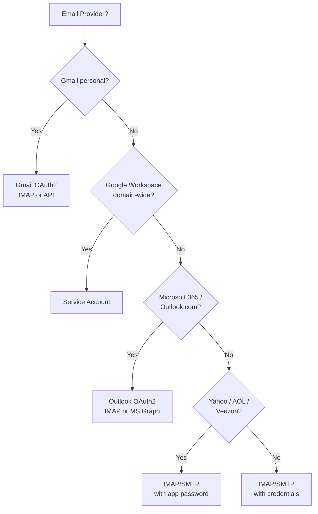
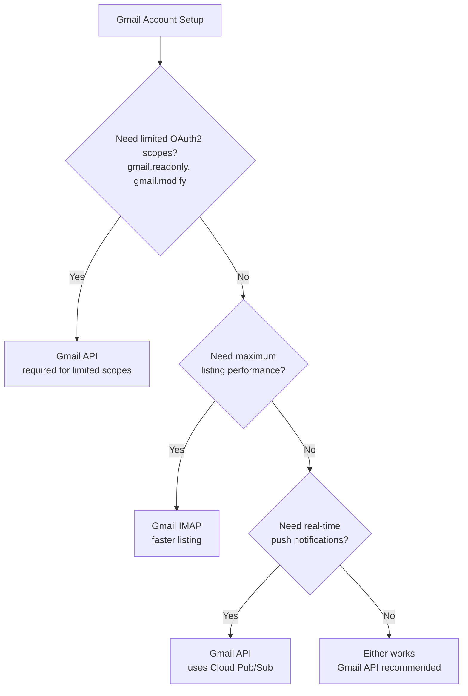
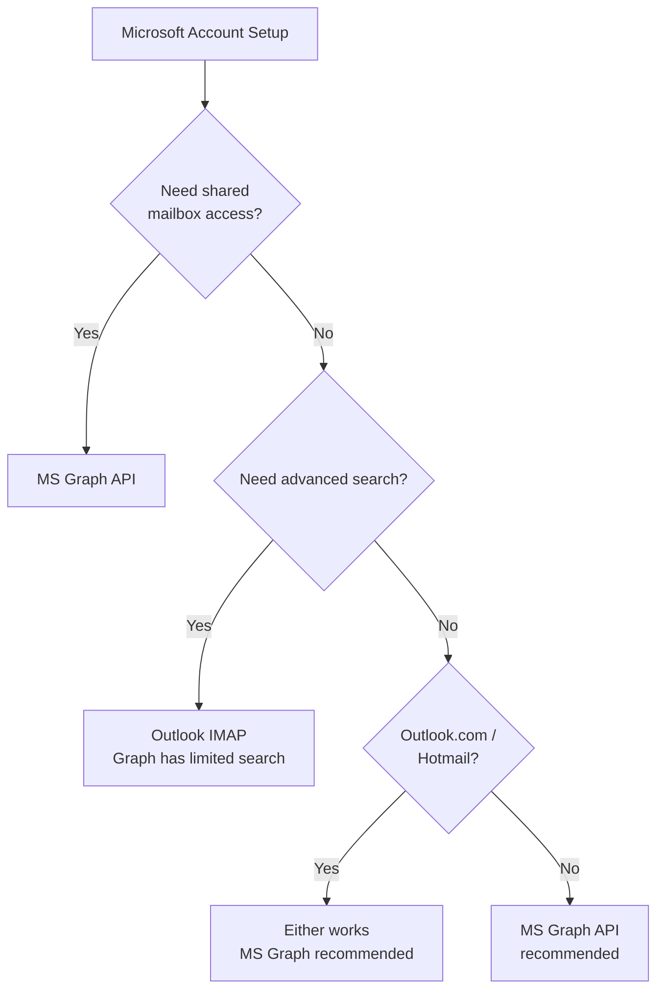

# EmailEngine AI Agent Reference

This document is designed for AI coding assistants helping developers integrate with the EmailEngine API. It provides a consolidated, machine-parseable overview of all capabilities, endpoints, and patterns.

## What EmailEngine Does

EmailEngine is a **self-hosted email API gateway** that provides REST API access to email accounts via:
- IMAP/SMTP protocols
- Gmail API (native)
- Microsoft Graph API (native)
- OAuth2 authentication

**Key value proposition:** Instead of dealing with IMAP/SMTP protocols directly, developers interact with a single REST API. EmailEngine handles connection management, authentication, synchronization, and real-time notifications via webhooks.

## Quick Facts

| Aspect | Details |
|--------|---------|
| API Style | RESTful JSON |
| Authentication | Bearer token (`Authorization: Bearer TOKEN`) |
| Base URL | `http://localhost:3000/v1` (default) |
| Webhooks | HTTP POST to configured endpoint |
| Data Storage | Redis (credentials encrypted with `EENGINE_SECRET`) |
| Message Storage | None - fetched from mail server on demand |

## Core Capabilities Matrix

| Capability | Endpoint | Key Parameters |
|------------|----------|----------------|
| **Register account** | `POST /v1/account` | `account`, `imap`, `smtp`, or `oauth2` |
| **List accounts** | `GET /v1/accounts` | `page`, `pageSize`, `state` |
| **Get account** | `GET /v1/account/{account}` | - |
| **Update account** | `PUT /v1/account/{account}` | Partial updates supported |
| **Delete account** | `DELETE /v1/account/{account}` | - |
| **Reconnect account** | `PUT /v1/account/{account}/reconnect` | - |
| **Send email** | `POST /v1/account/{account}/submit` | `to`, `subject`, `text`/`html` |
| **List messages** | `GET /v1/account/{account}/messages` | `path`, `page`, `pageSize` |
| **Get message** | `GET /v1/account/{account}/message/{message}` | `textType`, `embedAttachedImages` |
| **Search messages** | `POST /v1/account/{account}/search` | `search` object |
| **Update message** | `PUT /v1/account/{account}/message/{message}` | `flags`, `labels`, `seen` |
| **Delete message** | `DELETE /v1/account/{account}/message/{message}` | - |
| **Move message** | `PUT /v1/account/{account}/message/{message}/move` | `path` (destination) |
| **Download attachment** | `GET /v1/account/{account}/attachment/{attachment}` | - |
| **List mailboxes** | `GET /v1/account/{account}/mailboxes` | - |
| **Create mailbox** | `POST /v1/account/{account}/mailbox` | `path` |
| **Delete mailbox** | `DELETE /v1/account/{account}/mailbox` | `path` |
| **Configure webhooks** | `POST /v1/settings` | `webhooks`, `webhookEvents` |
| **Manage templates** | `POST /v1/templates/template` | `name`, `content`, `format` |
| **View outbox** | `GET /v1/outbox` | - |
| **Cancel queued email** | `DELETE /v1/outbox/{queueId}` | - |
| **Generate auth form** | `POST /v1/authentication/form` | `account`, `redirectUrl` |

## Complete API Endpoints

### Account Management

| Method | Endpoint | Description |
|--------|----------|-------------|
| `POST` | `/v1/account` | Register new email account |
| `GET` | `/v1/accounts` | List all accounts (paginated) |
| `GET` | `/v1/account/{account}` | Get account details and status |
| `PUT` | `/v1/account/{account}` | Update account configuration |
| `DELETE` | `/v1/account/{account}` | Delete account |
| `PUT` | `/v1/account/{account}/reconnect` | Force reconnection |
| `PUT` | `/v1/account/{account}/flush` | Reset sync state, re-index |
| `PUT` | `/v1/account/{account}/sync` | Trigger immediate sync |
| `GET` | `/v1/account/{account}/oauth-token` | Get current OAuth2 access token |
| `POST` | `/v1/verifyAccount` | Test account credentials |
| `POST` | `/v1/authentication/form` | Generate hosted auth form URL |
| `GET` | `/v1/autoconfig` | Auto-detect IMAP/SMTP settings |
| `GET` | `/v1/account/{account}/server-signatures` | List server signatures for account |

### Message Operations

| Method | Endpoint | Description |
|--------|----------|-------------|
| `GET` | `/v1/account/{account}/messages` | List messages in mailbox |
| `GET` | `/v1/account/{account}/message/{message}` | Get message details |
| `GET` | `/v1/account/{account}/message/{message}/source` | Get raw RFC822 source |
| `PUT` | `/v1/account/{account}/message/{message}` | Update flags/labels |
| `DELETE` | `/v1/account/{account}/message/{message}` | Delete message |
| `PUT` | `/v1/account/{account}/message/{message}/move` | Move to another mailbox |
| `POST` | `/v1/account/{account}/message` | Upload message to mailbox |
| `POST` | `/v1/account/{account}/search` | Search messages |
| `GET` | `/v1/account/{account}/text/{text}` | Get message text part |
| `GET` | `/v1/account/{account}/attachment/{attachment}` | Download attachment |

### Bulk Message Operations

| Method | Endpoint | Description |
|--------|----------|-------------|
| `POST` | `/v1/account/{account}/messages/move` | Move multiple messages |
| `POST` | `/v1/account/{account}/messages/delete` | Delete multiple messages |

### Mailbox Operations

| Method | Endpoint | Description |
|--------|----------|-------------|
| `GET` | `/v1/account/{account}/mailboxes` | List all mailboxes/folders |
| `POST` | `/v1/account/{account}/mailbox` | Create mailbox |
| `DELETE` | `/v1/account/{account}/mailbox` | Delete mailbox |

### Sending Emails

| Method | Endpoint | Description |
|--------|----------|-------------|
| `POST` | `/v1/account/{account}/submit` | Send/queue email |
| `GET` | `/v1/outbox` | List queued emails |
| `GET` | `/v1/outbox/{queueId}` | Get queued email details |
| `DELETE` | `/v1/outbox/{queueId}` | Cancel queued email |

### Templates

| Method | Endpoint | Description |
|--------|----------|-------------|
| `GET` | `/v1/templates` | List all templates |
| `POST` | `/v1/templates/template` | Create template |
| `GET` | `/v1/templates/template/{template}` | Get template |
| `PUT` | `/v1/templates/template/{template}` | Update template |
| `DELETE` | `/v1/templates/template/{template}` | Delete template |
| `GET` | `/v1/templates/account/{account}` | List account's templates |

### Settings & Configuration

| Method | Endpoint | Description |
|--------|----------|-------------|
| `GET` | `/v1/settings` | Get all settings |
| `POST` | `/v1/settings` | Update settings |
| `GET` | `/v1/settings/queue/{queue}` | Get queue configuration |
| `PUT` | `/v1/settings/queue/{queue}` | Update queue configuration |

### Webhooks

| Method | Endpoint | Description |
|--------|----------|-------------|
| `GET` | `/v1/webhookRoutes` | List webhook routes |
| `POST` | `/v1/webhookRoutes/webhookRoute` | Create webhook route |
| `PUT` | `/v1/webhookRoutes/webhookRoute/{webhookRoute}` | Update route |
| `DELETE` | `/v1/webhookRoutes/webhookRoute/{webhookRoute}` | Delete route |

### OAuth2 Applications

| Method | Endpoint | Description |
|--------|----------|-------------|
| `GET` | `/v1/oauth2` | List OAuth2 apps |
| `POST` | `/v1/oauth2` | Register OAuth2 app |
| `GET` | `/v1/oauth2/{app}` | Get OAuth2 app |
| `PUT` | `/v1/oauth2/{app}` | Update OAuth2 app |
| `DELETE` | `/v1/oauth2/{app}` | Delete OAuth2 app |

### SMTP Gateway

| Method | Endpoint | Description |
|--------|----------|-------------|
| `GET` | `/v1/gateways` | List SMTP gateways |
| `POST` | `/v1/gateway` | Register gateway |
| `GET` | `/v1/gateway/{gateway}` | Get gateway |
| `PUT` | `/v1/gateway/edit/{gateway}` | Update gateway |
| `DELETE` | `/v1/gateway/{gateway}` | Delete gateway |

### Access Tokens

| Method | Endpoint | Description |
|--------|----------|-------------|
| `GET` | `/v1/tokens` | List all tokens |
| `POST` | `/v1/token` | Create token |
| `GET` | `/v1/token/{token}` | Get token |
| `DELETE` | `/v1/token/{token}` | Delete token |
| `GET` | `/v1/tokens/account/{account}` | List account tokens |

### Blocklists

| Method | Endpoint | Description |
|--------|----------|-------------|
| `GET` | `/v1/blocklists` | List blocklists |
| `GET` | `/v1/blocklist/{listId}` | Get blocklist entries |
| `POST` | `/v1/blocklist/{listId}` | Add to blocklist |
| `DELETE` | `/v1/blocklist/{listId}` | Remove from blocklist |

### Monitoring & Stats

| Method | Endpoint | Description |
|--------|----------|-------------|
| `GET` | `/v1/stats` | Get usage statistics |
| `GET` | `/v1/logs/{account}` | Get account logs |
| `GET` | `/v1/changes` | Get recent changes |
| `GET` | `/v1/license` | Get license info |

### Deliverability Testing

| Method | Endpoint | Description |
|--------|----------|-------------|
| `POST` | `/v1/delivery-test/account/{account}` | Start delivery test |
| `GET` | `/v1/delivery-test/check/{deliveryTest}` | Check test results |

## Webhook Events (22 Total)

### Message Events

| Event | Description | Key Payload Fields |
|-------|-------------|-------------------|
| `messageNew` | New email received | `data.id`, `data.from`, `data.to`, `data.subject`, `data.text` |
| `messageDeleted` | Email deleted | `data.id` |
| `messageUpdated` | Flags/labels changed | `data.id`, `data.changes` |
| `messageMissing` | Message not found | `data.id` |

### Delivery Events

| Event | Description | Key Payload Fields |
|-------|-------------|-------------------|
| `messageSent` | Email sent successfully | `data.messageId`, `data.response` |
| `messageDeliveryError` | Delivery attempt failed | `data.error`, `data.job.attemptsMade` |
| `messageFailed` | Delivery permanently failed | `data.error`, `data.messageId` |
| `messageBounce` | Bounce notification received | `data.recipient`, `data.bounceMessage` |
| `messageComplaint` | Spam complaint (ARF) | `data.recipient` |

### Account Events

| Event | Description | Key Payload Fields |
|-------|-------------|-------------------|
| `accountAdded` | Account registered | `account` |
| `accountDeleted` | Account removed | `account` |
| `accountInitialized` | Account ready | `account`, `state` |
| `authenticationError` | Auth failed | `account`, `data.error` |
| `authenticationSuccess` | Auth succeeded | `account` |
| `connectError` | Connection failed | `account`, `data.error` |

### Mailbox Events

| Event | Description | Key Payload Fields |
|-------|-------------|-------------------|
| `mailboxNew` | Folder created | `data.path` |
| `mailboxDeleted` | Folder deleted | `data.path` |
| `mailboxReset` | Folder UIDVALIDITY changed | `data.path` |

### Tracking Events

| Event | Description | Key Payload Fields |
|-------|-------------|-------------------|
| `trackOpen` | Email opened | `data.messageId`, `data.recipient` |
| `trackClick` | Link clicked | `data.messageId`, `data.url` |
| `listUnsubscribe` | User unsubscribed | `data.recipient` |
| `listSubscribe` | User re-subscribed | `data.recipient` |

## Common Patterns

### Pattern 1: Register an IMAP/SMTP Account

```bash
curl -X POST "https://emailengine.example.com/v1/account" \
  -H "Authorization: Bearer YOUR_TOKEN" \
  -H "Content-Type: application/json" \
  -d '{
    "account": "user123",
    "name": "John Doe",
    "email": "john@example.com",
    "imap": {
      "host": "imap.example.com",
      "port": 993,
      "secure": true,
      "auth": {
        "user": "john@example.com",
        "pass": "password"
      }
    },
    "smtp": {
      "host": "smtp.example.com",
      "port": 465,
      "secure": true,
      "auth": {
        "user": "john@example.com",
        "pass": "password"
      }
    }
  }'
```

### Pattern 2: Register OAuth2 Account (Gmail/Outlook)

```bash
curl -X POST "https://emailengine.example.com/v1/account" \
  -H "Authorization: Bearer YOUR_TOKEN" \
  -H "Content-Type: application/json" \
  -d '{
    "account": "user123",
    "email": "john@gmail.com",
    "oauth2": {
      "provider": "OAUTH_APP_ID",
      "refreshToken": "REFRESH_TOKEN",
      "auth": {
        "user": "john@gmail.com"
      }
    }
  }'
```

### Pattern 3: Send a Simple Email

```bash
curl -X POST "https://emailengine.example.com/v1/account/user123/submit" \
  -H "Authorization: Bearer YOUR_TOKEN" \
  -H "Content-Type: application/json" \
  -d '{
    "to": [{"address": "recipient@example.com", "name": "Recipient"}],
    "subject": "Hello",
    "text": "Plain text body",
    "html": "<p>HTML body</p>"
  }'
```

### Pattern 4: Send Email with Attachments

```bash
curl -X POST "https://emailengine.example.com/v1/account/user123/submit" \
  -H "Authorization: Bearer YOUR_TOKEN" \
  -H "Content-Type: application/json" \
  -d '{
    "to": [{"address": "recipient@example.com"}],
    "subject": "Document attached",
    "text": "Please find the document attached.",
    "attachments": [
      {
        "filename": "document.pdf",
        "content": "BASE64_ENCODED_CONTENT",
        "contentType": "application/pdf"
      }
    ]
  }'
```

### Pattern 5: Reply to an Email

```bash
curl -X POST "https://emailengine.example.com/v1/account/user123/submit" \
  -H "Authorization: Bearer YOUR_TOKEN" \
  -H "Content-Type: application/json" \
  -d '{
    "to": [{"address": "original-sender@example.com"}],
    "subject": "Re: Original Subject",
    "text": "My reply",
    "reference": {
      "message": "ORIGINAL_MESSAGE_ID",
      "action": "reply"
    }
  }'
```

### Pattern 6: Forward an Email

```bash
curl -X POST "https://emailengine.example.com/v1/account/user123/submit" \
  -H "Authorization: Bearer YOUR_TOKEN" \
  -H "Content-Type: application/json" \
  -d '{
    "to": [{"address": "forward-to@example.com"}],
    "subject": "Fwd: Original Subject",
    "text": "Forwarding this email",
    "reference": {
      "message": "ORIGINAL_MESSAGE_ID",
      "action": "forward"
    }
  }'
```

### Pattern 7: Search Messages

```bash
curl -X POST "https://emailengine.example.com/v1/account/user123/search" \
  -H "Authorization: Bearer YOUR_TOKEN" \
  -H "Content-Type: application/json" \
  -d '{
    "search": {
      "from": "sender@example.com",
      "subject": "invoice",
      "unseen": true,
      "since": "2024-01-01"
    }
  }'
```

### Pattern 8: Configure Webhooks

```bash
curl -X POST "https://emailengine.example.com/v1/settings" \
  -H "Authorization: Bearer YOUR_TOKEN" \
  -H "Content-Type: application/json" \
  -d '{
    "webhooks": "https://your-app.com/webhooks",
    "webhooksEnabled": true,
    "webhookEvents": ["messageNew", "messageSent", "messageFailed"]
  }'
```

### Pattern 9: Handle Webhook (Node.js)

```javascript
app.post('/webhooks', express.json(), (req, res) => {
  const { event, account, data } = req.body;

  // Acknowledge immediately
  res.status(200).json({ success: true });

  // Process asynchronously
  switch (event) {
    case 'messageNew':
      // New email: data.id, data.from, data.to, data.subject
      break;
    case 'messageSent':
      // Email sent: data.messageId
      break;
    case 'messageFailed':
      // Delivery failed: data.error
      break;
  }
});
```

### Pattern 10: List and Paginate Messages

```bash
# First page (20 messages)
curl "https://emailengine.example.com/v1/account/user123/messages?path=INBOX&page=0&pageSize=20" \
  -H "Authorization: Bearer YOUR_TOKEN"

# Next page
curl "https://emailengine.example.com/v1/account/user123/messages?path=INBOX&page=1&pageSize=20" \
  -H "Authorization: Bearer YOUR_TOKEN"
```

### Pattern 11: Mail Merge (Bulk Personalized Emails)

```bash
curl -X POST "https://emailengine.example.com/v1/account/user123/submit" \
  -H "Authorization: Bearer YOUR_TOKEN" \
  -H "Content-Type: application/json" \
  -d '{
    "subject": "Hello {{name}}",
    "html": "<p>Dear {{name}}, your order #{{orderId}} is ready.</p>",
    "mailMerge": [
      {
        "to": [{"address": "alice@example.com"}],
        "params": {"name": "Alice", "orderId": "1001"}
      },
      {
        "to": [{"address": "bob@example.com"}],
        "params": {"name": "Bob", "orderId": "1002"}
      }
    ]
  }'
```

### Pattern 12: Generate Hosted Authentication Form

```bash
# Generate form URL
curl -X POST "https://emailengine.example.com/v1/authentication/form" \
  -H "Authorization: Bearer YOUR_TOKEN" \
  -H "Content-Type: application/json" \
  -d '{
    "account": "new-user",
    "name": "New User",
    "redirectUrl": "https://your-app.com/settings"
  }'

# Response: {"url": "https://emailengine.example.com/accounts/new?data=..."}
# Redirect user to this URL to complete authentication
```

## Account Types

| Type | Value | Description | Requirements |
|------|-------|-------------|--------------|
| IMAP/SMTP | `imap` | Standard email protocol | Host, port, credentials |
| Gmail OAuth2 | `gmail` | Gmail via OAuth2 + IMAP | OAuth2 app, refresh token |
| Gmail API | `gmail` | Gmail native API | OAuth2 app, Cloud Pub/Sub |
| Gmail Service Account | `gmailService` | Google Workspace domain-wide | Service account key |
| Outlook OAuth2 | `outlook` | Microsoft via OAuth2 | Azure AD app, refresh token |
| MS Graph API | `outlook` | Microsoft native API | Azure AD app, graph subscription |
| Mail.ru OAuth2 | `mailRu` | Mail.ru via OAuth2 + IMAP | OAuth2 app, refresh token |
| Generic OAuth2 | `oauth2` | Generic OAuth2 provider | OAuth2 app configuration |

## Account States

| State | Description | Next Steps |
|-------|-------------|------------|
| `init` | Being initialized | Wait |
| `syncing` | Initial sync in progress | Wait |
| `connecting` | Establishing connection | Wait |
| `connected` | Active and operational | Ready for API calls |
| `disconnected` | Connection lost | Will auto-reconnect |
| `authenticationError` | Invalid credentials | Update credentials |
| `connectError` | Network/server error | Check connectivity |
| `unset` | OAuth2 not completed | Complete OAuth2 flow |

## Error Handling

### HTTP Status Codes

| Code | Meaning | Action |
|------|---------|--------|
| `200` | Success | - |
| `400` | Bad Request | Check request parameters |
| `401` | Unauthorized | Verify API token |
| `403` | Forbidden | Check token permissions |
| `404` | Not Found | Verify account/message ID |
| `409` | Conflict | Duplicate account ID |
| `429` | Rate Limited | Retry with backoff |
| `500` | Server Error | Retry after delay |
| `503` | Unavailable | Service restarting, retry |

### Error Response Format

```json
{
  "error": "Human-readable message",
  "code": "ErrorCode",
  "statusCode": 400
}
```

### Common Error Codes

| Code | Description |
|------|-------------|
| `AccountNotFound` | Account doesn't exist |
| `MessageNotFound` | Message doesn't exist |
| `InvalidRequest` | Request validation failed |
| `AuthenticationRequired` | Missing API token |
| `RateLimitExceeded` | Too many requests |
| `ConnectionError` | Can't connect to mail server |

## Decision Trees

### Choosing Account Type



### Gmail API vs Gmail IMAP



### MS Graph vs Outlook IMAP



## Environment Variables

| Variable | Required | Description |
|----------|----------|-------------|
| `EENGINE_REDIS` | Yes | Redis URL (e.g., `redis://localhost:6379/8`) |
| `EENGINE_SECRET` | Prod | Encryption key for credentials (32+ hex chars) |
| `EENGINE_PORT` | No | API port (default: 3000) |
| `EENGINE_HOST` | No | Bind address (default: 127.0.0.1) |
| `EENGINE_WORKERS` | No | IMAP worker count (default: 4) |
| `EENGINE_LOG_LEVEL` | No | Log level (trace/debug/info/warn/error) |

## Submit API Key Parameters

The `POST /v1/account/{account}/submit` endpoint accepts these key parameters:

| Parameter | Type | Description |
|-----------|------|-------------|
| `to` | array | Recipients `[{address, name}]` (required) |
| `cc` | array | CC recipients |
| `bcc` | array | BCC recipients |
| `subject` | string | Email subject |
| `text` | string | Plain text body |
| `html` | string | HTML body |
| `from` | object | Override sender `{address, name}` |
| `replyTo` | object | Reply-to address |
| `attachments` | array | Attachments `[{filename, content, contentType}]` |
| `headers` | object | Custom headers |
| `reference` | object | For replies/forwards `{message, action}` |
| `template` | string | Template ID to use |
| `mailMerge` | array | Bulk send with personalization |
| `sendAt` | string | Schedule sending (ISO 8601) |
| `trackOpens` | boolean | Enable open tracking |
| `trackClicks` | boolean | Enable click tracking |
| `copy` | boolean | Save to Sent folder (default: true) |
| `dryRun` | boolean | Preview without sending |
| `gateway` | string | Use specific SMTP gateway |
| `deliveryAttempts` | number | Max retry attempts |

## Search Parameters

The `POST /v1/account/{account}/search` endpoint accepts these search criteria:

| Parameter | Type | Description |
|-----------|------|-------------|
| `from` | string | Sender address/name |
| `to` | string | Recipient address/name |
| `subject` | string | Subject contains |
| `body` | string | Body contains |
| `unseen` | boolean | Unread only |
| `flagged` | boolean | Starred/flagged only |
| `since` | string | After date (YYYY-MM-DD) |
| `before` | string | Before date (YYYY-MM-DD) |
| `header` | object | Custom header match |
| `emailId` | string | Specific message ID |
| `threadId` | string | Specific thread ID |

## See Also

- [Full API Reference](/docs/api/emailengine-api) - Auto-generated OpenAPI documentation
- [Webhook Events Reference](/docs/reference/webhook-events) - Complete webhook payload docs
- [Quick Reference](/docs/reference/quick-reference) - Tables for common lookups
- [Machine-Readable Capabilities](/capabilities.json) - JSON capabilities manifest
