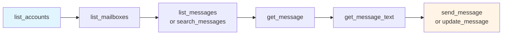

# MCP Tools Reference

The MCP endpoint exposes 15 tools. This page documents each one, what it returns, and the REST endpoint it dispatches to.

Tools are not a second implementation of the API. Each one wraps a route: the tool's input schema is generated from that route's request validation, and calling the tool runs that route in-process with the caller's own credential. Anything the [API Reference](/docs/api-reference) says about an endpoint - identifier formats, provider differences, error conditions - is true of the tool that wraps it.

## The catalog

| Tool | What it does | Behavior | Wraps |
|------|--------------|----------|-------|
| `list_accounts` | Lists accounts on the instance, paged | read-only | [`GET /v1/accounts`](/docs/api/get-v-1-accounts) |
| `get_account` | One account: name, address, connection state, sync status | read-only | [`GET /v1/account/{account}`](/docs/api/get-v-1-account-account) |
| `list_mailboxes` | Folder tree with counters and special-use roles | read-only | [`GET /v1/account/{account}/mailboxes`](/docs/api/get-v-1-account-account-mailboxes) |
| `list_messages` | Messages in one folder, newest first, paged | read-only | [`GET /v1/account/{account}/messages`](/docs/api/get-v-1-account-account-messages) |
| `search_messages` | Structured search inside one folder | read-only | [`POST /v1/account/{account}/search`](/docs/api/post-v-1-account-account-search) |
| `get_message` | One message: envelope, flags, attachment list, text id | read-only | [`GET /v1/account/{account}/message/{message}`](/docs/api/get-v-1-account-account-message-message) |
| `get_message_text` | The text and HTML body of a message | read-only | [`GET /v1/account/{account}/text/{text}`](/docs/api/get-v-1-account-account-text-text) |
| `get_attachment` | One attachment, inline as base64 | read-only | [`GET /v1/account/{account}/attachment/{attachment}`](/docs/api/get-v-1-account-account-attachment-attachment) |
| `update_message` | Adds or removes flags and Gmail labels | write | [`PUT /v1/account/{account}/message/{message}`](/docs/api/put-v-1-account-account-message-message) |
| `move_message` | Moves a message to another folder | write | [`PUT /v1/account/{account}/message/{message}/move`](/docs/api/put-v-1-account-account-message-message-move) |
| `delete_message` | Moves to Trash, or deletes permanently from Trash | destructive | [`DELETE /v1/account/{account}/message/{message}`](/docs/api/delete-v-1-account-account-message-message) |
| `create_draft` | Stores a message in a folder without sending it | write | [`POST /v1/account/{account}/message`](/docs/api/post-v-1-account-account-message) |
| `send_message` | Queues an email for delivery to real recipients | sends email | [`POST /v1/account/{account}/submit`](/docs/api/post-v-1-account-account-submit) |
| `get_outbox` | The sending queue, including scheduled messages | read-only | [`GET /v1/outbox`](/docs/api/get-v-1-outbox) |
| `list_templates` | Stored email templates | read-only | [`GET /v1/templates`](/docs/api/get-v-1-templates) |

The **Behavior** column is what the tool advertises through MCP annotations (`readOnlyHint`, `destructiveHint`, `openWorldHint`). Clients use them to decide what to run without asking and what to confirm first. `send_message` is the only tool marked as reaching the outside world, because it is the only one that can leave the connected mailboxes.

The same catalog is rendered live in the admin interface, under **Configuration** > **MCP** > **Connect an agent** > **Exposed tools**. That page reads the running registry, so it is the authority on what the instance in front of you exposes:


_The Exposed tools card shows exactly what a client receives from `tools/list`_

:::note Not everything the API can do
The catalog is deliberately small. Creating and deleting folders, editing accounts, exporting mailboxes, managing webhooks, gateways and templates, reading connection logs and everything under settings and credentials have no tools, and an `mcp` token is refused those operations even if it asks for them by another route. Use the [REST API](/docs/api-reference) for administration.
:::

## Typical agent workflow

The tool descriptions steer a model through this sequence, and the server sends the same guidance as MCP instructions on connect:



1. `list_accounts` gives the `account` id every other tool needs. An account-bound token skips this: it is told its own account id in the connect instructions instead.
2. `list_mailboxes` gives folder paths. Paths are what `list_messages`, `search_messages` and `move_message` take, and they are provider-specific strings, not names to guess at.
3. `list_messages` or `search_messages` gives message ids.
4. `get_message` gives the envelope and a `text.id`.
5. `get_message_text` gives the body. It is a separate call on purpose: message text is unbounded, and an agent that only needs subjects should not pay for bodies.
6. Acting on the message: flags with `update_message`, filing with `move_message`, replying with `send_message` and a `reference`.

## Arguments

Every tool takes `account` except `list_accounts`, `get_outbox` and `list_templates`, which are instance-wide. Required arguments are marked.

### Accounts and folders

**`list_accounts`**

| Argument | Type | Notes |
|----------|------|-------|
| `page` | integer | Zero-indexed |
| `pageSize` | integer | Entries per page |
| `state` | string | Filter by connection state, for example `connected` |
| `query` | string | Substring match on the account id, name or address |

**`get_account`**

| Argument | Type | Notes |
|----------|------|-------|
| `account` (required) | string | Account id |
| `quota` | boolean | Include mailbox quota |

Credentials are masked in the response.

**`list_mailboxes`**

| Argument | Type | Notes |
|----------|------|-------|
| `account` (required) | string | Account id |
| `counters` | boolean | Include message and unseen counts |

### Reading

**`list_messages`**

| Argument | Type | Notes |
|----------|------|-------|
| `account` (required) | string | Account id |
| `path` (required) | string | Folder path, or a special-use label like `\Sent`. `\All` works on Gmail IMAP |
| `cursor` | string | `nextPageCursor` or `prevPageCursor` from a previous response |
| `page` | integer | Zero-indexed. IMAP accounts only |
| `pageSize` | integer | Entries per page |

**`search_messages`**

| Argument | Type | Notes |
|----------|------|-------|
| `account` (required) | string | Account id |
| `search` (required) | object | Search criteria: `from`, `to`, `subject`, `body`, `since`, `before`, `seen`, `flagged`, `emailId`, `header` and more. See [Searching Messages](/docs/receiving/searching) |
| `path` | string | Folder to search. One folder at a time, not the whole account |
| `cursor`, `page`, `pageSize` | | Paging, as above |
| `useOutlookSearch` | boolean | MS Graph only: use `$search` instead of `$filter` |

**`get_message`**

| Argument | Type | Notes |
|----------|------|-------|
| `account` (required) | string | Account id |
| `message` (required) | string | Message id from a listing or search |
| `textType` | string | Include the body directly: `plain`, `html` or `*` |
| `maxBytes` | integer | Cap on the returned text |
| `webSafeHtml` | boolean | Return HTML that is safe to display, with quoted history collapsed. See [Web Safe HTML](/docs/receiving/web-safe-html) |
| `embedAttachedImages`, `preProcessHtml` | boolean | The individual parts of `webSafeHtml` |
| `markAsSeen` | boolean | Set `\Seen` while reading |

**`get_message_text`**

| Argument | Type | Notes |
|----------|------|-------|
| `account` (required) | string | Account id |
| `text` (required) | string | The `text.id` value from `get_message` or a listing |
| `textType` | string | `plain`, `html` or `*` |
| `maxBytes` | integer | Cap on the returned text |

**`get_attachment`**

| Argument | Type | Notes |
|----------|------|-------|
| `account` (required) | string | Account id |
| `attachment` (required) | string | Attachment id from the `attachments` array of `get_message` |

Returns the file inline as a base64 MCP resource. See [Binary results](#binary-results) for the size limit.

### Organizing

**`update_message`**

| Argument | Type | Notes |
|----------|------|-------|
| `account` (required) | string | Account id |
| `message` (required) | string | Message id |
| `flags` | object | `{ "add": ["\\Seen"], "delete": ["\\Flagged"], "set": [...] }` |
| `labels` | object | Same shape, Gmail only |

**`move_message`**

| Argument | Type | Notes |
|----------|------|-------|
| `account` (required) | string | Account id |
| `message` (required) | string | Message id |
| `path` (required) | string | Destination folder path |
| `source` | string | Source folder path. Gmail API accounts only, where it is what removes the old label |

The message id changes when a message moves. The response carries the new one.

**`delete_message`**

| Argument | Type | Notes |
|----------|------|-------|
| `account` (required) | string | Account id |
| `message` (required) | string | Message id |
| `force` | boolean | Delete outright instead of moving to Trash. Not supported on Gmail API accounts |

Deleting moves the message to Trash when it is not already there, and deletes it permanently when it is.

### Writing and sending

**`create_draft`** stores a message in a folder. Nothing is sent.

| Argument | Type | Notes |
|----------|------|-------|
| `account` (required) | string | Account id |
| `path` (required) | string | Target folder, usually the Drafts folder from `list_mailboxes` |
| `from`, `to`, `cc`, `bcc` | object / array | Addresses |
| `subject`, `text`, `html` | string | Content |
| `attachments` | array | Attachment objects |
| `reference` | object | `{ "message": "<id>", "action": "reply" }` to store a reply in context |
| `flags`, `internalDate`, `messageId`, `headers`, `locale`, `tz` | | As on the REST endpoint |
| `raw` | string | A complete base64-encoded RFC 822 message instead of the structured fields |

**`send_message`** queues a message for delivery. It takes the whole [submit payload](/docs/api/post-v-1-account-account-submit), including:

| Argument | Type | Notes |
|----------|------|-------|
| `account` (required) | string | Account id |
| `to`, `cc`, `bcc` | array | Recipients |
| `subject`, `text`, `html` | string | Content |
| `reference` | object | `{ "message": "<id>", "action": "reply" }` or `"forward"`. Sets the threading headers and can quote the original |
| `template` | string | Send a [stored template](/docs/sending/templates) |
| `attachments` | array | Attachment objects |
| `sendAt` | string | ISO date to [schedule](/docs/sending/basic-sending#scheduled-sending) the send |
| `trackOpens`, `trackClicks` | boolean | Per-message [tracking](/docs/sending/basic-sending#email-tracking) |
| `gateway`, `dsn`, `listId`, `copy`, `sentMailPath`, `dryRun` | | As on the REST endpoint |

Three payload fields are deliberately not offered as tool arguments: `proxy` and `localAddress`, which retarget where the connection carrying the account's SMTP credentials is made, and the deprecated `documentStore` flag.

Delivery is queued, not immediate. The response carries a `queueId`, and the message shows up in the `get_outbox` listing until it is delivered.

:::warning Sending is the one irreversible tool
`send_message` reaches real recipients, and a queued message can only be cancelled while it is still in the outbox. Clients that honor MCP annotations treat it as an open-world call and ask for confirmation. If you would rather they could not call it at all, issue the token at the read-only access level - see [Access Control](/docs/mcp/access-control#access-levels).
:::

### Queue and templates

**`get_outbox`** takes `page` and `pageSize`. It lists queued and scheduled messages with their delivery progress.

**`list_templates`** takes `account` (for account-specific templates; omit for shared ones), `page` and `pageSize`.

## Results

A successful tool call returns the endpoint's JSON response twice: once as text, for models that read the content block, and once as `structuredContent`, for clients that parse it.

```json
{
  "jsonrpc": "2.0",
  "id": 2,
  "result": {
    "content": [
      {
        "type": "text",
        "text": "{\"total\":1,\"pages\":1,\"page\":0,\"accounts\":[{\"account\":\"user123\",\"name\":\"John Doe\",\"email\":\"john.doe@example.com\",\"type\":\"imap\",\"state\":\"connected\"}]}"
      }
    ],
    "structuredContent": {
      "total": 1,
      "pages": 1,
      "page": 0,
      "accounts": [
        {
          "account": "user123",
          "name": "John Doe",
          "email": "john.doe@example.com",
          "type": "imap",
          "state": "connected"
        }
      ]
    }
  }
}
```

The JSON is compact on purpose: indentation is padding to a model, and it counts against the size cap below.

### Errors

A failed tool call is a result, not a protocol error. The result carries `isError: true` and the API's own error body, so an agent can read what went wrong and correct itself:

```json
{
  "jsonrpc": "2.0",
  "id": 3,
  "result": {
    "content": [
      {
        "type": "text",
        "text": "{\"statusCode\":403,\"error\":\"Forbidden\",\"message\":\"Unauthorized permission\",\"requiredPermission\":{\"action\":\"send\",\"group\":\"submit\"}}"
      }
    ],
    "isError": true
  }
}
```

Argument mistakes are caught before dispatch and named:

```json
{ "content": [{ "type": "text", "text": "Missing required tool argument: message" }], "isError": true }
```

```json
{ "content": [{ "type": "text", "text": "Unknown tool argument: bogus" }], "isError": true }
```

Calling a tool that does not exist is a JSON-RPC error rather than a result, because no tool ran - see [Error codes](/docs/mcp/protocol#error-codes).

### Size limits

| Limit | Value | What happens |
|-------|-------|--------------|
| Tool result | 512 KB | The text is cut at the limit and a notice is appended naming the full size; `structuredContent` is omitted so the cap is not defeated |
| Inline attachment | 1 MB | `get_attachment` refuses and points at the REST download endpoint |
| Accounts in `resources/list` | 500 | Larger instances are browsed with `list_accounts` and its paging arguments |

A single message can carry megabytes of text, and an oversized result degrades or breaks the calling model, so the caps err low. Narrow the request instead: page smaller, ask for `textType: "plain"`, or set `maxBytes`.

### Binary results

`get_attachment` returns an embedded resource rather than text:

```json
{
  "content": [
    {
      "type": "resource",
      "resource": {
        "uri": "emailengine://account/user123/attachment/AAAAAQAACnAcdefgh",
        "mimeType": "application/pdf",
        "blob": "JVBERi0xLjQKJcfs..."
      }
    }
  ]
}
```

The URI is a stable identifier for the client to attach the blob to. It is not listed by `resources/list` and not readable with `resources/read` - the content is in the result.

## Resources

Each account the credential can see is published as an MCP resource:

```json
{
  "uri": "emailengine://account/user123",
  "name": "user123",
  "title": "John Doe",
  "description": "john.doe@example.com, state: connected",
  "mimeType": "application/json"
}
```

`resources/read` on that URI returns the same payload as `get_account`. Clients that browse resources can therefore show what a credential reaches without calling a tool, and an account-bound credential sees exactly its own account.

Accounts whose id contains `/`, `?` or `#` are skipped in the listing: they cannot round-trip through the URI. Their mail is still reachable through the tools, which take the id as an argument.

Modern-revision clients can also subscribe to an account resource and be notified when its state changes - see [Subscriptions](/docs/mcp/protocol#subscriptions).

## See Also

- [Access Control](/docs/mcp/access-control) - which of these tools a given credential is offered
- [Protocol Reference](/docs/mcp/protocol) - `tools/list`, `tools/call` and the rest of the wire format
- [Messages API](/docs/api-reference/messages-api) - the REST endpoints behind the reading and organizing tools
- [Sending Emails](/docs/sending/basic-sending) - what `send_message` does under the hood
- [EmailEngine IDs Explained](/docs/advanced/ids-explained) - message ids, text ids and how they change
