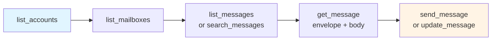

# MCP Tools Reference

The MCP endpoint exposes two tool sets behind two scopes: the **mail tools**, which the `mcp` scope opens, and the **management tools**, which the `mcp-manage` scope opens. This page documents each tool, what it returns, and the REST endpoint it dispatches to.

Tools are not a second implementation of the API. Each one wraps a route: the tool's input schema is generated from that route's request validation, and calling the tool runs that route in-process with the caller's own credential. Anything the [API Reference](/docs/api-reference) says about an endpoint - identifier formats, provider differences, error conditions - is true of the tool that wraps it.

:::info Beta
The mail tools shipped with MCP support in EmailEngine v2.79.2. The management tools and the `mcp-manage` scope were added in v2.80.1 (2026-09-10). The set may still change between releases; the live catalog described [below](#the-catalog) is the authority for the instance in front of you.
:::

## The catalog

The same catalog is rendered live in the admin interface, under **Configuration** > **MCP** > **Exposed tools**, grouped by scope. That page reads the running registry, so it is the authority on what the instance in front of you exposes:


_The Exposed tools card shows exactly what a client receives from `tools/list`_

The **Behavior** column in the tables below is what a tool advertises through MCP annotations (`readOnlyHint`, `destructiveHint`, `openWorldHint`). Clients use them to decide what to run without asking and what to confirm first. A tool is marked as reaching outside the instance when it sends mail (`send_message`) or connects to a host the arguments or a stored record name (`autodiscover_settings`, `verify_account_settings`, `verify_oauth2_app`).

### Mail tools (`mcp` scope)

| Tool | What it does | Behavior | Wraps |
|------|--------------|----------|-------|
| `list_accounts` | Lists accounts on the instance, paged | read-only, both scopes | [`GET /v1/accounts`](/docs/api/get-v-1-accounts) |
| `get_account` | One account: name, address, connection state, sync status | read-only, both scopes | [`GET /v1/account/{account}`](/docs/api/get-v-1-account-account) |
| `list_mailboxes` | Folder tree with counters and special-use roles | read-only | [`GET /v1/account/{account}/mailboxes`](/docs/api/get-v-1-account-account-mailboxes) |
| `list_messages` | Messages in one folder, newest first, paged | read-only | [`GET /v1/account/{account}/messages`](/docs/api/get-v-1-account-account-messages) |
| `search_messages` | Structured search inside one folder | read-only | [`POST /v1/account/{account}/search`](/docs/api/post-v-1-account-account-search) |
| `get_message` | One message: envelope, flags, attachment list, and the body inline | read-only | [`GET /v1/account/{account}/message/{message}`](/docs/api/get-v-1-account-account-message-message) |
| `get_message_text` | A message body on its own, with a larger budget than `get_message` | read-only | [`GET /v1/account/{account}/text/{text}`](/docs/api/get-v-1-account-account-text-text) |
| `get_attachment` | One attachment, inline as base64 | read-only | [`GET /v1/account/{account}/attachment/{attachment}`](/docs/api/get-v-1-account-account-attachment-attachment) |
| `update_message` | Adds or removes flags and Gmail labels | write | [`PUT /v1/account/{account}/message/{message}`](/docs/api/put-v-1-account-account-message-message) |
| `move_message` | Moves a message to another folder | write | [`PUT /v1/account/{account}/message/{message}/move`](/docs/api/put-v-1-account-account-message-message-move) |
| `delete_message` | Moves to Trash, or deletes permanently from Trash | destructive | [`DELETE /v1/account/{account}/message/{message}`](/docs/api/delete-v-1-account-account-message-message) |
| `create_draft` | Stores a message in a folder without sending it | write | [`POST /v1/account/{account}/message`](/docs/api/post-v-1-account-account-message) |
| `send_message` | Queues an email for delivery to real recipients | sends email, reaches outside | [`POST /v1/account/{account}/submit`](/docs/api/post-v-1-account-account-submit) |
| `get_outbox` | The sending queue, including scheduled messages | read-only, both scopes | [`GET /v1/outbox`](/docs/api/get-v-1-outbox) |
| `list_templates` | Stored email templates | read-only, both scopes | [`GET /v1/templates`](/docs/api/get-v-1-templates) |

Four of these are reached by both scopes: `list_accounts`, `get_account`, `get_outbox` and `list_templates` are reads an agent managing the instance needs as much as one reading mail. The admin catalog files them under instance management with a "both scopes" badge.

### Management tools (`mcp-manage` scope)

Everything below is instance administration. A credential that holds only the `mcp` scope is not offered any of it, however wide its permissions record - see [Access Control](/docs/mcp/access-control#the-mcp-scopes).

**Accounts**

| Tool | What it does | Behavior | Wraps |
|------|--------------|----------|-------|
| `create_account` | Registers an account: IMAP and SMTP settings the user supplied, or an OAuth2 application id with `oauth2.authorize` set, which returns a sign-in URL | write | [`POST /v1/account`](/docs/api/post-v-1-account) |
| `update_account` | Changes an account's configuration, connection settings included. Only the fields sent change | write | [`PUT /v1/account/{account}`](/docs/api/put-v-1-account-account) |
| `delete_account` | Removes an account, its index and the tokens bound to it; `revoke` also revokes the OAuth2 grant at the provider | destructive | [`DELETE /v1/account/{account}`](/docs/api/delete-v-1-account-account) |
| `reconnect_account` | Closes and re-opens the account's connection | write | [`PUT /v1/account/{account}/reconnect`](/docs/api/put-v-1-account-account-reconnect) |
| `sync_account` | Runs a sync now instead of waiting for the next scheduled one | write | [`PUT /v1/account/{account}/sync`](/docs/api/put-v-1-account-account-sync) |
| `flush_account` | Discards the local index and syncs from scratch; every message counts as new again | destructive | [`PUT /v1/account/{account}/flush`](/docs/api/put-v-1-account-account-flush) |
| `get_account_logs` | The stored connection log: the raw IMAP or provider API trace, which names folders, message ids and subjects | read-only | [`GET /v1/logs/{account}`](/docs/api/get-v-1-logs-account) |
| `create_account_setup_link` | Mints a one-time link to the hosted setup form, so the user signs in without a password passing through the conversation | write | [`POST /v1/authentication/form`](/docs/api/post-v-1-authentication-form) |
| `verify_account_settings` | Tests IMAP and SMTP settings without saving them | read-only, reaches outside | [`POST /v1/verifyAccount`](/docs/api/post-v-1-verifyaccount) |
| `autodiscover_settings` | Discovers the IMAP and SMTP servers for an address from DNS and the provider's autoconfiguration | read-only, reaches outside | [`GET /v1/autoconfig`](/docs/api/get-v-1-autoconfig) |

**Settings and queues**

| Tool | What it does | Behavior | Wraps |
|------|--------------|----------|-------|
| `get_settings` | Reads instance settings. Secrets come back as a boolean, credentials inside URLs are masked, and `eventTypes` lists the webhook event names | read-only | [`GET /v1/settings`](/docs/api/get-v-1-settings) |
| `update_settings` | Changes instance settings; they take effect at once on every worker | write | [`POST /v1/settings`](/docs/api/post-v-1-settings) |
| `get_queue` | Whether the `notify` or `submit` queue is paused and how many jobs are active, waiting and delayed | read-only | [`GET /v1/settings/queue/{queue}`](/docs/api/get-v-1-settings-queue-queue) |
| `set_queue_state` | Pauses or resumes a queue | write | [`PUT /v1/settings/queue/{queue}`](/docs/api/put-v-1-settings-queue-queue) |
| `cancel_queued_message` | Cancels a message waiting in the sending queue, by its queue id | destructive | [`DELETE /v1/outbox/{queueId}`](/docs/api/delete-v-1-outbox-queueid) |

The two settings tools offer only the keys a settings editor may hold. The keys that would widen the credential - operator scripts, the link signing secret, the authentication server, proxy trust and local addresses, proxies, the built-in listeners, TLS certificates and provisioning, the service URL, mail certificate checking, the AI key and endpoint, custom webhook headers, hosted page markup, the MCP and audit switches, and error reporting - are absent from both schemas, and the REST route refuses them to a narrowed token as well. See [Access Control](/docs/mcp/access-control#what-an-mcp-credential-can-never-do).

**OAuth2 applications**

| Tool | What it does | Behavior | Wraps |
|------|--------------|----------|-------|
| `list_oauth2_apps` | The applications accounts can sign in through, paged. Client secrets are masked | read-only | [`GET /v1/oauth2`](/docs/api/get-v-1-oauth-2) |
| `get_oauth2_app` | One application: provider, client id, scopes, redirect URL and Pub/Sub settings | read-only | [`GET /v1/oauth2/{app}`](/docs/api/get-v-1-oauth-2-app) |
| `create_oauth2_app` | Registers an application with the credentials created at the provider | write | [`POST /v1/oauth2`](/docs/api/post-v-1-oauth-2) |
| `update_oauth2_app` | Changes an application; a client secret can be replaced but not read back | write | [`PUT /v1/oauth2/{app}`](/docs/api/put-v-1-oauth-2-app) |
| `delete_oauth2_app` | Removes an application; accounts that signed in through it stop syncing | destructive | [`DELETE /v1/oauth2/{app}`](/docs/api/delete-v-1-oauth-2-app) |
| `verify_oauth2_app` | Checks an application against its provider, and optionally one account's connection | read-only, reaches outside | [`POST /v1/oauth2/{app}/verify`](/docs/api/post-v-1-oauth-2-app-verify) |
| `get_pubsub_status` | The Gmail Pub/Sub subscriptions of the applications and their state, paged | read-only | [`GET /v1/pubsub/status`](/docs/api/get-v-1-pubsub-status) |

**SMTP gateways**

| Tool | What it does | Behavior | Wraps |
|------|--------------|----------|-------|
| `list_gateways` | Relay servers messages can be sent through, paged. Passwords are masked | read-only | [`GET /v1/gateways`](/docs/api/get-v-1-gateways) |
| `get_gateway` | One gateway: host, port, TLS mode, username and the last delivery error | read-only | [`GET /v1/gateway/{gateway}`](/docs/api/get-v-1-gateway-gateway) |
| `create_gateway` | Registers a gateway | write | [`POST /v1/gateway`](/docs/api/post-v-1-gateway) |
| `update_gateway` | Changes a gateway. Only the fields sent change | write | [`PUT /v1/gateway/edit/{gateway}`](/docs/api/put-v-1-gateway-edit-gateway) |
| `delete_gateway` | Removes a gateway; messages queued through it fail to deliver | destructive | [`DELETE /v1/gateway/{gateway}`](/docs/api/delete-v-1-gateway-gateway) |

**Templates, suppression lists and webhook routes**

| Tool | What it does | Behavior | Wraps |
|------|--------------|----------|-------|
| `create_template` | Stores a template `send_message` can reference by id | write | [`POST /v1/templates/template`](/docs/api/post-v-1-templates-template) |
| `update_template` | Changes a template's name, description, format or content | write | [`PUT /v1/templates/template/{template}`](/docs/api/put-v-1-templates-template-template) |
| `delete_template` | Removes a template | destructive | [`DELETE /v1/templates/template/{template}`](/docs/api/delete-v-1-templates-template-template) |
| `delete_account_templates` | Removes every template of one account; requires `force` | destructive | [`DELETE /v1/templates/account/{account}`](/docs/api/delete-v-1-templates-account-account) |
| `list_blocklists` | The suppression lists and how many addresses each holds, paged | read-only | [`GET /v1/blocklists`](/docs/api/get-v-1-blocklists) |
| `get_blocklist` | The addresses on one list, paged, with the reason and source of each | read-only | [`GET /v1/blocklist/{listId}`](/docs/api/get-v-1-blocklist-listid) |
| `add_to_blocklist` | Adds a recipient address to a list | write | [`POST /v1/blocklist/{listId}`](/docs/api/post-v-1-blocklist-listid) |
| `remove_from_blocklist` | Removes an address from a list | destructive | [`DELETE /v1/blocklist/{listId}`](/docs/api/delete-v-1-blocklist-listid) |
| `list_webhook_routes` | The custom webhook routes, paged. Credentials in target URLs are masked | read-only | [`GET /v1/webhookRoutes`](/docs/api/get-v-1-webhookroutes) |
| `get_webhook_route` | One route: target, events, whether it is enabled, and its filter and mapping functions | read-only | [`GET /v1/webhookRoutes/webhookRoute/{webhookRoute}`](/docs/api/get-v-1-webhookroutes-webhookroute-webhookroute) |

**Access tokens, license and diagnostics**

| Tool | What it does | Behavior | Wraps |
|------|--------------|----------|-------|
| `list_tokens` | The access tokens on the instance, paged: description, scopes, restrictions, binding and last use. Never the token values | read-only | [`GET /v1/tokens`](/docs/api/get-v-1-tokens) |
| `get_token` | One token by id: scopes, permissions, restrictions and last use | read-only | [`GET /v1/tokens/{token}`](/docs/api/get-v-1-tokens-token) |
| `get_token_log` | The audit log of one token, paged, while the `tokenAuditLog` setting is on | read-only | [`GET /v1/tokens/{token}/log`](/docs/api/get-v-1-tokens-token-log) |
| `revoke_token` | Revokes a token; every client using it is cut off at once | destructive | [`DELETE /v1/tokens/{token}`](/docs/api/delete-v-1-tokens-token) |
| `get_license` | The active license, or an empty object when the instance runs unlicensed | read-only | [`GET /v1/license`](/docs/api/get-v-1-license) |
| `set_license` | Applies a license key, as the full text including its BEGIN and END lines | write | [`POST /v1/license`](/docs/api/post-v-1-license) |
| `get_instance_stats` | Version, license, account counts by state, and message and webhook counters for the last `seconds` | read-only | [`GET /v1/stats`](/docs/api/get-v-1-stats) |
| `check_delivery_test` | The result of a delivery test started over the REST API | read-only | [`GET /v1/delivery-test/check/{deliveryTest}`](/docs/api/get-v-1-deliverytest-check-deliverytest) |

There is no tool that mints a token. A management credential can list, inspect and revoke tokens, but creating one stays outside every MCP scope, which is what keeps an agent credential from widening itself.

:::note Not everything the API can do
Operations with no tool: bulk export, creating, renaming and deleting folders, the bulk message actions, a message's raw source, re-submitting a stored draft, starting a delivery test, server signatures, the credentialed autodiscovery lookup (`POST /v1/autoconfig`), the change stream, a single outbox entry or template by id, removing the license, minting tokens, and an account's live OAuth2 access token. An MCP-scoped token is refused those operations even if it asks for them by another route. Use the [REST API](/docs/api-reference) for them.
:::

## A tool schema is narrower than its endpoint

The arguments a tool offers are a curated subset of what the REST route accepts. Three rules shape them, and they are worth knowing before comparing a tool against its endpoint documentation:

- **Hidden arguments.** Fields that are an operator's decision rather than an agent's do not appear. `send_message` offers the message an agent composes and nothing else: no `gateway` or `envelope` routing, no `trackOpens`/`trackClicks`, no `dsn`, no `headers`/`messageId`, no `raw`, and no `mailMerge` - an agent that should write to several people calls the tool several times, so that each send is visible as a send. `create_account`, `update_account` and `verify_account_settings` hide `proxy`, so an agent cannot route a stored credential through a host of its choosing, and the two account tools also hide `smtpEhloName`, `webhooksCustomHeaders`, `copy`, `locale` and `tz`. `create_account_setup_link` offers only `account`, `name`, `email`, `expectedEmail`, `redirectUrl` and `type`. The settings tools leave out every [privileged key](#management-tools-mcp-manage-scope).
- **Forced values.** Some arguments are pinned by the server and removed from the schema, so the model is not offered a choice it does not have. Both body tools force sanitized [web-safe HTML](/docs/receiving/web-safe-html) with a size budget, which is why neither takes `textType` or `maxBytes`. `reconnect_account`, `sync_account` and `flush_account` force the flag their routes take, so each is a plain call with an account id.
- **Tightened bounds.** Every paged listing caps `pageSize` at 100 rather than the endpoint's 1000. The schema says so, and the dispatch clamps a larger value anyway.

None of this is enforcement. It shapes what the agent is offered; what it is *allowed* to do is decided by the credential - see [Access Control](/docs/mcp/access-control).

:::tip Account-bound credentials see simpler tools
When the token is [bound to one account](/docs/mcp/access-control#account-binding), the `account` argument disappears from every tool that takes one, and EmailEngine fills the binding in on dispatch. Tools that take no account argument at all - the instance-wide listings, and most of the management tools - are not offered to such a credential. The agent is told which account it is working with in the connect instructions, so it never has to look one up. Everything below shows the unbound shape.
:::

## Typical agent workflows

The tool descriptions steer a model through these sequences, and the server sends the same guidance as MCP instructions on connect.

**Reading and answering mail**


```mermaid
graph LR
    A[list_accounts] --> B[list_mailboxes]
    B --> C[list_messages<br/>or search_messages]
    C --> D[get_message<br/>envelope + body]
    D --> E[send_message<br/>or update_message]

    style A fill:#e1f5ff
    style E fill:#fff4e5
```

1. `list_accounts` gives the `account` id every other mail tool needs. A bound token skips this step entirely.
2. `list_mailboxes` gives folder paths. Paths are what `list_messages`, `search_messages` and `move_message` take, and they are provider-specific strings, not names to guess at.
3. `list_messages` or `search_messages` gives message ids.
4. `get_message` gives the envelope, the attachment list and the body in one call. Only when `text.hasMore` is true is a second call needed, and `get_message_text` is the one that makes it.
5. Acting on the message: flags with `update_message`, filing with `move_message`, answering with `send_message` and a `reference` block.

**Operating the instance**

A management credential is told to start with `get_instance_stats` and `list_accounts`, and to confirm with the user before changing where webhooks are delivered, before changing where an account or gateway connects, and before anything destructive. To add a mailbox it is told to prefer `create_account_setup_link`, so the user signs in on the hosted form and no password passes through the conversation; `autodiscover_settings` and `verify_account_settings` exist for the case where the user has supplied IMAP settings and a password and wants them checked before `create_account`.

## Arguments

Every mail tool takes an `account` argument except `list_accounts` and `get_outbox`, which are instance-wide; `list_templates` takes one optionally, to pick account-specific templates over shared ones. Among the management tools, the ones that act on one account (`get_account`, `update_account`, `delete_account`, `reconnect_account`, `sync_account`, `flush_account`, `get_account_logs`, `delete_account_templates`) take it as a required argument, and `create_account`, `create_account_setup_link`, `create_template`, `add_to_blocklist`, `list_tokens` and `verify_oauth2_app` take it as a field of the operation. Required arguments are marked.

### Accounts and folders

**`list_accounts`**

| Argument | Type | Notes |
|----------|------|-------|
| `page` | integer | Zero-indexed |
| `pageSize` | integer | Entries per page, at most 100 |
| `state` | string | Filter by connection state, for example `connected` |
| `query` | string | Substring match on the account id, name or address |

**`get_account`**

| Argument | Type | Notes |
|----------|------|-------|
| `account` (required) | string | Account id |
| `quota` | boolean | Include mailbox quota |

Credentials are masked in the response.

**`list_mailboxes`**

| Argument | Type | Notes |
|----------|------|-------|
| `account` (required) | string | Account id |
| `counters` | boolean | Include message and unseen counts |

### Reading

**`list_messages`**

| Argument | Type | Notes |
|----------|------|-------|
| `account` (required) | string | Account id |
| `path` (required) | string | Folder path, or a special-use label like `\Sent`. `\All` works on Gmail IMAP |
| `cursor` | string | `nextPageCursor` or `prevPageCursor` from a previous response |
| `page` | integer | Zero-indexed. IMAP accounts only |
| `pageSize` | integer | Entries per page, at most 100 |

**`search_messages`**

| Argument | Type | Notes |
|----------|------|-------|
| `account` (required) | string | Account id |
| `path` (required) | string | Folder to search. One folder at a time, not the whole account |
| `search` (required) | object | Search criteria: `from`, `to`, `subject`, `body`, `since`, `before`, `seen`, `flagged`, `emailId`, `header` and more. See [Searching Messages](/docs/receiving/searching) |
| `cursor`, `page`, `pageSize` | | Paging, as above |
| `useOutlookSearch` | boolean | MS Graph only: use `$search` instead of `$filter` |

**`get_message`**

| Argument | Type | Notes |
|----------|------|-------|
| `account` (required) | string | Account id |
| `message` (required) | string | Message id from a listing or search |
| `markAsSeen` | boolean | Set `\Seen` while reading |

The body comes back inline - see [Message bodies](#message-bodies) for its shape and the rendering the tool pins.

**`get_message_text`**

| Argument | Type | Notes |
|----------|------|-------|
| `account` (required) | string | Account id |
| `text` (required) | string | The `text.id` value from `get_message` or a listing |

**`get_attachment`**

| Argument | Type | Notes |
|----------|------|-------|
| `account` (required) | string | Account id |
| `attachment` (required) | string | Attachment id from the `attachments` array of `get_message` |

Returns the file inline as a base64 MCP resource. See [Binary results](#binary-results) for the size limit.

### Organizing

**`update_message`**

| Argument | Type | Notes |
|----------|------|-------|
| `account` (required) | string | Account id |
| `message` (required) | string | Message id |
| `flags` | object | `{ "add": ["\\Seen"], "delete": ["\\Flagged"], "set": [...] }` |
| `labels` | object | Same shape, Gmail only |

**`move_message`**

| Argument | Type | Notes |
|----------|------|-------|
| `account` (required) | string | Account id |
| `message` (required) | string | Message id |
| `path` (required) | string | Destination folder path |
| `source` | string | Source folder path. Gmail API accounts only, where it is what removes the old label |

The message id changes when a message moves. The response carries the new one.

**`delete_message`**

| Argument | Type | Notes |
|----------|------|-------|
| `account` (required) | string | Account id |
| `message` (required) | string | Message id |
| `force` | boolean | Delete outright instead of moving to Trash. Not supported on Gmail API accounts |

Deleting moves the message to Trash when it is not already there, and deletes it permanently when it is.

### Writing and sending

**`create_draft`** stores a message in a folder. Nothing is sent.

| Argument | Type | Notes |
|----------|------|-------|
| `account` (required) | string | Account id |
| `path` (required) | string | Target folder, usually the Drafts folder from `list_mailboxes` |
| `from`, `to`, `cc`, `bcc` | object / array | Addresses |
| `subject`, `text`, `html` | string | Content |
| `attachments` | array | Attachment objects |
| `reference` | object | Draft a reply or a forward, see [below](#replying-and-forwarding) |
| `flags` | array | Flags for the stored copy, for example `["\\Draft"]` |

**`send_message`** queues a message for delivery.

| Argument | Type | Notes |
|----------|------|-------|
| `account` (required) | string | Account id |
| `to`, `cc`, `bcc` | array | Recipients |
| `subject`, `text`, `html` | string | Content |
| `from`, `replyTo` | object | Sender addresses. `from` defaults to the account's own address |
| `reference` | object | Reply to or forward a stored message, see [below](#replying-and-forwarding) |
| `template` | string | Send a [stored template](/docs/sending/templates) |
| `render` | object | Values for the template's placeholders |
| `attachments` | array | Attachment objects |
| `sendAt` | string | ISO date to [schedule](/docs/sending/basic-sending#scheduled-sending) the send |

Delivery is queued, not immediate. The response carries a `queueId`, and the message shows up in the `get_outbox` listing until it is delivered.

:::warning Sending is the one irreversible mail tool
`send_message` reaches real recipients, and a queued message can only be cancelled while it is still in the outbox. Clients that honor MCP annotations treat it as an open-world call and ask for confirmation. If you would rather they could not call it at all, issue the token at the read-only mail level - see [Access Control](/docs/mcp/access-control#access-levels).
:::

#### Replying and forwarding

Both `send_message` and `create_draft` take a `reference` block, which is how an agent answers the message a user is looking at. Point it at a stored message and write only the new text: EmailEngine derives the subject, the recipients of a reply and the `In-Reply-To`/`References` headers from the referenced message, and flags that message as answered or forwarded once the new one is sent.

| Field | Type | Notes |
|-------|------|-------|
| `message` | string | Id of the message being answered or passed on |
| `action` | string | `reply` (default), `reply-all` or `forward` |
| `inline` | boolean | Quote the original under the new text, the way an email client does. Off by default |
| `forwardAttachments` | boolean | Carry the original's attachments into the forwarded copy. Only meaningful with `forward` |
| `ignoreMissing` | boolean | Send anyway if the referenced message cannot be found |
| `messageId` | string | Verify the original's `Message-ID` before sending |
| `threadId` | string | Gmail thread to attach the outgoing message to |

```json
{
  "name": "send_message",
  "arguments": {
    "account": "user123",
    "reference": { "message": "AAAAAQAACnA", "action": "reply", "inline": true },
    "text": "Thanks - Tuesday at 10:00 works for me."
  }
}
```

### Queue and templates

**`get_outbox`** takes `page` and `pageSize` (at most 100). It lists queued and scheduled messages with their delivery progress.

**`list_templates`** takes `account` (for account-specific templates; omit for shared ones), `page` and `pageSize` (at most 100).

### Management tools

The management tools take the fields of the endpoint they wrap, minus the [hidden ones](#a-tool-schema-is-narrower-than-its-endpoint). The endpoint pages linked from the catalog are the field reference; the shapes that differ from a plain wrap are:

| Tool | Arguments |
|------|-----------|
| `reconnect_account`, `sync_account` | `account` only. The route's flag is forced on |
| `flush_account` | `account`, plus the optional `notifyFrom` and `imapIndexer` the route accepts for the re-sync |
| `delete_account` | `account`, `revoke` |
| `create_account_setup_link` | `redirectUrl` (required), `account`, `name`, `email`, `expectedEmail`, `type` |
| `verify_account_settings` | `imap`, `smtp`, `mailboxes`. No `proxy` |
| `autodiscover_settings` | `email` |
| `get_settings` | One boolean per setting to return, plus `eventTypes` |
| `update_settings` | The settings to change, by key |
| `get_queue`, `set_queue_state` | `queue` (`notify` or `submit`); `paused` on the setter |
| `get_instance_stats` | `seconds`, the window the counters cover |
| `delete_account_templates` | `account`, `force` |
| `get_token_log`, `get_blocklist` and every listing | `page`, `pageSize` (at most 100), plus the listing's own filters (`query` and `account` on `list_tokens`) |

## Message bodies

Both body tools return exactly one rendering: sanitized [web-safe HTML](/docs/receiving/web-safe-html), generated from the plaintext part when a message carries no HTML one. There is no plaintext twin beside it, and the rendering is not the agent's to choose - `textType`, `webSafeHtml`, `preProcessHtml`, `embedAttachedImages` and `maxBytes` are all pinned by the server and absent from the tool schemas.

`get_message` carries the body inline, so reading one message is one call:

```json
{
  "subject": "Your ticket #8812 has been resolved",
  "from": { "name": "Support", "address": "support@example.org" },
  "flags": [],
  "text": {
    "id": "AAAAAQAAAAaTkaExkaEykA",
    "encodedSize": { "plain": 175, "html": 219 },
    "html": "<div style=\"overflow: auto;\"><p>We closed ticket #8812.</p>...</div>",
    "hasMore": false,
    "webSafe": true
  }
}
```

`hasMore: true` means the body was longer than the budget below. That is when `get_message_text` earns its call, using `text.id`:

```json
{
  "html": "<div style=\"overflow: auto;\">...</div>",
  "webSafe": true,
  "hasMore": false
}
```

**Quoted history is marked, not stripped.** Reply and forward history is wrapped in a `<details class="ee-collapsed-thread">` element - the boundary an email client hides behind a "show more" control. Everything outside it is what the sender wrote this time, which on a long thread is a small fraction of the bytes. The server instructions name the class, so a model can use it without being told. See [Web Safe HTML](/docs/receiving/web-safe-html#quoted-thread-history).

**Attached images are not inlined.** An agent reads a body rather than displaying it, so `cid:` references are left as they are instead of being expanded into data URIs that would multiply the size of the result. The references name attachments `get_attachment` can fetch.

## Results

A successful tool call returns the endpoint's JSON response twice: once as text, for models that read the content block, and once as `structuredContent`, for clients that parse it.

```json
{
  "jsonrpc": "2.0",
  "id": 2,
  "result": {
    "content": [
      {
        "type": "text",
        "text": "{\"total\":1,\"pages\":1,\"page\":0,\"accounts\":[{\"account\":\"user123\",\"name\":\"John Doe\",\"email\":\"john.doe@example.com\",\"type\":\"imap\",\"state\":\"connected\"}]}"
      }
    ],
    "structuredContent": {
      "total": 1,
      "pages": 1,
      "page": 0,
      "accounts": [
        {
          "account": "user123",
          "name": "John Doe",
          "email": "john.doe@example.com",
          "type": "imap",
          "state": "connected"
        }
      ]
    }
  }
}
```

The JSON is compact on purpose: indentation is padding to a model, and it counts against the size cap below.

### Errors

A failed tool call is a result, not a protocol error. The result carries `isError: true` and the API's own error body, so an agent can read what went wrong and correct itself:

```json
{
  "jsonrpc": "2.0",
  "id": 3,
  "result": {
    "content": [
      {
        "type": "text",
        "text": "{\"statusCode\":403,\"error\":\"Forbidden\",\"message\":\"Unauthorized permission\",\"requiredPermission\":{\"action\":\"send\",\"group\":\"submit\"}}"
      }
    ],
    "isError": true
  }
}
```

Argument mistakes are caught before dispatch and named:

```json
{ "content": [{ "type": "text", "text": "Missing required tool argument: message" }], "isError": true }
```

```json
{ "content": [{ "type": "text", "text": "Unknown tool argument: bogus" }], "isError": true }
```

Calling a tool that does not exist is a JSON-RPC error rather than a result, because no tool ran - see [Error codes](/docs/mcp/protocol#error-codes).

### Size limits

| Limit | Value | What happens |
|-------|-------|--------------|
| Tool result | 128 KB | The text is cut at the limit and a notice is appended naming the full size; `structuredContent` is omitted so the cap is not defeated |
| `get_message` body | 32768 characters | The body is cut before rendering and `text.hasMore` is set |
| `get_message_text` body | 65536 characters | Same, reported as `hasMore` |
| Page size on any listing | 100 entries | The schema says so, and a larger request is clamped |
| Inline attachment | 1 MB | `get_attachment` refuses and points at the REST download endpoint |
| Accounts in `resources/list` | 500 | Larger instances are browsed with `list_accounts` and its paging arguments |

The two body budgets are input bounds: they cut each text part before the web-safe rendering runs, and that rendering can come out somewhat larger than what went in. The 128 KB result cap is the promise. They are set well under it so an ordinary message never reaches truncation, because a truncated result leaves the caller with a JSON fragment it cannot parse.

A single message can carry megabytes of text, and an oversized result degrades or breaks the calling model, so the caps err low. When one bites, narrow the request rather than working around it: page smaller, search instead of listing, and follow `hasMore` only when the rest of the body actually matters.

### Binary results

`get_attachment` returns an embedded resource rather than text:

```json
{
  "content": [
    {
      "type": "resource",
      "resource": {
        "uri": "emailengine://account/user123/attachment/AAAAAQAACnAcdefgh",
        "mimeType": "application/pdf",
        "blob": "JVBERi0xLjQKJcfs..."
      }
    }
  ]
}
```

The URI is a stable identifier for the client to attach the blob to. It is not listed by `resources/list` and not readable with `resources/read` - the content is in the result.

## Resources

Each account the credential can see is published as an MCP resource:

```json
{
  "uri": "emailengine://account/user123",
  "name": "user123",
  "title": "John Doe",
  "description": "john.doe@example.com, state: connected",
  "mimeType": "application/json"
}
```

`resources/read` on that URI returns the same payload as `get_account`. Clients that browse resources can therefore show what a credential reaches without calling a tool, and an account-bound credential sees exactly its own account.

Accounts whose id contains `/`, `?` or `#`, or is `.` or `..`, are skipped in the listing: they cannot round-trip through the URI. Their mail is still reachable through the tools, which take the id as an argument.

Modern-revision clients can also subscribe to an account resource and be notified when its state changes - see [Subscriptions](/docs/mcp/protocol#subscriptions).

## See Also

- [Access Control](/docs/mcp/access-control) - which of these tools a given credential is offered
- [Protocol Reference](/docs/mcp/protocol) - `tools/list`, `tools/call` and the rest of the wire format
- [Web Safe HTML](/docs/receiving/web-safe-html) - the rendering both body tools return
- [Messages API](/docs/api-reference/messages-api) - the REST endpoints behind the reading and organizing tools
- [EmailEngine IDs Explained](/docs/receiving/ids-explained) - message ids, text ids and how they change
