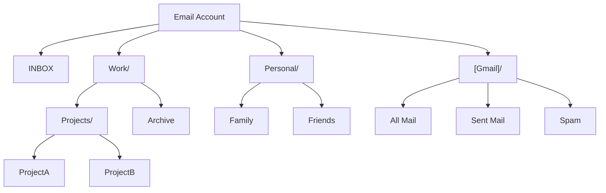

# Mailbox Operations

<!--
Source attribution:
- PRIMARY: blog/2023-04-04-about-mailbox.md
- Enhanced with API examples and operations
-->

Mailbox operations in EmailEngine allow you to list, manage, and work with email folders (also called mailboxes in IMAP terminology). Understanding folder structure and special-use folders is essential for properly routing messages and building email applications.

## Understanding Mailboxes

### What is a Mailbox?

In IMAP terms, a "mailbox" is what most users think of as a "folder." Each mailbox can contain:

- Email messages
- Sub-mailboxes (nested folders)
- Metadata (message count, flags, etc.)

### The Special INBOX

**INBOX is unique:**

- It's the **only guaranteed folder** on every account
- Name is **case-insensitive** (INBOX, Inbox, inbox all work)
- All other folder names are **case-sensitive**
- Cannot be deleted or renamed

It's entirely valid for an account to have only INBOX and no other folders.

### Folder Hierarchies

Folders can be nested using a delimiter (usually `/` or `.`):



## Special-Use Folders

### What are Special-Use Folders?

Special-use folders indicate a folder's intended purpose regardless of its name. This solves the multi-language problem where "Sent Mail" might be "Saadetud kirjad" in Estonian or "Correo enviado" in Spanish.

**Provider Support:**

Different providers handle special-use folder detection differently:

- **Gmail** (IMAP and API): Exposes special-use flags natively (most reliable)
- **Outlook IMAP**: Does NOT expose special-use flags over IMAP (EmailEngine uses heuristics instead)
- **Outlook Graph API**: Provides special-use flags natively
- **Generic IMAP**: Many servers expose special-use flags natively, some don't

### Special-Use Flags

EmailEngine recognizes these special-use flags:

| Flag       | Purpose              | Example Names                        |
| ---------- | -------------------- | ------------------------------------ |
| `\Inbox`   | Main inbox           | INBOX                                |
| `\Sent`    | Sent emails          | Sent Mail, Saadetud kirjad, Enviados |
| `\Drafts`  | Draft emails         | Drafts, Mustandid, Borradores        |
| `\Trash`   | Deleted emails       | Trash, Prügikast, Papelera           |
| `\Junk`    | Spam emails          | Junk, Rämps, Spam                    |
| `\Archive` | Archived emails      | Archive, Arhiiv, Archivo             |
| `\All`     | All emails (virtual) | All Mail, Todos                      |

### Special-Use Sources

EmailEngine indicates how it determined a folder's special-use flag:

**`extension`** - Server provided the hint (most reliable)

```json
{
  "path": "[Gmail]/Sent Mail",
  "specialUse": "\\Sent",
  "specialUseSource": "extension"
}
```

Available when:

- Gmail (IMAP and API)
- Microsoft Graph API
- Many modern IMAP servers

**`name`** - Determined by folder name matching using heuristics (fallback)

```json
{
  "path": "Sent Items",
  "specialUse": "\\Sent",
  "specialUseSource": "name"
}
```

Used when:

- **Outlook IMAP** (does not expose special-use flags)
- Other IMAP servers without special-use extension
- **May be incorrect on localized accounts** (e.g., "Gesendete Elemente" in German)

**`user`** - You explicitly configured it (highest priority, always correct)

```json
{
  "path": "My Custom Sent Folder",
  "specialUse": "\\Sent",
  "specialUseSource": "user"
}
```

:::warning Outlook IMAP and Localized Accounts
Outlook does **not** expose special-use flags over IMAP. EmailEngine uses heuristics (folder name matching) which may fail on localized accounts. If EmailEngine incorrectly identifies special folders on your Outlook IMAP account, manually set the correct paths using `imap.sentMailPath`, `imap.draftsMailPath`, etc.
:::

## Listing Mailboxes

### Basic Listing

List all mailboxes for an account using the [mailboxes API](/docs/api/get-v-1-account-account-mailboxes):

```bash
curl "https://your-emailengine.com/v1/account/example/mailboxes" \
  -H "Authorization: Bearer YOUR_ACCESS_TOKEN"
```

**Response:**

```json
{
  "mailboxes": [
    {
      "path": "INBOX",
      "delimiter": "/",
      "parentPath": "",
      "name": "INBOX",
      "listed": true,
      "subscribed": true,
      "specialUse": "\\Inbox",
      "specialUseSource": "name",
      "messages": 1523,
      "uidNext": 12456,
      "uidValidity": 1634567890,
      "highestModseq": 1234567
    },
    {
      "path": "[Gmail]/Sent Mail",
      "delimiter": "/",
      "parentPath": "[Gmail]",
      "name": "Sent Mail",
      "listed": true,
      "subscribed": true,
      "specialUse": "\\Sent",
      "specialUseSource": "extension",
      "messages": 891,
      "uidNext": 2485,
      "uidValidity": 1634567890
    },
    {
      "path": "Work/Projects",
      "delimiter": "/",
      "parentPath": "Work",
      "name": "Projects",
      "listed": true,
      "subscribed": true,
      "messages": 45,
      "uidNext": 78,
      "uidValidity": 1634567890
    }
  ]
}
```

### Response Fields

| Field              | Description                                                  |
| ------------------ | ------------------------------------------------------------ |
| `path`             | Full folder path (use this for API calls)                    |
| `delimiter`        | Hierarchy delimiter (usually `/` or `.`)                     |
| `parentPath`       | Parent folder path (empty for top-level)                     |
| `name`             | Display name (last part of path)                             |
| `listed`           | Whether folder is listed (vs hidden)                         |
| `subscribed`       | Whether user is subscribed to folder                         |
| `specialUse`       | Special-use flag if applicable (`\Sent`, `\Drafts`, etc.)    |
| `specialUseSource` | How special-use was determined (`extension`, `name`, `user`) |
| `messages`         | Total message count                                          |
| `uidNext`          | Next expected UID                                            |
| `uidValidity`      | Folder validity identifier                                   |
| `highestModseq`    | Highest modification sequence (if supported)                 |

### Using Special-Use Folders

Find the sent folder regardless of name:

```javascript
async function getSentFolder(accountId) {
  const response = await fetch(`https://your-emailengine.com/v1/account/${accountId}/mailboxes`, {
    headers: { Authorization: "Bearer YOUR_ACCESS_TOKEN" },
  });

  const data = await response.json();

  // Find folder with \Sent special-use flag
  const sentFolder = data.mailboxes.find((mailbox) => mailbox.specialUse === "\\Sent");

  return sentFolder ? sentFolder.path : null;
}
```

List all messages from the sent folder:

```javascript
async function listSentMessagesManual(accountId) {
  const sentPath = await getSentFolder(accountId);

  if (!sentPath) {
    throw new Error("Sent folder not found");
  }

  const response = await fetch(`https://your-emailengine.com/v1/account/${accountId}/messages?path=${encodeURIComponent(sentPath)}`, {
    headers: { Authorization: "Bearer YOUR_ACCESS_TOKEN" },
  });

  return await response.json();
}
```

List all messages from the sent folder using special-use flag alias:

```javascript
async function listSentMessages(accountId) {
  // Use special-use flag directly - EmailEngine resolves the actual path
  const response = await fetch(`https://your-emailengine.com/v1/account/${accountId}/messages?path=${encodeURIComponent("\\Sent")}`, {
    headers: { Authorization: "Bearer YOUR_ACCESS_TOKEN" },
  });

  return await response.json();
}
```

:::tip Special-Use Flag Aliases
EmailEngine allows using special-use flags (like `\Sent`, `\Drafts`, `\Trash`) directly as the `path` parameter. EmailEngine automatically resolves the flag to the actual folder path before executing the operation. This works regardless of the folder's actual name or location.
:::

## Creating Mailboxes

### Create a New Folder

Create a mailbox folder using the [create mailbox API](/docs/api/post-v-1-account-account-mailbox):

```bash
curl -X POST "https://your-emailengine.com/v1/account/example/mailbox" \
  -H "Authorization: Bearer YOUR_ACCESS_TOKEN" \
  -H "Content-Type: application/json" \
  -d '{
    "path": ["Work", "NewProject"]
  }'
```

**Response:**

```json
{
  "path": "Work/NewProject",
  "created": true
}
```

:::tip Array Syntax for Subfolders
Use array syntax `["Parent", "Child"]` instead of string `"Parent/Child"` when creating nested folders. Different servers use different delimiters (`/` vs `.`), and the array syntax works universally across all IMAP servers.
:::

### Automatic Namespace Handling

EmailEngine automatically adds the server's namespace prefix if missing:

```javascript
// If server namespace is "INBOX." and you create:
{ "path": "test" }

// EmailEngine creates:
"INBOX.test"
```

This ensures folder paths are always valid for the specific IMAP server configuration.

### Create Nested Folders

EmailEngine creates parent folders automatically if needed:

```javascript
async function createFolder(accountId, folderPath) {
  const response = await fetch(`https://your-emailengine.com/v1/account/${accountId}/mailbox`, {
    method: "POST",
    headers: {
      Authorization: "Bearer YOUR_ACCESS_TOKEN",
      "Content-Type": "application/json",
    },
    body: JSON.stringify({ path: folderPath }),
  });

  return await response.json();
}

// Creates Personal/Finance/2025 (and parents if needed)
await createFolder("example", ["Personal", "Finance", "2025"]);
```

## Renaming Mailboxes

### Rename a Folder

Rename a mailbox using the [rename mailbox API](/docs/api/put-v-1-account-account-mailbox):

```bash
curl -X PUT "https://your-emailengine.com/v1/account/example/mailbox" \
  -H "Authorization: Bearer YOUR_ACCESS_TOKEN" \
  -H "Content-Type: application/json" \
  -d '{
    "path": ["Work", "OldProject"],
    "newPath": ["Work", "CompletedProject"]
  }'
```

**Response:**

```json
{
  "path": "Work/CompletedProject",
  "renamed": true
}
```

### Rename with Children

Renaming a parent folder renames all children automatically:

```javascript
// Rename Work/Projects to Work/Archive
// Also renames:
//   Work/Projects/ProjectA → Work/Archive/ProjectA
//   Work/Projects/ProjectB → Work/Archive/ProjectB

await fetch(`https://your-emailengine.com/v1/account/example/mailbox`, {
  method: "PUT",
  headers: {
    Authorization: "Bearer YOUR_ACCESS_TOKEN",
    "Content-Type": "application/json",
  },
  body: JSON.stringify({
    path: ["Work", "Projects"],
    newPath: ["Work", "Archive"],
  }),
});
```

## Deleting Mailboxes

### Delete a Folder

Delete a mailbox using the [delete mailbox API](/docs/api/delete-v-1-account-account-mailbox):

```bash
curl -X DELETE "https://your-emailengine.com/v1/account/example/mailbox" \
  -H "Authorization: Bearer YOUR_ACCESS_TOKEN" \
  -H "Content-Type: application/json" \
  -d '{
    "path": ["Work", "OldProject"]
  }'
```

**Response:**

```json
{
  "path": "Work/OldProject",
  "deleted": true
}
```

### Important Notes

**Cannot delete INBOX:**

```javascript
// This will fail
await deleteFolder("example", "INBOX");
// Error: Cannot delete INBOX
```

**Delete children first:**

```javascript
// Must delete child folders before parent
await deleteFolder("example", ["Work", "Projects", "ProjectA"]);
await deleteFolder("example", ["Work", "Projects", "ProjectB"]);
await deleteFolder("example", ["Work", "Projects"]);
```

**Messages are deleted:**
When you delete a folder, all messages in it are permanently deleted (unless the server automatically moves them to Trash).

## Overriding Special-Use Folders

### Setting Custom Special-Use Paths

You can explicitly configure which folders to use for special purposes:

```bash
curl -X PUT "https://your-emailengine.com/v1/account/example" \
  -H "Authorization: Bearer YOUR_ACCESS_TOKEN" \
  -H "Content-Type: application/json" \
  -d '{
    "imap": {
      "partial": true,
      "sentMailPath": "Custom/Sent Emails",
      "draftsMailPath": "Custom/Drafts",
      "junkMailPath": "Custom/Spam",
      "trashMailPath": "Custom/Trash",
      "archiveMailPath": "Custom/Archive"
    }
  }'
```

**Important:** Always set `"partial": true` to merge with existing config. Otherwise, you'll overwrite the entire IMAP configuration.

**Available Overrides:**

- `sentMailPath` - Where sent messages are stored
- `draftsMailPath` - Where drafts are saved
- `junkMailPath` - Where spam/junk goes
- `trashMailPath` - Where deleted messages go
- `archiveMailPath` - Where archived messages are stored

**Example:**

```javascript
async function setCustomSentFolder(accountId, folderPath) {
  const response = await fetch(`https://your-emailengine.com/v1/account/${accountId}`, {
    method: "PUT",
    headers: {
      Authorization: "Bearer YOUR_ACCESS_TOKEN",
      "Content-Type": "application/json",
    },
    body: JSON.stringify({
      imap: {
        partial: true,
        sentMailPath: folderPath,
      },
    }),
  });

  return await response.json();
}

// Now all sent emails will go to "My Company/Sent"
await setCustomSentFolder("example", "My Company/Sent");
```

## Working with Gmail Labels and Outlook Categories

EmailEngine uses the `labels` array for both Gmail labels and Microsoft Outlook/Graph API categories.

### Gmail Labels

Gmail uses labels instead of folders. EmailEngine maps labels to the folder structure:

| Traditional IMAP | Gmail             | Description                                        |
| ---------------- | ----------------- | -------------------------------------------------- |
| INBOX            | INBOX             | Messages with `\Inbox` label                       |
| Sent Mail        | [Gmail]/Sent Mail | Messages with `\Sent` label                        |
| Drafts           | [Gmail]/Drafts    | Messages with `\Drafts` label                      |
| -                | [Gmail]/All Mail  | All messages except Trash and Spam (virtual folder)|

**Multiple Labels:**

A Gmail message can have multiple labels, which EmailEngine represents in the `labels` array:

```json
{
  "id": "AAAAAQAAMqo",
  "path": "[Gmail]/All Mail",
  "labels": ["\\Inbox", "Work", "Important"],
  "specialUse": "\\All"
}
```

**Gmail label characteristics:**

- Labels must be pre-created in Gmail
- Labels map to folders (e.g., label "Work" corresponds to a folder)
- Used with Gmail IMAP and Gmail API accounts

### Microsoft Outlook Categories

For accounts using **Microsoft Graph API** backend, EmailEngine uses the `labels` array for Outlook categories:

```json
{
  "id": "AAMkADU1...",
  "path": "Inbox",
  "labels": ["Blue category", "Red category"]
}
```

**Outlook category characteristics:**

- Categories are **automatically created** when you set them (no pre-creation needed)
- Categories are **not folders** - they're an additional filter/tag
- Categories don't map to mailbox folders (unlike Gmail labels)
- Only available when using Microsoft Graph API backend

:::info Important
Outlook categories are **not a replacement for folders**. Unlike Gmail where a label creates a folder, Outlook categories are independent color-coded tags that don't affect folder structure.
:::

## Common Folder Patterns

### Finding Inbox

```javascript
async function getInboxPath(accountId) {
  const response = await fetch(`https://your-emailengine.com/v1/account/${accountId}/mailboxes`, {
    headers: { Authorization: "Bearer YOUR_ACCESS_TOKEN" },
  });

  const data = await response.json();

  // INBOX is guaranteed to exist
  const inbox = data.mailboxes.find((m) => m.path.toUpperCase() === "INBOX");

  return inbox.path; // Returns "INBOX" or "Inbox" etc.
}
```

### Finding All Special-Use Folders

```javascript
async function getSpecialUseFolders(accountId) {
  const response = await fetch(`https://your-emailengine.com/v1/account/${accountId}/mailboxes`, {
    headers: { Authorization: "Bearer YOUR_ACCESS_TOKEN" },
  });

  const data = await response.json();

  const specialFolders = {};

  data.mailboxes.forEach((mailbox) => {
    if (mailbox.specialUse) {
      const key = mailbox.specialUse.replace(/\\/g, "").toLowerCase();
      specialFolders[key] = mailbox.path;
    }
  });

  return specialFolders;
}

// Returns:
// {
//   inbox: "INBOX",
//   sent: "[Gmail]/Sent Mail",
//   drafts: "Drafts",
//   trash: "Deleted Items",
//   junk: "Spam",
//   archive: "[Gmail]/All Mail"
// }
```
