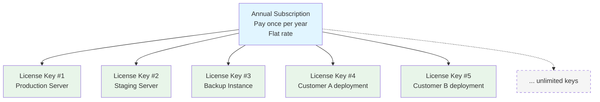

# EmailEngine Licensing

Complete information about EmailEngine subscription-based licensing, free trial, activation, and management.

:::info Quick Summary

- **Free Trial:** 14 days, full functionality, no limitations
- **Production:** Annual subscription with unlimited license keys
- **Pricing:** [View current pricing](https://postalsys.com/plans)
- **License Keys:** Generate unlimited keys per subscription
  :::

## Free Trial

Every EmailEngine instance includes a **14-day free trial** with **full functionality**.

**Trial Features:**

- **Unlimited accounts** - No account limits
- **Full API access** - All endpoints available
- **All email protocols** - IMAP, SMTP, Gmail API, Microsoft Graph
- **OAuth2 authentication** - Gmail, Outlook, Microsoft 365
- **Webhooks** - Real-time notifications
- **All features** - Identical to paid subscription
- **No credit card required** - Start immediately

**How to activate:**

```bash
# Simply start EmailEngine without license key
emailengine
```

1. Access web interface: `http://localhost:3000`
2. Click **"Activate Trial"** button in the dashboard
3. Trial begins immediately (no sign-up required)
4. Lasts for 14 days from activation

**Trial period:**

- Starts when you click "Activate Trial" button
- Lasts 14 days from activation
- No functionality restrictions
- Full production capabilities
- No sign-up or account creation needed

**After trial expires:**

- EmailEngine stops accepting connections
- Existing accounts remain in database
- No data loss
- Activate with license key to continue

**Best for:**

- Evaluating EmailEngine
- Testing integration
- Proof of concept
- Development and prototyping

:::tip No Credit Card Needed
Start using EmailEngine immediately. No sign-up, no credit card, no limitations during trial period.
:::

---

## Production Subscription

**Features:**

- **Unlimited accounts** - No restrictions
- **Unlimited EmailEngine instances** - Run as many as needed
- **Unlimited license keys** - Generate keys for all instances
- **Unlimited API calls** - No rate limits beyond technical constraints
- **All features included** - Same as trial, no feature tiers
- **Priority support** - Email support with faster response
- **Commercial use** - Deploy in production environments
- **Updates included** - All updates during subscription period
- **Source code access** - Self-hosted deployment

**Pricing:**

- [View current pricing and plans](https://postalsys.com/plans)
- Annual subscription model
- Flat rate (not per-mailbox or per-instance)
- Payment via credit card or SEPA direct debit

**How it works:**

1. Purchase a **subscription** (not individual licenses)
2. Generate **unlimited license keys** for your EmailEngine instances
3. All keys remain valid as long as subscription is active
4. No additional costs per key, instance, account, or API call

## How Subscriptions Work

### Subscription vs License Keys

**Important distinction:**

- **Subscription:** Your annual plan that you pay for at https://postalsys.com/
- **License Keys:** Individual keys generated from your subscription for each EmailEngine instance

**You buy one subscription, generate many keys.**

### Subscription Model



**No additional costs for:**

- Number of license keys
- Number of EmailEngine instances
- Number of email accounts
- Number of API calls

**You only pay for the subscription.**

## Getting Started

### Step 1: Try for Free

1. [Download and install EmailEngine](/docs/installation)
2. Start EmailEngine without license key
3. Access web interface at `http://localhost:3000`
4. Click **"Activate Trial"** button in the dashboard
5. 14-day trial begins immediately
6. Full functionality, no limitations

### Step 2: Create Account (When Ready to Purchase)

1. Visit [https://postalsys.com/](https://postalsys.com/)
2. Click "Sign Up"
3. Provide email and password

### Step 3: Add Billing Information

1. Log in to your account at [https://postalsys.com/](https://postalsys.com/)
2. Navigate to **Billing** section: [https://postalsys.com/billing/info](https://postalsys.com/billing/info)
3. Add billing details:
   - Company name (required)
   - Billing address
   - Tax information (if applicable)
4. Add payment method:
   - Credit card, or
   - SEPA direct debit

### Step 4: Subscribe to Plan

1. Go to [https://postalsys.com/plans](https://postalsys.com/plans)
2. Review available plans and pricing
3. Select the plan that fits your needs
4. Click "Subscribe"
5. Confirm payment

**Upon successful payment:**

- Subscription is activated immediately
- "License Keys" section becomes available in your account
- You can now generate license keys

### Step 5: Generate License Keys

1. Log in to [https://postalsys.com/](https://postalsys.com/)
2. Navigate to **License Keys** section: [https://postalsys.com/licenses](https://postalsys.com/licenses)
3. Click "Generate New License Key"
4. Optionally add a label (e.g., "Production Server", "Staging")
5. Copy the generated license key

**You can generate as many license keys as you need at no additional cost.**

### Step 6: Activate License in EmailEngine

**Option 1: Web Dashboard (Recommended)**

1. Access web interface: `http://127.0.0.1:3000`
2. Navigate to **License** page: `http://127.0.0.1:3000/admin/config/license`
3. Paste license key in the text field
4. Click **Update License Key**

This is the easiest method for manual activation.

---

**Option 2: Environment Variable**

For automated deployments and containerized environments:

```bash
export EENGINE_PREPARED_LICENSE="-----BEGIN LICENSE-----
Application: EmailEngine
Licensed to: Your Company Name

eyJhbGciOiJIUzI1NiIsInR5cCI6IkpXVCJ9abcdefghijklmnopqrstuvwxyz...
-----END LICENSE-----"

# Start EmailEngine
emailengine
```

**For SystemD service:**

Edit `/etc/systemd/system/emailengine.service` and add to the `[Service]` section:

```ini
[Service]
Environment="EENGINE_PREPARED_LICENSE=-----BEGIN LICENSE-----\nApplication: EmailEngine\nLicensed to: Your Company Name\n\neyJhbGciOiJIUzI1NiIsInR5cCI6IkpXVCJ9abcdefghijklmnopqrstuvwxyz...\n-----END LICENSE-----"
```

Then reload and restart the service:

```bash
sudo systemctl daemon-reload
sudo systemctl restart emailengine
```

**For Docker:**

```bash
docker run -d \
  --env EENGINE_PREPARED_LICENSE="-----BEGIN LICENSE-----
Application: EmailEngine
Licensed to: Your Company Name

eyJhbGciOiJIUzI1NiIsInR5cCI6IkpXVCJ9abcdefghijklmnopqrstuvwxyz...
-----END LICENSE-----" \
  postalsys/emailengine:v2
```

**For Docker Compose:**

```yaml
services:
  emailengine:
    environment:
      - EENGINE_PREPARED_LICENSE=${EENGINE_PREPARED_LICENSE}
```

---

**Option 3: Command Line**

For quick testing or scripts:

```bash
emailengine --preparedLicense="-----BEGIN LICENSE-----
Application: EmailEngine
Licensed to: Your Company Name

eyJhbGciOiJIUzI1NiIsInR5cCI6IkpXVCJ9abcdefghijklmnopqrstuvwxyz...
-----END LICENSE-----"
```

## Managing Your Subscription

### Inviting Team Members

You can invite teammates to help manage license keys and billing:

1. Log in to [https://postalsys.com/](https://postalsys.com/)
2. Navigate to **Manage Team**
3. Click "Invite Member"
4. Enter their email address

### Annual Renewal

**Automatic Renewal (Default):**

- **7 days before expiration:** Renewal reminder email sent
- **On renewal date:** Subscription automatically renews
- **Payment:** Credit card or SEPA direct debit charged automatically
- **License keys:** All existing keys remain valid
- **No action needed** if auto-renewal succeeds

**What happens on successful renewal:**

- Subscription extended for another year
- All license keys remain active
- No interruption to EmailEngine instances
- Invoice generated and emailed

### Failed Renewal

**If automatic renewal fails (expired card, insufficient funds, etc.):**

1. **Immediate notification:**

   - Email sent to billing email address

2. **Invoice generated:**

   - Payment due within 28 days
   - Late payment grace period

3. **View invoice:**

   - Log in to [https://postalsys.com/](https://postalsys.com/)
   - Warning banner displayed with link to invoice

4. **During 28-day grace period:**

   - All license keys remain valid
   - EmailEngine continues working normally
   - No interruption to service
   - Warning shown in account dashboard

5. **Pay the invoice:**

   - Payment must be made on the invoice page via credit card or SEPA direct debit
   - Update payment method if needed
   - Complete payment online

6. **After payment:**
   - Subscription status restored to active
   - New expiration date = original date + 1 year
   - All license keys remain active
   - No disruption

### Grace Period Expiration

**If invoice remains unpaid after 28 days:**

1. **Subscription canceled automatically**
2. **All license keys revoked**
3. **EmailEngine instances:**
   - Stop accepting new connections
   - Existing data preserved
   - Cannot process emails
   - All accounts remain in database

**To restore service:**

1. Subscribe to a new plan at [https://postalsys.com/plans](https://postalsys.com/plans)
2. Generate new license keys
3. Update EmailEngine instances with new keys
4. Service restored immediately
5. All accounts and data preserved

### Voluntary Subscription Cancellation

**If you cancel your subscription voluntarily:**

1. **Subscription remains active until renewal date**

   - No immediate service interruption
   - All license keys remain valid
   - EmailEngine continues working normally

2. **On original renewal date:**

   - Subscription expires
   - All license keys revoked
   - EmailEngine instances stop functioning
   - All data preserved in database

3. **To continue service:**
   - Resubscribe before expiration date
   - Or subscribe after expiration to restore access
   - Generate new license keys after resubscribing
   - Update EmailEngine instances with new keys

**Example timeline:**

```
Jan 1, 2025:  Subscribe (expires Jan 1, 2026)
Nov 15, 2025: Cancel subscription voluntarily
              → Service continues normally
              → License keys still valid
Jan 1, 2026:  Subscription expires (original renewal date)
              → License keys revoked
              → EmailEngine stops functioning
```

## FAQ

### General Questions

**Q: How long is the free trial?**

A: 14 days from first launch of EmailEngine instance. Full functionality, no limitations, no credit card required.

**Q: What happens when trial expires?**

A: EmailEngine stops accepting connections. All data preserved. Activate with license key to continue.

**Q: Can I extend the trial?**

A: Trial is fixed at 14 days. Contact support@postalsys.com if you need more evaluation time.

**Q: Do I need separate subscriptions for dev/staging/production?**

A: No. One subscription covers all environments. Generate separate license keys for each environment from the same subscription. Or use free trial for testing/development.

**Q: Can I share my subscription with others?**

A: If you're part of the same organization, yes. Invite them as team members. Each team member can manage license keys. Do not share subscriptions across different companies.

**Q: What happens if I cancel my subscription?**

A: Your subscription remains active until the original renewal date. All license keys continue working normally until that date. On the renewal date, the subscription expires and all license keys are revoked. You can resubscribe anytime to restore service.

**Q: Do you offer refunds?**

A: No refunds are offered. Please use the 14-day free trial to fully evaluate EmailEngine before subscribing. The trial includes all features with no limitations, allowing you to thoroughly test the service for your use case.

---

### Business Questions

**Q: Can I resell EmailEngine as part of my SaaS?**

A: Yes, with active subscription. Your customers don't need individual subscriptions. You deploy EmailEngine with your license keys on your infrastructure.

Example: You build a CRM with email. You subscribe to EmailEngine. Your 1,000 customers use your CRM. You only need one subscription.

**Q: Do I need to buy separate subscriptions for each customer?**

A: No. One subscription covers all your deployments, regardless of how many customers you serve.

**Q: Can I pay via invoice/PO?**

A: Invoice payment is not available for regular self-service plans. All regular plan payments must be made online via credit card or SEPA direct debit.

However, **custom plans** are available with invoice payment options. Custom plans are more expensive than regular plans but offer additional flexibility such as:

- Invoice/PO payment
- Lifetime subscriptions
- Custom terms and pricing
- Enterprise agreements

Contact support@postalsys.com for custom plan details and pricing.

Note: If automatic renewal fails on a regular plan, an invoice is generated for the grace period, but payment must still be completed online using credit card or SEPA direct debit.

**Q: What currency is pricing in?**

A: See https://postalsys.com/plans for currency options. Credit card payments auto-convert.

## Support

### What's Included

**Community support:**

- Documentation

**Email support:**

- support@postalsys.com
- Response time: Usually within 24 hours
- Bug reports prioritized

### Not Included

- Custom development
- On-site training
- Consulting services
- Architecture review
- White-glove support
