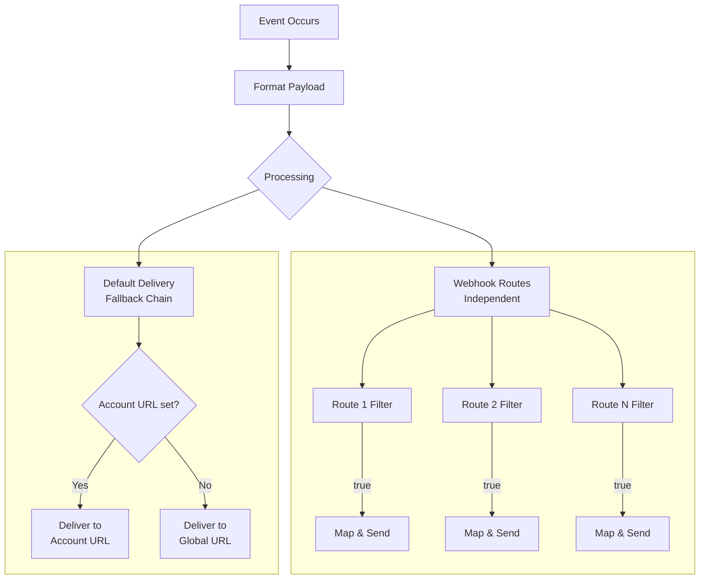

import Tabs from '@theme/Tabs';
import TabItem from '@theme/TabItem';

# Webhook Routing

Webhook routing allows you to define custom conditions that route specific webhook events to different target endpoints. Instead of sending all webhooks to a single global URL, you can create multiple routes with JavaScript filter functions that determine which events should be forwarded to which destinations.

## Overview

### What is Webhook Routing?

EmailEngine's webhook routing system enables you to:

- **Route by Account**: Send webhooks for specific accounts to dedicated endpoints
- **Route by Event Type**: Forward only certain event types (e.g., `messageNew`) to specific handlers
- **Route by Content**: Use JavaScript filter functions to inspect the payload and decide whether to forward
- **Transform Payloads**: Use mapping functions to transform the webhook payload before delivery
- **Multiple Destinations**: Send the same event to multiple endpoints if multiple route filters match

### When to Use Webhook Routing

**Multi-tenant Applications**

Route webhooks for different customer accounts to separate endpoints:

```javascript
// Filter: Route all webhooks for customer "acme-corp" to their dedicated endpoint
if (payload.account === 'acme-corp') {
    return true;
}
```

**Event-Specific Processing**

Send different event types to specialized handlers:

```javascript
// Filter: Only forward bounce notifications
if (payload.event === 'messageBounce') {
    return true;
}
```

**Reducing Webhook Volume**

Filter out events you don't need to process:

```javascript
// Filter: Only forward new messages in INBOX
const isInbox = payload.path === 'INBOX' || payload.data?.labels?.includes('\\Inbox');
if (payload.event === 'messageNew' && isInbox) {
    return true;
}
```

**Third-Party Integrations**

Transform webhooks to match the expected format of external services like Slack, Discord, or Zapier:

```javascript
// Map: Transform to Slack incoming webhook format
return {
    text: `New email from ${payload.data?.from?.address}`,
    blocks: [
        {
            type: 'section',
            text: {
                type: 'mrkdwn',
                text: `*Subject:* ${payload.data?.subject}`
            }
        }
    ]
};
```

## How Routing Works

### Route Processing Order

When EmailEngine generates a webhook event:

1. **Filter Evaluation**: Each enabled route's filter function is executed with the payload
2. **Matching Routes**: All routes where the filter returns `true` receive the webhook
3. **Payload Transformation**: If a route has a mapping function, the payload is transformed before delivery
4. **Parallel Delivery**: Webhooks are queued for delivery to all matching routes simultaneously
5. **Default Delivery**: The webhook is also sent to either the account-specific URL or global URL (see fallback below)



### Filter Function

The filter function determines whether a webhook should be sent to this route's target URL. It receives the complete webhook `payload` as a global variable.

**Requirements:**

- Must return a truthy value to forward the webhook
- Return `false`, `null`, `undefined`, or any falsy value to skip
- Has access to the full webhook payload via the `payload` variable
- Errors are logged but don't stop processing

**Example Filter Functions:**

```javascript
// Forward all webhooks (default behavior)
return true;

// Forward only for specific account
if (payload.account === 'my-account-id') {
    return true;
}

// Forward only new messages
if (payload.event === 'messageNew') {
    return true;
}

// Forward messages from specific sender
if (payload.event === 'messageNew' &&
    payload.data?.from?.address?.endsWith('@important-domain.com')) {
    return true;
}

// Forward messages with specific subject pattern
if (payload.event === 'messageNew' &&
    /urgent|critical/i.test(payload.data?.subject || '')) {
    return true;
}
```

### Mapping Function

The mapping function transforms the webhook payload before delivery. This is useful when integrating with third-party services that expect a specific payload format.

**Requirements:**

- Must return the transformed payload object
- The returned value is sent as the webhook body
- Has access to the original payload via the `payload` variable
- If not defined, the original payload is sent unchanged

**Example Mapping Functions:**

```javascript
// Return payload unchanged (default behavior)
return payload;

// Add timestamp
payload.timestamp = Date.now();
return payload;

// Transform to Slack format
return {
    text: `New email received`,
    blocks: [
        {
            type: 'section',
            text: {
                type: 'mrkdwn',
                text: `*From:* ${payload.data?.from?.address}\n*Subject:* ${payload.data?.subject}`
            }
        }
    ]
};

// Transform to Discord webhook format
return {
    content: `New email from ${payload.data?.from?.name || payload.data?.from?.address}`,
    embeds: [
        {
            title: payload.data?.subject,
            description: payload.data?.text?.plain?.substring(0, 200) || '',
            color: 5814783
        }
    ]
};

// Simplify payload for processing
return {
    event: payload.event,
    account: payload.account,
    messageId: payload.data?.id,
    from: payload.data?.from?.address,
    subject: payload.data?.subject,
    receivedAt: payload.date
};
```

## Disabling the Default Webhook

When using webhook routing, you may want to disable the default global webhook to avoid receiving duplicate events. The default webhook is configured in the main webhook settings and receives all events (based on the event filter).

### Understanding Webhook Hierarchy

EmailEngine processes webhooks in two parallel tracks:

**Track 1: Webhook Routes (Independent)**

Custom webhook routes are always evaluated first and independently. If a route's filter function returns `true`, the webhook is sent to that route's target URL. Multiple routes can match the same event, each receiving their own copy.

**Track 2: Default Webhook Delivery (Fallback Chain)**

After routes are processed, EmailEngine sends the webhook to a "default" destination using this fallback order:

1. **Account-Specific Webhook URL** - If the account has a dedicated webhook URL configured, the webhook is sent there
2. **Global Webhook URL** - If no account-specific URL is set, the global webhook URL is used

:::info Account-Specific Webhooks
Each account can have its own dedicated webhook URL configured in the account settings. When set, this URL **replaces** the global webhook URL for that account - webhooks are sent to the account URL, not the global URL. This is useful for multi-tenant setups where each customer's account needs to send webhooks to their own endpoint.

Webhook routes are **not affected** by account-specific webhook URLs. Routes are evaluated independently and will still receive webhooks based on their filter functions, regardless of whether an account has a dedicated URL set.
:::

To use only routed webhooks (disable both account and global default webhooks):

- Leave the global webhook URL empty, AND
- Do not set account-specific webhook URLs

To use only account-specific webhooks (no global fallback):

- Leave the global webhook URL empty
- Set webhook URLs on individual accounts as needed

### Via Web UI

1. Navigate to **Configuration** in the sidebar
2. Click **Webhooks**
3. Leave the **Webhook URL** field empty
4. Keep **Enable webhooks** checked (required for routing to work)
5. Click **Update Settings**


:::warning Important
The "Enable webhooks" toggle must remain enabled for webhook routing to work. This setting controls the entire webhook system, including custom routes. Only clear the webhook URL field if you want to disable the default destination while keeping routes active.
:::

### Via API

Use the [settings API](/docs/api/post-v-1-settings) to clear the default webhook URL:

<Tabs groupId="code-examples">
<TabItem value="curl" label="cURL">

```bash
curl -X POST "https://emailengine.example.com/v1/settings" \
  -H "Authorization: Bearer YOUR_ACCESS_TOKEN" \
  -H "Content-Type: application/json" \
  -d '{
    "webhooks": "",
    "webhooksEnabled": true
  }'
```

</TabItem>
<TabItem value="nodejs" label="Node.js">

```javascript
const response = await fetch('https://emailengine.example.com/v1/settings', {
    method: 'POST',
    headers: {
        'Authorization': 'Bearer YOUR_ACCESS_TOKEN',
        'Content-Type': 'application/json'
    },
    body: JSON.stringify({
        webhooks: '',           // Empty string to disable default webhook
        webhooksEnabled: true   // Keep routing enabled
    })
});

const result = await response.json();
console.log('Settings updated:', result.success);
```

</TabItem>
<TabItem value="python" label="Python">

```python
import requests

response = requests.post(
    'https://emailengine.example.com/v1/settings',
    headers={
        'Authorization': 'Bearer YOUR_ACCESS_TOKEN',
        'Content-Type': 'application/json'
    },
    json={
        'webhooks': '',           # Empty string to disable default webhook
        'webhooksEnabled': True   # Keep routing enabled
    }
)

result = response.json()
print(f"Settings updated: {result['success']}")
```

</TabItem>
<TabItem value="php" label="PHP">

```php
<?php
$ch = curl_init('https://emailengine.example.com/v1/settings');

curl_setopt_array($ch, [
    CURLOPT_POST => true,
    CURLOPT_RETURNTRANSFER => true,
    CURLOPT_HTTPHEADER => [
        'Authorization: Bearer YOUR_ACCESS_TOKEN',
        'Content-Type: application/json'
    ],
    CURLOPT_POSTFIELDS => json_encode([
        'webhooks' => '',         // Empty string to disable default webhook
        'webhooksEnabled' => true // Keep routing enabled
    ])
]);

$response = curl_exec($ch);
$result = json_decode($response, true);
echo "Settings updated: " . ($result['success'] ? 'true' : 'false');
?>
```

</TabItem>
</Tabs>

### Setting Account-Specific Webhook URLs

To set a dedicated webhook URL for a specific account, use the [Update Account API](/docs/api/put-v-1-account-account):

<Tabs groupId="code-examples">
<TabItem value="curl" label="cURL">

```bash
curl -X PUT "https://emailengine.example.com/v1/account/my-account-id" \
  -H "Authorization: Bearer YOUR_ACCESS_TOKEN" \
  -H "Content-Type: application/json" \
  -d '{
    "webhooks": "https://customer-a.example.com/webhooks"
  }'
```

</TabItem>
<TabItem value="nodejs" label="Node.js">

```javascript
const accountId = 'my-account-id';
const response = await fetch(`https://emailengine.example.com/v1/account/${accountId}`, {
    method: 'PUT',
    headers: {
        'Authorization': 'Bearer YOUR_ACCESS_TOKEN',
        'Content-Type': 'application/json'
    },
    body: JSON.stringify({
        webhooks: 'https://customer-a.example.com/webhooks'
    })
});

const result = await response.json();
console.log('Account updated:', result.account);
```

</TabItem>
<TabItem value="python" label="Python">

```python
import requests

account_id = 'my-account-id'
response = requests.put(
    f'https://emailengine.example.com/v1/account/{account_id}',
    headers={
        'Authorization': 'Bearer YOUR_ACCESS_TOKEN',
        'Content-Type': 'application/json'
    },
    json={
        'webhooks': 'https://customer-a.example.com/webhooks'
    }
)

result = response.json()
print(f"Account updated: {result['account']}")
```

</TabItem>
</Tabs>

To clear an account-specific webhook URL (falling back to global webhook), set `webhooks` to an empty string:

```bash
curl -X PUT "https://emailengine.example.com/v1/account/my-account-id" \
  -H "Authorization: Bearer YOUR_ACCESS_TOKEN" \
  -H "Content-Type: application/json" \
  -d '{"webhooks": ""}'
```

## Setting Up Routes via Web UI

### Creating a New Route

1. Navigate to **Webhook Routing** in the sidebar (under the Webhooks section)


2. Click **Create new** to open the route creation form

3. Fill in the route details:

   - **Name**: A descriptive name for the route (e.g., "Notify Slack on Inbox Messages")
   - **Description**: Optional description of what this route does
   - **Target URL**: The webhook endpoint URL that will receive matching events
   - **Enable this Webhook Routing**: Check to activate the route


4. Configure the **Filter Function**:

   The filter function determines which webhooks are forwarded to this route. Write JavaScript code that returns `true` to send the webhook or `false` to skip it.

   ```javascript
   // Example: Only forward new messages in INBOX
   const isInbox = payload.path === 'INBOX' || payload.data?.labels?.includes('\\Inbox');
   if (payload.event === 'messageNew' && isInbox) {
       return true;
   }
   ```


5. Configure the **Map Function** (optional):

   The mapping function transforms the payload before sending. If not defined, the original payload is sent unchanged.

   ```javascript
   // Return payload unchanged
   return payload;
   ```

6. Click **Create routing** to save the route

### Viewing Route Details

After creating a route, you can view its details including:

- Trigger count (how many times the route has been activated)
- Current status (Enabled/Disabled)
- Filter and mapping function code
- Error log (if any errors occurred during function execution)


### Editing a Route

1. Click on a route in the list to view its details
2. Click **Edit** to modify the route configuration
3. Make your changes and click **Update routing**


### Managing Custom Headers

You can add custom HTTP headers to webhook requests for authentication or identification:

1. In the route form, expand **Custom request headers**
2. Add headers in `Key: Value` format, one per line:

   ```
   Authorization: Bearer your-secret-token
   X-Custom-Header: custom-value
   ```

### Deleting a Route

1. Navigate to the route detail page
2. Click **Delete**
3. Confirm the deletion in the modal dialog

:::warning
Deleting a route is permanent and cannot be undone. Any webhooks that would have matched this route will no longer be delivered to its target URL.
:::

## Viewing Routes via API

You can retrieve webhook route information programmatically using the EmailEngine API:

- **List routes** - `GET /v1/webhookRoutes` - Retrieve all configured webhook routes
- **Get route details** - `GET /v1/webhookRoutes/webhookRoute/{webhookRoute}` - Get a specific route with filter and mapping functions

:::info Web UI Required for Route Management
Creating, updating, and deleting webhook routes is only available through the Web UI. The API provides read-only access to route information.
:::

## Practical Examples

### Example 1: Route to Slack

Send new email notifications to a Slack channel with a formatted message.

**Filter Function:**

```javascript
// Only forward new messages in INBOX
const isInbox = payload.path === 'INBOX' || payload.data?.labels?.includes('\\Inbox');
if (payload.event === 'messageNew' && isInbox) {
    return true;
}
```

**Map Function:**

```javascript
// Format for Slack incoming webhook
return {
    text: `New email in ${payload.account}`,
    blocks: [
        {
            type: 'header',
            text: {
                type: 'plain_text',
                text: 'New Email Received'
            }
        },
        {
            type: 'section',
            fields: [
                {
                    type: 'mrkdwn',
                    text: `*From:*\n${payload.data?.from?.name || ''} <${payload.data?.from?.address}>`
                },
                {
                    type: 'mrkdwn',
                    text: `*Subject:*\n${payload.data?.subject || '(no subject)'}`
                }
            ]
        },
        {
            type: 'context',
            elements: [
                {
                    type: 'mrkdwn',
                    text: `Account: ${payload.account} | Received: ${new Date(payload.date).toLocaleString()}`
                }
            ]
        }
    ]
};
```

### Example 2: Route by Account for Multi-Tenant

Route webhooks for different customer accounts to their dedicated endpoints.

**Route 1 - Customer A:**

```javascript
// Filter: Only Customer A's accounts
if (payload.account.startsWith('customer-a-')) {
    return true;
}
```

**Route 2 - Customer B:**

```javascript
// Filter: Only Customer B's accounts
if (payload.account.startsWith('customer-b-')) {
    return true;
}
```

### Example 3: Bounce Notification Handler

Route bounce notifications to a dedicated analytics service.

**Filter Function:**

```javascript
// Forward bounce and complaint notifications
if (payload.event === 'messageBounce' || payload.event === 'messageComplaint') {
    return true;
}
```

**Map Function:**

```javascript
// Simplify payload for bounce analytics
return {
    type: payload.event,
    account: payload.account,
    originalMessageId: payload.data?.messageId,
    recipient: payload.data?.recipient,
    bounceType: payload.data?.bounceInfo?.action,
    errorCode: payload.data?.bounceInfo?.response?.code,
    errorMessage: payload.data?.bounceInfo?.response?.message,
    timestamp: payload.date
};
```

### Example 4: High-Priority Message Alert

Send immediate alerts for emails matching urgent criteria.

**Filter Function:**

```javascript
// Check for high-priority messages
if (payload.event !== 'messageNew') {
    return false;
}

const subject = (payload.data?.subject || '').toLowerCase();
const from = payload.data?.from?.address || '';

// Check priority indicators
const isUrgent = /urgent|critical|emergency|asap/i.test(subject);
const isVIP = ['ceo@company.com', 'cfo@company.com'].includes(from);
const hasHighPriority = payload.data?.headers?.['x-priority'] === '1';

if (isUrgent || isVIP || hasHighPriority) {
    return true;
}
```

**Map Function:**

```javascript
// Format for alerting service
return {
    alertType: 'high-priority-email',
    account: payload.account,
    from: payload.data?.from?.address,
    subject: payload.data?.subject,
    preview: (payload.data?.text?.plain || '').substring(0, 200),
    messageId: payload.data?.id,
    receivedAt: payload.date
};
```

### Example 5: Filter by Sender Domain

Only forward webhooks from specific sender domains.

**Filter Function:**

```javascript
// Forward only messages from trusted domains
const trustedDomains = ['partner.com', 'supplier.com', 'client.com'];

if (payload.event === 'messageNew') {
    const senderAddress = payload.data?.from?.address || '';
    const senderDomain = senderAddress.split('@')[1];

    if (trustedDomains.includes(senderDomain)) {
        return true;
    }
}
```

## Available Variables in Functions

### The `payload` Object

The `payload` variable contains the complete webhook payload. The structure varies by event type, but common fields include:

| Field | Type | Description |
|-------|------|-------------|
| `event` | string | Event type (e.g., `messageNew`, `messageSent`) |
| `account` | string | Account identifier |
| `date` | string | ISO timestamp of the event |
| `path` | string | Mailbox path (for message events) |
| `data` | object | Event-specific data |

For `messageNew` events, `payload.data` includes:

| Field | Type | Description |
|-------|------|-------------|
| `id` | string | EmailEngine message ID |
| `uid` | number | IMAP UID |
| `messageId` | string | Message-ID header value |
| `subject` | string | Email subject |
| `from` | object | Sender information (`name`, `address`) |
| `to` | array | Recipients |
| `date` | string | Message date |
| `labels` | array | Gmail labels (if applicable) |
| `flags` | array | IMAP flags |
| `text` | object | Message content (`plain`, `html`) |
| `attachments` | array | Attachment information |

See [Webhook Events Reference](/docs/reference/webhook-events) for complete payload documentation by event type.

### Additional Globals

Filter and mapping functions have access to:

| Variable | Description |
|----------|-------------|
| `payload` | The complete webhook payload object |
| `logger` | Logging object with `.info()`, `.error()`, etc. |
| `fetch` | Fetch API for making HTTP requests (async) |
| `URL` | URL constructor for URL manipulation |
| `env` | Environment variables defined in Script Environment settings |

:::info
The `fetch` function is available for making external API calls within your functions, but use it sparingly as it can slow down webhook processing. Consider using mapping functions only for payload transformation.
:::

## Troubleshooting

### Route Not Triggering

**Check if the route is enabled:**

- Navigate to the route detail page
- Verify the status shows "Enabled"

**Verify the filter function:**

- Use the test payload feature in the UI to test your filter
- Check the error log tab for any JavaScript errors
- Ensure the function returns `true` for matching payloads

**Confirm webhooks are enabled globally:**

- Go to **Configuration > Webhooks**
- Ensure "Enable webhooks" is checked

### Webhooks Not Being Delivered

**Check the target URL:**

- Verify the URL is correct and publicly accessible
- Test the URL with a simple curl request
- Check for HTTPS certificate issues

**Review the webhook queue:**

- Go to **Tools > Bull Board**
- Check the "Webhooks" queue for failed jobs
- Review error messages for delivery failures

**Enable job retention:**

- Go to **Configuration > Service**
- Set "Completed/failed queue entries to keep" to 100
- Failed webhooks will be visible in Bull Board

### Filter Function Errors

**Check the error log:**

- Open the route detail page
- Click the "Error log" tab
- Review recent errors with their payloads

**Common issues:**

- Accessing undefined properties: Use optional chaining (`payload.data?.from?.address`)
- Syntax errors: Check for missing brackets or semicolons
- Type errors: Ensure you're comparing the right types

### Mapping Function Issues

**Verify the output:**

- Use the mapping preview in the edit form
- Test with sample payloads
- Check that the return value is valid JSON

**Common issues:**

- Not returning a value: The function must return the transformed payload
- Returning undefined: Check for conditional paths that don't return
- Invalid JSON: Template strings with special characters need escaping

## See Also

- [Webhook Overview](/docs/webhooks/overview) - General webhook concepts and setup
- [Webhook Events Reference](/docs/reference/webhook-events) - Complete event type documentation
- [Webhooks API](/docs/api-reference/webhooks-api) - API endpoints for webhook management
- [Pre-Processing Functions](/docs/advanced/pre-processing) - Advanced JavaScript functions for EmailEngine
- [List Webhook Routes API](/docs/api/get-v-1-webhookroutes) - API reference for listing routes
- [Get Webhook Route API](/docs/api/get-v-1-webhookroutes-webhookroute-webhookroute) - API reference for route details
